# The BET model

## Introduction

`opal` is an open, modular R package for fisheries stock assessment
built on [RTMB](https://github.com/kaskr/RTMB) for automatic
differentiation. It includes bundled data from the western and central
Pacific Ocean (WCPO) bigeye tuna (BET) stock assessment. This vignette
demonstrates model setup, fitting, and diagnostics using those data.

## Load inputs

Load the `opal` package and the `RTMB` dependency. The `ggplot2` package
is used for plotting.

Show code

``` r

library(opal)
library(tidyverse)
library(RTMB)

theme_set(theme_bw())
```

The bundled data object `wcpo_bet_data` contains all biological
parameters, catch and CPUE observations, length structure, and prior
specifications needed for the BET assessment model:

Show code

``` r

data(wcpo_bet_data)
data <- wcpo_bet_data
if (is.null(data$n_index)) data$n_index <- 1L
if (!"index" %in% names(data$cpue_data)) data$cpue_data$index <- rep(1L, nrow(data$cpue_data))
names(data)
#>  [1] "age_a"          "n_age"          "n_season"       "n_fishery"     
#>  [5] "len_bin_start"  "len_bin_width"  "n_len"          "first_yr"      
#>  [9] "last_yr"        "years"          "n_year"         "first_yr_catch"
#> [13] "catch_units_f"  "cpue_switch"    "cpue_data"      "A1"            
#> [17] "A2"             "lw_a"           "lw_b"           "maturity"      
#> [21] "fecundity"      "M"              "catch_obs_ysf"  "sel_type_f"    
#> [25] "priors"         "n_index"
```

Key dimensions of the data:

Show code

``` r

cat("Number of ages:", data$n_age, "\n")
#> Number of ages: 40
cat("Number of years:", data$n_year, "\n")
#> Number of years: 268
cat("Number of fisheries:", data$n_fishery, "\n")
#> Number of fisheries: 15
cat("Number of length bins:", data$n_len, "\n")
#> Number of length bins: 95
```

### Biological inputs

Natural mortality at age, maturity at length, and length-weight
parameters are all contained in the data object. The two primary
biological inputs are plotted below.

Show code

``` r

ages <- data$age_a
real_age <- ages / 4

# Natural mortality
ggplot(data = data.frame(age = real_age, M = data$M), aes(x = age, y = M)) +
  geom_line() + geom_point() +
  scale_y_continuous(limits = c(0, NA), expand = expansion(mult = c(0, 0.05))) +
  labs(x = "Age (years)", y = "M (quarterly rate)", 
       title = "Natural Mortality-at-Age")

# Maturity at length
len_mid <- seq(data$len_bin_start + data$len_bin_width / 2,
               by = data$len_bin_width, length.out = data$n_len)
ggplot(data = data.frame(length = len_mid, maturity = data$maturity), 
       aes(x = length, y = maturity)) +
  geom_line() + geom_point() +
  scale_y_continuous(limits = c(0, NA), expand = expansion(mult = c(0, 0.05))) +
  labs(x = "Length (cm)", y = "Maturity", title = "Maturity-at-Length")

fleet_names <- c("F01_LL.NORTH", "F02_LL.US", "F03_LL.OFFSH",
                 "F04_LL.EQUAT", "F05_LL.WEST", "F06_LL.SOUTH", "F07_LL.AUS",
                 "F08_PS.ASSOC", "F09_PS.UNASS", "F10_DOM.MISC",
                 "F11_DOM.HL", "F12_JP.PS.N", "F13_JP.PL", "F14_EQ.PL",
                 "S01_INDEX")
fleet_palette <- setNames(
  grDevices::hcl.colors(data$n_fishery, palette = "Dark 3"),
  fleet_names
)
```

[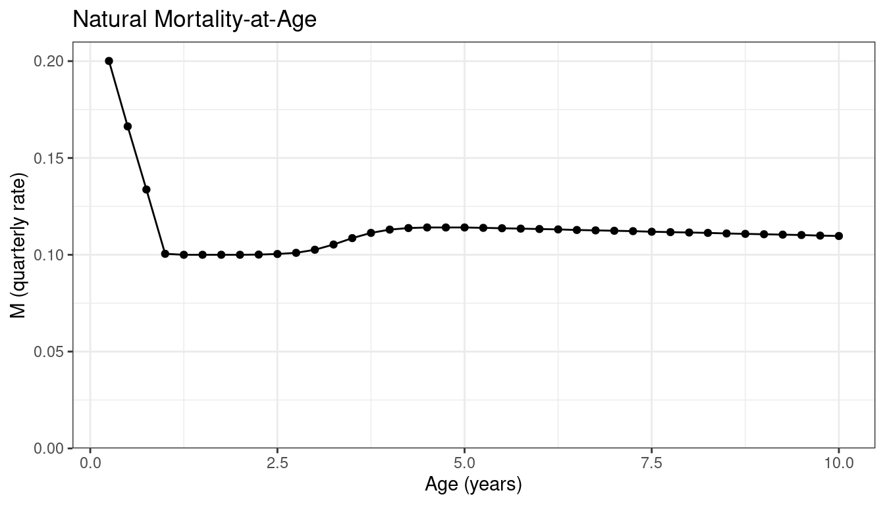](https://n-ducharmebarth-noaa.github.io/opal/articles/bet_files/figure-html/fig-biology-1.png "Figure 1: Natural mortality-at-age and maturity-at-length used in the BET model.")

Figure 1: Natural mortality-at-age and maturity-at-length used in the
BET model.

[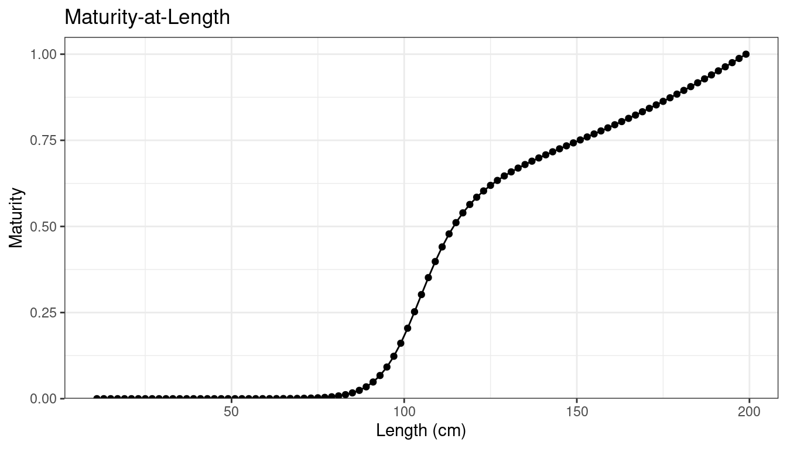](https://n-ducharmebarth-noaa.github.io/opal/articles/bet_files/figure-html/fig-biology-2.png "Figure 2: Natural mortality-at-age and maturity-at-length used in the BET model.")

Figure 2: Natural mortality-at-age and maturity-at-length used in the
BET model.

### CPUE data

Show code

``` r

data$cpue_data$index <- as.integer(factor(data$cpue_data$month, levels = c(2, 5, 8, 11)))
data$n_index <- 4L
```

### Length composition data

Length composition observations are loaded from the bundled
`wcpo_bet_lf` long-format data object and transformed into model-ready
arrays.

Show code

``` r

data(wcpo_bet_lf)

# Pivot to wide format: one row per fishery x timestep, bins as columns
# Note: LF data exist for fisheries 8-14. Fishery 8 is retained here, but is
# strongly downweighted relative to the other active LF fisheries.
lf_wide <- wcpo_bet_lf %>%
  pivot_wider(
    id_cols = c(fishery, year, month, ts),
    names_from = bin,
    values_from = value,
    values_fill = 0
  ) %>%
  arrange(fishery, ts)

unique(lf_wide$fishery)
#> [1]  8  9 10 11 12 13 14

# define variance adjustment scalars for each fishery if using lf_switch = 1 (multinomial)
var_adjust_scalars <- rep(1, data$n_fishery)
var_adjust_scalars[] <- 80
var_adjust_scalars[8] <- 5000 # keep LF8 present but much less influential
# var_adjust_scalars <- 1/rep(20000,data$n_fishery)
# var_adjust_scalars[c(1, 4, 5, 6, 15)] <- 1 / 40000
# var_adjust_scalars[] <- 1 / 4e9

data <- prep_lf_data(data = data, lf_wide = lf_wide, 
                     lf_keep_fisheries = c(8, 9, 10, 11, 12, 13, 14),
                     lf_var_adjust = var_adjust_scalars)
lf_year_lookup <- lf_wide %>%
  distinct(ts, year, month)
lf_year_match <- match(data$lf_year, lf_year_lookup$ts)
data$lf_calendar_year <- lf_year_lookup$year[lf_year_match] +
  (lf_year_lookup$month[lf_year_match] - 1) / 12
data$lf_calendar_year_fi <- split(data$lf_calendar_year, data$lf_fishery)

data$lf_fishery
#>   [1]  8  8  8  8  8  8  8  8  8  8  8  8  8  8  8  8  8  8  8  8  8  8  8  8  8
#>  [26]  8  8  8  8  8  8  8  8  8  8  8  8  8  8  8  8  8  8  8  8  8  8  8  8  8
#>  [51]  8  8  8  8  8  8  8  8  8  8  8  8  8  8  8  8  8  8  8  8  8  8  8  8  8
#>  [76]  8  8  8  8  8  8  8  8  8  8  8  8  8  8  8  8  8  8  8  8  8  8  8  8  8
#> [101]  8  8  8  8  8  8  8  8  8  8  8  8  8  8  8  8  8  8  8  8  8  8  9  9  9
#> [126]  9  9  9  9  9  9  9  9  9  9  9  9  9  9  9  9  9  9  9  9  9  9  9  9  9
#> [151]  9  9  9  9  9  9  9  9  9  9  9  9  9  9  9  9  9  9  9  9  9  9  9  9  9
#> [176]  9  9  9  9  9  9  9  9  9  9  9  9  9  9  9  9  9  9  9  9  9  9  9  9  9
#> [201]  9  9  9  9  9  9  9  9  9  9 10 10 10 10 10 10 10 10 10 10 10 10 10 10 10
#> [226] 10 10 10 10 10 10 10 10 10 10 10 10 10 10 10 10 10 10 10 10 10 10 10 10 10
#> [251] 10 10 10 10 10 10 10 10 10 10 10 10 10 10 10 10 10 10 10 10 10 10 10 10 10
#> [276] 10 10 10 10 10 10 10 10 10 10 10 10 10 10 10 10 10 10 10 10 10 10 10 10 10
#> [301] 10 10 11 11 11 11 11 11 11 11 11 11 11 11 11 11 11 11 11 11 11 11 11 11 11
#> [326] 11 11 11 11 11 11 11 11 11 11 11 11 11 11 11 11 11 11 11 11 11 11 11 11 11
#> [351] 11 11 11 11 11 11 11 11 11 11 11 11 11 11 11 11 11 11 11 11 11 11 11 11 11
#> [376] 11 11 11 11 11 11 11 11 11 11 11 11 11 11 11 11 12 12 12 12 12 12 12 12 12
#> [401] 12 12 12 12 12 12 12 12 12 12 12 12 12 12 12 12 12 12 12 12 12 12 12 12 12
#> [426] 12 12 12 12 12 12 12 12 12 13 13 13 13 13 13 13 13 13 13 13 13 13 13 13 13
#> [451] 13 13 13 13 13 13 13 13 13 13 13 13 13 13 13 13 13 13 13 13 13 13 13 13 13
#> [476] 13 13 13 13 13 13 13 13 13 13 13 13 13 13 13 13 13 13 13 13 13 13 13 13 13
#> [501] 13 13 13 13 13 13 13 13 13 13 13 14 14 14 14 14 14 14 14 14 14 14 14 14 14
#> [526] 14 14 14 14 14 14 14 14 14 14 14 14 14 14 14 14 14 14 14 14 14 14 14 14 14
#> [551] 14 14 14 14 14 14 14 14 14 14 14 14 14 14 14 14 14 14
range(data$lf_n) # aim for tens to low thousands per obs
#> [1]  0.002917426 55.137500000
sum(data$lf_n) # aim for ~1e4–1e5 total
#> [1] 2631.213
```

### Weight composition data

Weight composition observations are loaded from the bundled
`wcpo_bet_wf` long-format data object and transformed into model-ready
arrays.

Show code

``` r

data(wcpo_bet_wf)

# Weight bin scalars (1 kg bins, 1–200 kg)
data$wt_bin_start <- 1
data$wt_bin_width <- 1
data$n_wt <- 200L

# Pivot to wide format: one row per fishery x timestep, bins as columns
wf_wide <- wcpo_bet_wf |>
  pivot_wider(
    id_cols = c(fishery, year, month, ts),
    names_from = bin,
    values_from = value,
    values_fill = 0
  ) |>
  arrange(fishery, ts)

unique(wf_wide$fishery)
#> [1]  1  2  3  4  5  6  7 15

wf_var_adjust_scalars <- rep(2000, data$n_fishery)

data <- prep_wf_data(data = data, wf_wide = wf_wide,
                     wf_keep_fisheries = c(1, 2, 3, 4, 6, 7, 15),
                     wf_switch = 1L,
                     wf_var_adjust = wf_var_adjust_scalars)
wf_year_lookup <- wf_wide %>%
  distinct(ts, year, month)
wf_year_match <- match(data$wf_year, wf_year_lookup$ts)
data$wf_calendar_year <- wf_year_lookup$year[wf_year_match] +
  (wf_year_lookup$month[wf_year_match] - 1) / 12
data$wf_calendar_year_fi <- split(data$wf_calendar_year, data$wf_fishery)
```

## Model setup

### Parameters

Define the initial parameter values. Growth parameters (`log_L1`,
`log_L2`, `log_k`, `log_CV1`, `log_CV2`) and selectivity (`par_sel`) are
initialised at reasonable starting values. Load these from the bundled
`wcpo_bet_parameters` data object:

Show code

``` r

data(wcpo_bet_parameters)
par_sel_raw <- as.matrix(wcpo_bet_parameters$par_sel)
par_sel_start <- par_sel_raw

# BET double-normal width starts are stored on the legacy opal width scale.
# The current double-normal uses exp(width) * sd(length)^2, so shift width
# columns by log(sd(length)) to preserve the same natural-scale denominator.
double_normal_f <- data$sel_type_f == 2L
par_sel_start[double_normal_f, 3:4] <- par_sel_start[double_normal_f, 3:4] - log(sd(data$len_mid))

parameters <- list(
  # LF likelihoods are invalid from the bundled log_B0 = 12 start because
  # implied harvest rates can make predicted LF probabilities non-finite.
  log_B0 = 15,
  log_h = as.numeric(wcpo_bet_parameters$log_h),
  log_sigma_r = as.numeric(wcpo_bet_parameters$log_sigma_r),
  log_cpue_q = rep(0, data$n_index),
  cpue_creep = rep(as.numeric(wcpo_bet_parameters$cpue_creep), data$n_index),
  log_cpue_tau = rep(log(0.1), data$n_index),
  log_cpue_omega = rep(as.numeric(wcpo_bet_parameters$log_cpue_omega), data$n_index),
  log_lf_tau = as.numeric(log(rep(0.1, data$n_fishery))),
  log_wf_tau = rep(0, data$n_fishery),
  log_L1 = as.numeric(wcpo_bet_parameters$log_L1),
  log_L2 = as.numeric(wcpo_bet_parameters$log_L2),
  log_k = as.numeric(wcpo_bet_parameters$log_k),
  log_CV1 = as.numeric(wcpo_bet_parameters$log_CV1),
  log_CV2 = as.numeric(wcpo_bet_parameters$log_CV2),
  par_sel = par_sel_start,
  rdev_y = as.numeric(wcpo_bet_parameters$rdev_y)
)
```

The bundled `wcpo_bet_parameters$par_sel` values use the legacy opal
width scale for double-normal selectivity. They are converted to the
current
[`sel_double_normal()`](https://n-ducharmebarth-noaa.github.io/opal/reference/sel_double_normal.md)
width scale before fitting. [Table 1](#tbl-selectivity-scale) shows the
raw bundled values and the converted fitting starts.

Show code

``` r

parameter_names <- c("peak", "top", "asc_width", "desc_width", "init", "final")
bind_rows(
  as_tibble(par_sel_raw, .name_repair = ~ parameter_names) %>%
    mutate(fleet = row_number(), scale = "bundled"),
  as_tibble(parameters$par_sel, .name_repair = ~ parameter_names) %>%
    mutate(fleet = row_number(), scale = "opal_start")
) %>%
  relocate(fleet, scale) %>%
  mutate(across(where(is.numeric), ~ round(.x, 3))) %>%
  knitr::kable()
```

| fleet | scale      |   peak |    top | asc_width | desc_width | init |    final |
|------:|:-----------|-------:|-------:|----------:|-----------:|-----:|---------:|
|     1 | bundled    | -0.081 | -5.000 |     2.209 |     -7.313 |   -9 |    0.999 |
|     2 | bundled    |  0.009 | -5.000 |     2.215 |     -8.631 |   -9 |    1.457 |
|     3 | bundled    |  0.592 | -5.000 |     2.502 |      2.837 |   -9 | -495.000 |
|     4 | bundled    |  0.413 | -5.000 |     2.865 |      2.863 |   -9 | -495.000 |
|     5 | bundled    | -0.754 | -5.000 |   -10.672 |     -4.713 |   -9 |    5.849 |
|     6 | bundled    |  0.210 | -5.000 |     2.698 |      2.542 |   -9 |    0.890 |
|     7 | bundled    |  0.104 | -5.000 |     2.238 |      2.928 |   -9 |   -1.292 |
|     8 | bundled    | -0.984 | -5.000 |     0.044 |      0.447 |   -9 |   -9.000 |
|     9 | bundled    | -0.781 | -5.000 |     1.621 |      2.986 |   -9 |   -9.000 |
|    10 | bundled    | -1.334 | -5.000 |     0.267 |      1.667 | -495 |   -9.000 |
|    11 | bundled    |  0.635 |  0.032 |     0.000 |      0.000 |    0 |    0.000 |
|    12 | bundled    | -0.986 | -5.000 |    -1.803 |      2.967 |   -9 |   -9.000 |
|    13 | bundled    | -1.640 | -5.000 |     2.607 |     -0.013 |   -9 |   -9.000 |
|    14 | bundled    | -1.274 | -5.000 |     0.710 |      0.509 |   -9 |   -9.000 |
|    15 | bundled    | -0.276 | -1.104 |     0.000 |      0.000 |    0 |    0.000 |
|     1 | opal_start | -0.081 | -5.000 |    -1.801 |    -11.323 |   -9 |    0.999 |
|     2 | opal_start |  0.009 | -5.000 |    -1.795 |    -12.641 |   -9 |    1.457 |
|     3 | opal_start |  0.592 | -5.000 |    -1.508 |     -1.173 |   -9 | -495.000 |
|     4 | opal_start |  0.413 | -5.000 |    -1.145 |     -1.147 |   -9 | -495.000 |
|     5 | opal_start | -0.754 | -5.000 |   -14.682 |     -8.722 |   -9 |    5.849 |
|     6 | opal_start |  0.210 | -5.000 |    -1.312 |     -1.468 |   -9 |    0.890 |
|     7 | opal_start |  0.104 | -5.000 |    -1.772 |     -1.081 |   -9 |   -1.292 |
|     8 | opal_start | -0.984 | -5.000 |    -3.966 |     -3.563 |   -9 |   -9.000 |
|     9 | opal_start | -0.781 | -5.000 |    -2.389 |     -1.023 |   -9 |   -9.000 |
|    10 | opal_start | -1.334 | -5.000 |    -3.742 |     -2.343 | -495 |   -9.000 |
|    11 | opal_start |  0.635 |  0.032 |     0.000 |      0.000 |    0 |    0.000 |
|    12 | opal_start | -0.986 | -5.000 |    -5.813 |     -1.043 |   -9 |   -9.000 |
|    13 | opal_start | -1.640 | -5.000 |    -1.402 |     -4.023 |   -9 |   -9.000 |
|    14 | opal_start | -1.274 | -5.000 |    -3.300 |     -3.501 |   -9 |   -9.000 |
|    15 | opal_start | -0.276 | -1.104 |     0.000 |      0.000 |    0 |    0.000 |

Table 1: Raw bundled selectivity parameters and opal-scale fitting
starts.

### Priors

The BET diagnostic fit is run without parameter priors. This matches the
older diagnostic setup and avoids centering the `log_B0` prior on the
deliberately broad starting value.

Show code

``` r

data$priors <- list()
0
#> [1] 0
```

### Parameter map

Use RTMB’s `map` option to turn parameters on/off. Parameters mapped to
`factor(NA)` are fixed at their initial values. Recruitment deviations
are estimated for all model time steps. Initial age deviations are not
included in the BET diagnostic fit, so the model starts from equilibrium
initial age structure.

Show code

``` r

parameters$par_sel
#>               [,1]        [,2]       [,3]       [,4] [,5]        [,6]
#>  [1,] -0.080908739 -5.00000000  -1.801183 -11.323033   -9    0.998700
#>  [2,]  0.009286096 -5.00000000  -1.795053 -12.640753   -9    1.456760
#>  [3,]  0.592206263 -5.00000000  -1.508263  -1.173083   -9 -495.000000
#>  [4,]  0.413321957 -5.00000000  -1.144603  -1.147183   -9 -495.000000
#>  [5,] -0.753584827 -5.00000000 -14.681543  -8.722462   -9    5.849100
#>  [6,]  0.210279291 -5.00000000  -1.311543  -1.467583   -9    0.889611
#>  [7,]  0.104450443 -5.00000000  -1.771873  -1.081423   -9   -1.292480
#>  [8,] -0.984121229 -5.00000000  -3.966033  -3.562713   -9   -9.000000
#>  [9,] -0.781122092 -5.00000000  -2.388743  -1.023483   -9   -9.000000
#> [10,] -1.334248763 -5.00000000  -3.742343  -2.342823 -495   -9.000000
#> [11,]  0.634936814  0.03209684   0.000000   0.000000    0    0.000000
#> [12,] -0.985535908 -5.00000000  -5.813003  -1.043193   -9   -9.000000
#> [13,] -1.640136756 -5.00000000  -1.402353  -4.023103   -9   -9.000000
#> [14,] -1.274482216 -5.00000000  -3.299803  -3.501123   -9   -9.000000
#> [15,] -0.276377432 -1.10368706   0.000000   0.000000    0    0.000000
wcpo_bet_parameters$par_sel
#>               [,1]        [,2]        [,3]       [,4] [,5]        [,6]
#>  [1,] -0.080908739 -5.00000000   2.2086236 -7.3132264   -9    0.998700
#>  [2,]  0.009286096 -5.00000000   2.2147536 -8.6309464   -9    1.456760
#>  [3,]  0.592206263 -5.00000000   2.5015436  2.8367236   -9 -495.000000
#>  [4,]  0.413321957 -5.00000000   2.8652036  2.8626236   -9 -495.000000
#>  [5,] -0.753584827 -5.00000000 -10.6717364 -4.7126554   -9    5.849100
#>  [6,]  0.210279291 -5.00000000   2.6982636  2.5422236   -9    0.889611
#>  [7,]  0.104450443 -5.00000000   2.2379336  2.9283836   -9   -1.292480
#>  [8,] -0.984121229 -5.00000000   0.0437736  0.4470936   -9   -9.000000
#>  [9,] -0.781122092 -5.00000000   1.6210636  2.9863236   -9   -9.000000
#> [10,] -1.334248763 -5.00000000   0.2674636  1.6669836 -495   -9.000000
#> [11,]  0.634936814  0.03209684   0.0000000  0.0000000    0    0.000000
#> [12,] -0.985535908 -5.00000000  -1.8031964  2.9666136   -9   -9.000000
#> [13,] -1.640136756 -5.00000000   2.6074536 -0.0132964   -9   -9.000000
#> [14,] -1.274482216 -5.00000000   0.7100036  0.5086836   -9   -9.000000
#> [15,] -0.276377432 -1.10368706   0.0000000  0.0000000    0    0.000000

map_sel <- matrix(NA_integer_, nrow(parameters$par_sel), ncol(parameters$par_sel))

# Retained diagnostic set after sequential LF/WF exploration, using a
# selectivity map closer to SS3's 02-fix-sel setup:
# - LF8 is included with strong downweighting (lf_var_adjust = 5000).
# - WF5 remains inactive; an SS3-style WF5 screen still had large gradients.
# - SS3-fixed width parameters are fixed here too. Several longline final
#   selectivity logits are estimated because SS3 let those right-tail terms move.
next_sel_level <- 1L
free_sel <- function(f, cols) {
  levels <- seq.int(next_sel_level, length.out = length(cols))
  map_sel[f, cols] <<- levels
  next_sel_level <<- next_sel_level + length(cols)
}

free_sel(8, c(1, 3, 4))   # peak, asc-width, desc-width
free_sel(9, c(1, 3))      # peak, asc-width; desc-width fixed as in SS3
free_sel(10, c(1, 3, 4))  # peak, asc-width, desc-width
free_sel(11, 1:2)         # logistic inflection and width
free_sel(12, c(1, 3))     # peak, asc-width; desc-width fixed as in SS3
free_sel(13, c(1, 4))     # peak, desc-width; asc-width fixed as in SS3
free_sel(14, c(1, 3, 4))  # peak, asc-width, desc-width; SS3 desc-width hit HI

free_sel(1, c(1, 4, 6))   # peak, desc-width, final selectivity; asc-width fixed
free_sel(2, c(1, 4, 6))   # peak, desc-width, final selectivity; asc-width fixed
free_sel(3, 1)            # peak only; widths fixed and final logit did not move in SS3
free_sel(4, 1)            # peak only; widths fixed and final logit did not move in SS3
free_sel(6, c(1, 6))      # peak and final selectivity; widths fixed
free_sel(7, c(1, 6))      # peak and final selectivity; widths fixed
free_sel(15, 1:2)         # index-fishery logistic inflection and width

map_sel
#>       [,1] [,2] [,3] [,4] [,5] [,6]
#>  [1,]   18   NA   NA   19   NA   20
#>  [2,]   21   NA   NA   22   NA   23
#>  [3,]   24   NA   NA   NA   NA   NA
#>  [4,]   25   NA   NA   NA   NA   NA
#>  [5,]   NA   NA   NA   NA   NA   NA
#>  [6,]   26   NA   NA   NA   NA   27
#>  [7,]   28   NA   NA   NA   NA   29
#>  [8,]    1   NA    2    3   NA   NA
#>  [9,]    4   NA    5   NA   NA   NA
#> [10,]    6   NA    7    8   NA   NA
#> [11,]    9   10   NA   NA   NA   NA
#> [12,]   11   NA   12   NA   NA   NA
#> [13,]   13   NA   NA   14   NA   NA
#> [14,]   15   NA   16   17   NA   NA
#> [15,]   30   31   NA   NA   NA   NA

map_rdev <- seq_along(parameters$rdev_y)

map_lf_tau <- rep(NA, length(parameters$log_lf_tau))
map_lf_tau[c(8, 9, 10, 11, 12, 13, 14)] <- NA

map <- list(
  # log_B0 = factor(NA),
  log_h = factor(NA),
  log_sigma_r = factor(NA),
  log_cpue_q = factor(seq_len(data$n_index)),
  cpue_creep = factor(rep(NA, data$n_index)),
  log_cpue_tau = factor(rep(NA, data$n_index)),
  log_cpue_omega = factor(rep(NA, data$n_index)),
  log_lf_tau = factor(map_lf_tau),
  log_wf_tau = factor(rep(NA, data$n_fishery)),
  log_L1  = factor(NA),
  log_L2  = factor(NA),
  log_k   = factor(NA),
  log_CV1 = factor(NA),
  log_CV2 = factor(NA),
  par_sel = factor(map_sel),
  rdev_y = factor(map_rdev)
)
```

### Build the AD object

Using the `data`, the `parameters`, the parameter `map`, and the model
(`opal_model`), the AD object is created using RTMB’s `MakeADFun`
function. Optionally, we could also specify random effects here
(e.g. `random = "rdev_y"`), but we’ll start with a simpler fixed-effects
model to check everything is working first.

Show code

``` r

# data$lf_switch <- 0 # skip length comps (removal only)
data$lf_switch <- 1 # multinomial likelihood on flat counts (default)
# data$lf_switch <- 2 # fails while fitting, need to sort out log_lf_tau for this, use simulate to tune and find
# data$lf_switch <- 3 # fails - wants integers - think this should be an issue to RTMBdist guys

# Note: wf_switch was already set by prep_wf_data(); it is re-stated here for
# clarity alongside the equivalent lf_switch assignment.
data$wf_switch <- 1 # multinomial likelihood on flat counts (default)
# data$wf_switch <- 0 # skip weight comps (removal only)
# data$wf_switch <- 2 # Dirichlet
# data$wf_switch <- 3 # Dirichlet-multinomial

obj <- MakeADFun(func = cmb(opal_model, data), parameters = parameters, map = map)
obj$env$tracemgc <- FALSE
obj$par
#>        log_B0    log_cpue_q    log_cpue_q    log_cpue_q    log_cpue_q 
#>  15.000000000   0.000000000   0.000000000   0.000000000   0.000000000 
#>       par_sel       par_sel       par_sel       par_sel       par_sel 
#>  -0.984121229  -3.966032794  -3.562712794  -0.781122092  -2.388742794 
#>       par_sel       par_sel       par_sel       par_sel       par_sel 
#>  -1.334248763  -3.742342794  -2.342822794   0.634936814   0.032096843 
#>       par_sel       par_sel       par_sel       par_sel       par_sel 
#>  -0.985535908  -5.813002794  -1.640136756  -4.023102794  -1.274482216 
#>       par_sel       par_sel       par_sel       par_sel       par_sel 
#>  -3.299802794  -3.501122794  -0.080908739 -11.323032794   0.998700000 
#>       par_sel       par_sel       par_sel       par_sel       par_sel 
#>   0.009286096 -12.640752794   1.456760000   0.592206263   0.413321957 
#>       par_sel       par_sel       par_sel       par_sel       par_sel 
#>   0.210279291   0.889611000   0.104450443  -1.292480000  -0.276377432 
#>       par_sel        rdev_y        rdev_y        rdev_y        rdev_y 
#>  -1.103687064   0.057843051   0.250649244  -0.297200433  -0.332988095 
#>        rdev_y        rdev_y        rdev_y        rdev_y        rdev_y 
#>   0.436765054   0.060352409   0.081547956   0.336249134   0.291607395 
#>        rdev_y        rdev_y        rdev_y        rdev_y        rdev_y 
#>  -0.828532782  -0.802114156   0.833572916  -0.139021343   0.533254609 
#>        rdev_y        rdev_y        rdev_y        rdev_y        rdev_y 
#>   0.453715679  -0.069286219  -1.140285410   0.476695933   0.794901730 
#>        rdev_y        rdev_y        rdev_y        rdev_y        rdev_y 
#>  -0.115919747   0.415578293   0.221393600  -0.105304159  -0.616215018 
#>        rdev_y        rdev_y        rdev_y        rdev_y        rdev_y 
#>  -0.471341695  -0.064217582   0.201819599   0.501254175  -0.162970476 
#>        rdev_y        rdev_y        rdev_y        rdev_y        rdev_y 
#>   0.012973481   0.114400539   0.322098968  -0.988475967   0.453626213 
#>        rdev_y        rdev_y        rdev_y        rdev_y        rdev_y 
#>  -0.041498056  -0.415121560   0.049271116  -0.202691687   0.794726577 
#>        rdev_y        rdev_y        rdev_y        rdev_y        rdev_y 
#>  -0.377310752  -0.460181950  -0.023642665   0.487765666  -0.562912712 
#>        rdev_y        rdev_y        rdev_y        rdev_y        rdev_y 
#>  -0.962409020  -0.297170182  -0.685908662  -0.397531090  -0.426863210 
#>        rdev_y        rdev_y        rdev_y        rdev_y        rdev_y 
#>   0.165382494  -0.356184382   0.015674294   0.898530099  -0.563973461 
#>        rdev_y        rdev_y        rdev_y        rdev_y        rdev_y 
#>  -0.183516541   0.238314092  -0.171497450  -0.133567123   0.126998947 
#>        rdev_y        rdev_y        rdev_y        rdev_y        rdev_y 
#>  -0.636588115   1.146066687   0.028414336  -0.047641518   0.479028458 
#>        rdev_y        rdev_y        rdev_y        rdev_y        rdev_y 
#>  -1.401256562  -0.203773174  -0.078832223  -0.130978621  -0.488525204 
#>        rdev_y        rdev_y        rdev_y        rdev_y        rdev_y 
#>   0.284306425  -0.047274716   0.324781722   0.637904545  -0.810715647 
#>        rdev_y        rdev_y        rdev_y        rdev_y        rdev_y 
#>   0.765646846   0.036964860   0.100063981   0.233184371  -0.891093078 
#>        rdev_y        rdev_y        rdev_y        rdev_y        rdev_y 
#>   0.355044087  -1.095096013  -0.005126914   0.809034318   0.335101423 
#>        rdev_y        rdev_y        rdev_y        rdev_y        rdev_y 
#>  -0.061548931  -0.214361792  -0.752035707  -0.664931495  -0.378324474 
#>        rdev_y        rdev_y        rdev_y        rdev_y        rdev_y 
#>  -0.155891500  -0.466775383   0.309506700   0.270294628  -0.017327419 
#>        rdev_y        rdev_y        rdev_y        rdev_y        rdev_y 
#>  -0.134375908  -0.418423208  -0.362430199   0.275673104   0.210825169 
#>        rdev_y        rdev_y        rdev_y        rdev_y        rdev_y 
#>   0.837801899   0.503132786  -0.770294790   0.358373373  -0.288092231 
#>        rdev_y        rdev_y        rdev_y        rdev_y        rdev_y 
#>  -0.306213077  -1.082518385  -0.268826376  -0.429778452  -0.173496007 
#>        rdev_y        rdev_y        rdev_y        rdev_y        rdev_y 
#>  -0.148362602  -0.860826028   0.599621604  -0.011312378   0.425583209 
#>        rdev_y        rdev_y        rdev_y        rdev_y        rdev_y 
#>   0.609977957  -0.216508819   0.003967312   0.652694932   0.182359659 
#>        rdev_y        rdev_y        rdev_y        rdev_y        rdev_y 
#>   0.068432980   1.216514419  -0.509174959  -0.775349266  -0.626210818 
#>        rdev_y        rdev_y        rdev_y        rdev_y        rdev_y 
#>   0.628330693   0.899575692   0.107600439   1.297216502  -0.810507412 
#>        rdev_y        rdev_y        rdev_y        rdev_y        rdev_y 
#>  -0.429915349  -0.072952883  -0.014434876  -0.113183100  -0.247048161 
#>        rdev_y        rdev_y        rdev_y        rdev_y        rdev_y 
#>   0.672827179  -0.299564534  -0.806060725  -1.118264128   1.212867478 
#>        rdev_y        rdev_y        rdev_y        rdev_y        rdev_y 
#>  -0.103983585  -0.233071328   0.411082919  -0.288458784  -0.042592264 
#>        rdev_y        rdev_y        rdev_y        rdev_y        rdev_y 
#>   0.062811940   0.694383941  -0.097155163  -0.189585185  -0.474470182 
#>        rdev_y        rdev_y        rdev_y        rdev_y        rdev_y 
#>   0.684952643  -0.010422168   0.798556794   0.140277585   0.235851510 
#>        rdev_y        rdev_y        rdev_y        rdev_y        rdev_y 
#>  -0.014882855   0.259902538   0.528870845   0.029446826   0.033502480 
#>        rdev_y        rdev_y        rdev_y        rdev_y        rdev_y 
#>  -0.368080139  -0.008150006  -0.230261228  -0.192285413  -0.609192705 
#>        rdev_y        rdev_y        rdev_y        rdev_y        rdev_y 
#>  -0.289264830   0.502844051  -1.147089801   0.553735600   0.024658001 
#>        rdev_y        rdev_y        rdev_y        rdev_y        rdev_y 
#>  -0.446295361   0.375877851   0.260115187   0.208177995   0.169215764 
#>        rdev_y        rdev_y        rdev_y        rdev_y        rdev_y 
#>   0.228771825   0.041857350  -0.104475729  -0.474256656  -0.792615939 
#>        rdev_y        rdev_y        rdev_y        rdev_y        rdev_y 
#>   0.998499535   0.028183133   0.346760834   0.261907553  -0.692036385 
#>        rdev_y        rdev_y        rdev_y        rdev_y        rdev_y 
#>   1.055652233   0.414850981  -0.175311808  -0.203425473   0.396521590 
#>        rdev_y        rdev_y        rdev_y        rdev_y        rdev_y 
#>  -0.814178866   0.175593383  -1.150905352  -0.159442309  -0.442357775 
#>        rdev_y        rdev_y        rdev_y        rdev_y        rdev_y 
#>  -0.511139024  -0.055187336  -0.356579109   0.312264782   0.271959004 
#>        rdev_y        rdev_y        rdev_y        rdev_y        rdev_y 
#>   0.704620662   0.447664284   0.278990343   0.385706065  -0.432099569 
#>        rdev_y        rdev_y        rdev_y        rdev_y        rdev_y 
#>  -0.174064904  -0.464303463  -1.001388865  -0.139836991   0.898778612 
#>        rdev_y        rdev_y        rdev_y        rdev_y        rdev_y 
#>   0.983867461   0.940322666   0.053078809   0.703895694  -0.455594136 
#>        rdev_y        rdev_y        rdev_y        rdev_y        rdev_y 
#>   0.351419999   0.560937075   0.185389434   0.169418269  -0.662620696 
#>        rdev_y        rdev_y        rdev_y        rdev_y        rdev_y 
#>   0.261350010  -0.844422174  -0.069992018  -0.214195471  -0.063668275 
#>        rdev_y        rdev_y        rdev_y        rdev_y        rdev_y 
#>   0.184117540   0.145164574   0.086970229   0.430087394  -0.394636568 
#>        rdev_y        rdev_y        rdev_y        rdev_y        rdev_y 
#>   0.199659597  -0.117825244  -1.206993009   0.031094245   1.061128591 
#>        rdev_y        rdev_y        rdev_y        rdev_y        rdev_y 
#>  -0.096240400   0.028411761  -0.778194184  -0.224390252   0.011707346 
#>        rdev_y        rdev_y        rdev_y        rdev_y        rdev_y 
#>  -0.375589164   0.930305012   0.322465731  -0.331009078  -0.533890574 
#>        rdev_y        rdev_y        rdev_y        rdev_y        rdev_y 
#>  -0.115394090   0.250577832  -0.113394958  -0.134218426  -0.090515629 
#>        rdev_y        rdev_y        rdev_y        rdev_y        rdev_y 
#>  -0.984362824   0.156417468  -0.072603883  -0.115860037  -0.499809751 
#>        rdev_y        rdev_y        rdev_y        rdev_y        rdev_y 
#>   0.616015144  -0.313249937   0.133116841   0.149500034  -0.046170007 
#>        rdev_y        rdev_y        rdev_y        rdev_y        rdev_y 
#>   0.566700332  -0.122934682   0.224349050   0.697588313  -0.413024612 
#>        rdev_y        rdev_y        rdev_y        rdev_y 
#>  -0.257026635  -0.823087913  -0.756605748   0.225216210
names(obj$par)
#>   [1] "log_B0"     "log_cpue_q" "log_cpue_q" "log_cpue_q" "log_cpue_q"
#>   [6] "par_sel"    "par_sel"    "par_sel"    "par_sel"    "par_sel"   
#>  [11] "par_sel"    "par_sel"    "par_sel"    "par_sel"    "par_sel"   
#>  [16] "par_sel"    "par_sel"    "par_sel"    "par_sel"    "par_sel"   
#>  [21] "par_sel"    "par_sel"    "par_sel"    "par_sel"    "par_sel"   
#>  [26] "par_sel"    "par_sel"    "par_sel"    "par_sel"    "par_sel"   
#>  [31] "par_sel"    "par_sel"    "par_sel"    "par_sel"    "par_sel"   
#>  [36] "par_sel"    "rdev_y"     "rdev_y"     "rdev_y"     "rdev_y"    
#>  [41] "rdev_y"     "rdev_y"     "rdev_y"     "rdev_y"     "rdev_y"    
#>  [46] "rdev_y"     "rdev_y"     "rdev_y"     "rdev_y"     "rdev_y"    
#>  [51] "rdev_y"     "rdev_y"     "rdev_y"     "rdev_y"     "rdev_y"    
#>  [56] "rdev_y"     "rdev_y"     "rdev_y"     "rdev_y"     "rdev_y"    
#>  [61] "rdev_y"     "rdev_y"     "rdev_y"     "rdev_y"     "rdev_y"    
#>  [66] "rdev_y"     "rdev_y"     "rdev_y"     "rdev_y"     "rdev_y"    
#>  [71] "rdev_y"     "rdev_y"     "rdev_y"     "rdev_y"     "rdev_y"    
#>  [76] "rdev_y"     "rdev_y"     "rdev_y"     "rdev_y"     "rdev_y"    
#>  [81] "rdev_y"     "rdev_y"     "rdev_y"     "rdev_y"     "rdev_y"    
#>  [86] "rdev_y"     "rdev_y"     "rdev_y"     "rdev_y"     "rdev_y"    
#>  [91] "rdev_y"     "rdev_y"     "rdev_y"     "rdev_y"     "rdev_y"    
#>  [96] "rdev_y"     "rdev_y"     "rdev_y"     "rdev_y"     "rdev_y"    
#> [101] "rdev_y"     "rdev_y"     "rdev_y"     "rdev_y"     "rdev_y"    
#> [106] "rdev_y"     "rdev_y"     "rdev_y"     "rdev_y"     "rdev_y"    
#> [111] "rdev_y"     "rdev_y"     "rdev_y"     "rdev_y"     "rdev_y"    
#> [116] "rdev_y"     "rdev_y"     "rdev_y"     "rdev_y"     "rdev_y"    
#> [121] "rdev_y"     "rdev_y"     "rdev_y"     "rdev_y"     "rdev_y"    
#> [126] "rdev_y"     "rdev_y"     "rdev_y"     "rdev_y"     "rdev_y"    
#> [131] "rdev_y"     "rdev_y"     "rdev_y"     "rdev_y"     "rdev_y"    
#> [136] "rdev_y"     "rdev_y"     "rdev_y"     "rdev_y"     "rdev_y"    
#> [141] "rdev_y"     "rdev_y"     "rdev_y"     "rdev_y"     "rdev_y"    
#> [146] "rdev_y"     "rdev_y"     "rdev_y"     "rdev_y"     "rdev_y"    
#> [151] "rdev_y"     "rdev_y"     "rdev_y"     "rdev_y"     "rdev_y"    
#> [156] "rdev_y"     "rdev_y"     "rdev_y"     "rdev_y"     "rdev_y"    
#> [161] "rdev_y"     "rdev_y"     "rdev_y"     "rdev_y"     "rdev_y"    
#> [166] "rdev_y"     "rdev_y"     "rdev_y"     "rdev_y"     "rdev_y"    
#> [171] "rdev_y"     "rdev_y"     "rdev_y"     "rdev_y"     "rdev_y"    
#> [176] "rdev_y"     "rdev_y"     "rdev_y"     "rdev_y"     "rdev_y"    
#> [181] "rdev_y"     "rdev_y"     "rdev_y"     "rdev_y"     "rdev_y"    
#> [186] "rdev_y"     "rdev_y"     "rdev_y"     "rdev_y"     "rdev_y"    
#> [191] "rdev_y"     "rdev_y"     "rdev_y"     "rdev_y"     "rdev_y"    
#> [196] "rdev_y"     "rdev_y"     "rdev_y"     "rdev_y"     "rdev_y"    
#> [201] "rdev_y"     "rdev_y"     "rdev_y"     "rdev_y"     "rdev_y"    
#> [206] "rdev_y"     "rdev_y"     "rdev_y"     "rdev_y"     "rdev_y"    
#> [211] "rdev_y"     "rdev_y"     "rdev_y"     "rdev_y"     "rdev_y"    
#> [216] "rdev_y"     "rdev_y"     "rdev_y"     "rdev_y"     "rdev_y"    
#> [221] "rdev_y"     "rdev_y"     "rdev_y"     "rdev_y"     "rdev_y"    
#> [226] "rdev_y"     "rdev_y"     "rdev_y"     "rdev_y"     "rdev_y"    
#> [231] "rdev_y"     "rdev_y"     "rdev_y"     "rdev_y"     "rdev_y"    
#> [236] "rdev_y"     "rdev_y"     "rdev_y"     "rdev_y"     "rdev_y"    
#> [241] "rdev_y"     "rdev_y"     "rdev_y"     "rdev_y"     "rdev_y"    
#> [246] "rdev_y"     "rdev_y"     "rdev_y"     "rdev_y"     "rdev_y"    
#> [251] "rdev_y"     "rdev_y"     "rdev_y"     "rdev_y"     "rdev_y"    
#> [256] "rdev_y"     "rdev_y"     "rdev_y"     "rdev_y"     "rdev_y"    
#> [261] "rdev_y"     "rdev_y"     "rdev_y"     "rdev_y"     "rdev_y"    
#> [266] "rdev_y"     "rdev_y"     "rdev_y"     "rdev_y"     "rdev_y"    
#> [271] "rdev_y"     "rdev_y"     "rdev_y"     "rdev_y"     "rdev_y"    
#> [276] "rdev_y"     "rdev_y"     "rdev_y"     "rdev_y"     "rdev_y"    
#> [281] "rdev_y"     "rdev_y"     "rdev_y"     "rdev_y"     "rdev_y"    
#> [286] "rdev_y"     "rdev_y"     "rdev_y"     "rdev_y"     "rdev_y"    
#> [291] "rdev_y"     "rdev_y"     "rdev_y"     "rdev_y"     "rdev_y"    
#> [296] "rdev_y"     "rdev_y"     "rdev_y"     "rdev_y"     "rdev_y"    
#> [301] "rdev_y"     "rdev_y"     "rdev_y"     "rdev_y"
unique(names(obj$par))
#> [1] "log_B0"     "log_cpue_q" "par_sel"    "rdev_y"
obj$fn()
#> [1] 20269.35
obj$gr()
#>           [,1]     [,2]     [,3]     [,4]      [,5]     [,6]       [,7]
#> [1,] -2382.635 58.16641 317.3109 251.2351 -9.074167 71.61343 -0.8794693
#>          [,8]     [,9]     [,10]    [,11]    [,12]     [,13]    [,14]     [,15]
#> [1,] 5.107194 375.1155 -13.87662 -89.4818 2.046878 -5.596028 3.996454 0.6365322
#>        [,16]     [,17]     [,18]     [,19]     [,20]    [,21]     [,22]
#> [1,] 162.849 -1.346811 -24799.52 -2295.784 -236.3332 5.001619 -12.55954
#>          [,23]       [,24]    [,25]     [,26]         [,27]    [,28]     [,29]
#> [1,] -71.94159 -0.01844421 3.715886 -99.08805 -1.141562e-33 3.567067 -73.81114
#>          [,30]    [,31]     [,32]     [,33]    [,34]     [,35]    [,36]
#> [1,] -54.10275 -4.71606 0.1051656 -16.93399 1.611125 -17.46364 37.69368
#>          [,37]     [,38]     [,39]     [,40]     [,41]     [,42]     [,43]
#> [1,] -38.55844 -49.27836 -31.11162 -31.29728 -65.56242 -46.55511 -47.64252
#>          [,44]     [,45]     [,46]     [,47]     [,48]     [,49]     [,50]
#> [1,] -60.19215 -55.65725 -20.03517 -19.42175 -79.40039 -28.03354 -55.13212
#>          [,51]     [,52]     [,53]     [,54]     [,55]     [,56]     [,57]
#> [1,] -102.9844 -375.3199 -1036.518 -17.46956 -22.19108 -9.649479 -13.84031
#>          [,58]     [,59]     [,60]     [,61]     [,62]    [,63]     [,64]
#> [1,] -12.05151 -13.00633 -30.35298 -237.9957 -7.927382 -9.51888 -12.11864
#>          [,65]     [,66]     [,67]     [,68]     [,69]     [,70]     [,71]
#> [1,] -7.242845 -8.030259 -8.529379 -10.02642 -5.701914 -11.88324 -8.435943
#>          [,72]     [,73]     [,74]     [,75]     [,76]     [,77]     [,78]
#> [1,] -7.007276 -9.021236 -7.365624 -15.62744 -6.637588 -6.645276 -8.820596
#>          [,79]    [,80]     [,81]     [,82]     [,83]     [,84]     [,85]
#> [1,] -13.95671 -7.17014 -6.495985 -8.547226 -7.214661 -8.093958 -7.500901
#>          [,86]     [,87]     [,88]    [,89]    [,90]    [,91]     [,92]
#> [1,] -9.767448 -8.160478 -14.10737 6.702306 -4.47633 -5.13099 -8.745503
#>          [,93]     [,94]    [,95]     [,96]     [,97]     [,98]    [,99]
#> [1,] 0.4607915 -6.880593 -9.07022 -6.971033 -15.67999 -5.893908 3.357208
#>        [,100]   [,101]   [,102]    [,103]    [,104]   [,105]    [,106]
#> [1,] -3.05569 15.64372 3.362253 -7.615684 -15.04745 13.85003 -2.781471
#>         [,107]    [,108]   [,109]   [,110]   [,111]   [,112]   [,113]   [,114]
#> [1,] -9.633324 -34.33555 40.58905 6.037857 1.397982 1.660321 24.68144 3.061537
#>         [,115]    [,116]   [,117]   [,118]   [,119]    [,120]   [,121]
#> [1,] -3.261688 -14.62717 9.519282 3.685231 2.414083 0.7719218 3.604022
#>         [,122]    [,123]    [,124]   [,125]    [,126]    [,127]    [,128]
#> [1,] -2.176878 -7.364199 -10.37477 12.23737 -4.296174 -5.305044 -10.83376
#>         [,129]    [,130]    [,131]    [,132] [,133]   [,134]   [,135]   [,136]
#> [1,] -5.420696 -10.74609 -9.178876 -2.905985 23.022 2.201385 2.969899 5.278169
#>        [,137]   [,138]   [,139]     [,140]   [,141]     [,142]   [,143]
#> [1,] 14.45875 6.571256 1.985403 -0.1035193 10.63606 -0.8337514 3.322886
#>        [,144]   [,145]  [,146]     [,147]   [,148]   [,149]   [,150]   [,151]
#> [1,] 1.424941 7.046044 4.04811 -0.3192889 10.05622 5.017225 8.487323 10.17213
#>        [,152]   [,153]   [,154]   [,155]    [,156]   [,157]    [,158]
#> [1,] 2.551917 5.600544 9.278637 2.900254 0.4097485 23.16293 0.5199882
#>          [,159]    [,160]   [,161]  [,162]   [,163]  [,164]   [,165]   [,166]
#> [1,] -0.8295945 0.3750455 20.66122 20.4484 7.442518 27.6309 4.680341 4.885724
#>        [,167]   [,168]   [,169]   [,170]   [,171]   [,172]   [,173]    [,174]
#> [1,] 2.271666 1.223029 3.524295 2.356591 6.094505 1.622928 2.255728 -1.074251
#>        [,175]   [,176]   [,177]      [,178]    [,179]    [,180]  [,181]
#> [1,] 27.21994 5.373924 3.309377 -0.08299146 -10.52041 -7.490575 3.87377
#>        [,182]    [,183]    [,184]   [,185]  [,186]   [,187]   [,188]   [,189]
#> [1,] 3.086558 -1.908044 0.3268357 2.128187 11.6892 4.516923 11.24077 8.904978
#>        [,190]   [,191]   [,192]   [,193]  [,194]   [,195]    [,196]     [,197]
#> [1,] 7.919081 4.066937 5.192218 18.56782 6.50663 3.473255 0.9943985 -0.3129607
#>         [,198]   [,199]   [,200]   [,201]   [,202]    [,203]  [,204]    [,205]
#> [1,] -5.259192 -9.73709 3.599304 14.25012 6.175061 -10.41006 28.8575 0.2269292
#>         [,206]     [,207]    [,208]  [,209]    [,210]   [,211]   [,212]
#> [1,] -12.62045 -0.3179905 -8.525722 8.39533 0.2818232 1.916797 1.136379
#>         [,213]    [,214]    [,215]   [,216]  [,217]   [,218]   [,219]   [,220]
#> [1,] 0.3898793 -0.479441 -4.728703 12.75256 23.6169 23.97336 16.68471 3.155891
#>       [,221]   [,222]   [,223]   [,224]   [,225]    [,226]    [,227]    [,228]
#> [1,] 34.1302 12.82789 5.313472 3.096548 9.990456 -4.311701 -17.22221 -10.65573
#>         [,229]   [,230]    [,231]    [,232]    [,233]   [,234]   [,235]
#> [1,] -13.30012 -15.3259 -13.54181 -11.81901 -3.108378 7.180754 9.633392
#>        [,236]  [,237]   [,238]   [,239]   [,240]  [,241]   [,242]    [,243]
#> [1,] 14.80748 8.31948 4.996508 7.305998 3.779906 8.05899 5.596835 0.2326816
#>        [,244]   [,245]   [,246]   [,247]   [,248]   [,249]   [,250]   [,251]
#> [1,] 7.655985 25.65785 30.33454 35.89709 12.93195 29.98854 5.270058 19.83228
#>       [,252]   [,253]   [,254]   [,255]   [,256]    [,257]   [,258]   [,259]
#> [1,] 23.8277 13.27487 17.26572 4.762885 14.64345 -1.556137 2.527521 5.691575
#>        [,260]   [,261]   [,262]   [,263]   [,264]  [,265]   [,266]   [,267]
#> [1,] 8.782989 14.30544 14.48176 12.78715 16.29803 3.42117 8.722192 6.699159
#>          [,268]   [,269]   [,270]   [,271]   [,272]    [,273]    [,274]
#> [1,] -0.7540829 12.86502 49.31836 10.29309 9.364413 -1.801957 -2.902002
#>          [,275]    [,276]    [,277]    [,278]    [,279]    [,280]    [,281]
#> [1,] 0.02809869 -2.430747 -6.301422 -10.14433 -11.01968 -10.99488 -7.580108
#>         [,282]    [,283]    [,284]   [,285]    [,286]   [,287]   [,288]
#> [1,] -6.442191 -6.147379 -3.564787 6.750351 -7.324946 10.05188 4.438564
#>         [,289]    [,290]   [,291]  [,292]   [,293]   [,294]     [,295]   [,296]
#> [1,] -0.545685 -8.919227 12.54362 5.94006 14.53035 3.591201 -0.1216517 21.15788
#>         [,297]    [,298]   [,299]     [,300]    [,301]    [,302]    [,303]
#> [1,] -4.281442 -9.062569 4.794239 -0.4842587 -2.914059 -4.568527 -2.038917
#>         [,304]
#> [1,] 0.6256006
# TMB::benchmark(obj, n = 500, expr = expression(obj$gr()))
```

Inspect initial model outputs. The initial biomass trajectory is shown
in [Figure 3](#fig-init-biomass), and the predicted catch checks are
shown in [Figure 4](#fig-init-catch).

Show code

``` r

plot(obj$report()$spawning_biomass_y, type = "l",
     xlab = "Time step", ylab = "Spawning biomass (mt)",
     main = "Initial spawning biomass trajectory")
```

[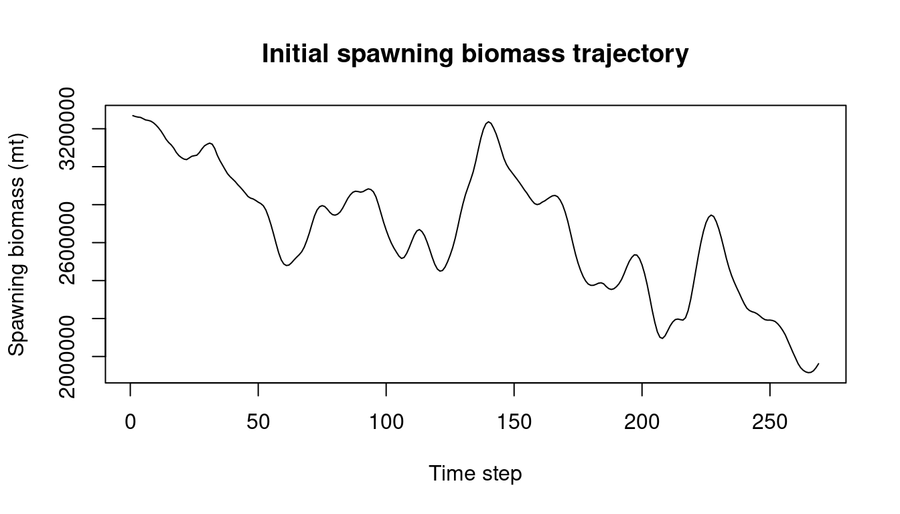](https://n-ducharmebarth-noaa.github.io/opal/articles/bet_files/figure-html/fig-init-biomass-1.png "Figure 3: Initial spawning biomass trajectory before optimization.")

Figure 3: Initial spawning biomass trajectory before optimization.

Show code

``` r

plot_catch(data = data, obj = obj)
```

[](https://n-ducharmebarth-noaa.github.io/opal/articles/bet_files/figure-html/fig-init-catch-1.png "Figure 4: Initial predicted catch by fleet compared with observed catch.")

Figure 4: Initial predicted catch by fleet compared with observed catch.

### Parameter bounds

Show code

``` r

Lwr <- rep(-Inf, length(obj$par))
Upr <- rep(Inf, length(obj$par))
Lwr[grep("log_B0", names(obj$par))] <- 12
Upr[grep("log_B0", names(obj$par))] <- 22
Lwr[grep("log_cpue_q", names(obj$par))] <- log(0.1)
Upr[grep("log_cpue_q", names(obj$par))] <- log(10)
Lwr[grep("log_lf_tau", names(obj$par))] <- rep(-9, length(grep("log_lf_tau", names(obj$par))))
Upr[grep("log_lf_tau", names(obj$par))] <- rep(9, length(grep("log_lf_tau", names(obj$par))))
Lwr[grep("rdev_y", names(obj$par))] <- rep(-5, length(grep("rdev_y", names(obj$par))))
Upr[grep("rdev_y", names(obj$par))] <- rep(5, length(grep("rdev_y", names(obj$par))))

mu_len <- mean(data$len_mid)
sd_len <- sd(data$len_mid)

par_labels <- names(obj$par)
par_sel_pos <- which(names(obj$par) == "par_sel")
par_sel_level_pos <- setNames(par_sel_pos, levels(map$par_sel))

for (f in seq_len(data$n_fishery)) {
  idx <- rep(NA_integer_, ncol(map_sel))
  for (p in seq_len(ncol(map_sel))) {
    level <- as.character(map_sel[f, p])
    if (!is.na(level)) {
      idx[p] <- par_sel_level_pos[[level]]
      par_labels[idx[p]] <- paste0("par_sel[", f, ",", p, "]")
    }
  }

  if (data$sel_type_f[f] == 1L) {
    # Logistic: inflection [5,200], width [4,500] cm
    if (!is.na(idx[1])) {
      Lwr[idx[1]] <- (5   - mu_len) / sd_len
      Upr[idx[1]] <- (200 - mu_len) / sd_len
    }

    if (!is.na(idx[2])) {
      Lwr[idx[2]] <- log(4    / sd_len)
      Upr[idx[2]] <- log(500  / sd_len)
    }
  } else {
    # Double-normal SS3 bounds
    if (!is.na(idx[1])) {
      Lwr[idx[1]] <- (10.1 - mu_len) / sd_len
      Upr[idx[1]] <- (200  - mu_len) / sd_len
    }

    if (!is.na(idx[2])) {
      Lwr[idx[2]] <- -7
      Upr[idx[2]] <-  7
    }

    # for sel_double_normal using exp(c)*sd^2 and exp(d)*sd^2:
    # keep widths positive on a practical natural scale while avoiding
    # artificial convergence on the transformed denominator bound.
    shift <- 2 * log(sd_len)
    width_log_lower <- log(4)
    width_log_upper <- 8
    if (!is.na(idx[3])) {
      Lwr[idx[3]] <- width_log_lower - shift
      Upr[idx[3]] <-  width_log_upper - shift
    }
    if (!is.na(idx[4])) {
      Lwr[idx[4]] <- width_log_lower - shift
      Upr[idx[4]] <-  width_log_upper - shift
    }

    if (!is.na(idx[5])) {
      Lwr[idx[5]] <- -9 # practical bound (instead of -999)
      Upr[idx[5]] <-  9
    }
    if (!is.na(idx[6])) {
      Lwr[idx[6]] <- -9
      Upr[idx[6]] <-  9
    }
  }
}

bounds <- data.frame(par = par_labels, lower = Lwr, upper = Upr)
```

## Optimisation

Optimise using the `nlminb` function:

Show code

``` r

control <- list(eval.max = 10000, iter.max = 10000)
# control <- list(eval.max = 100, iter.max = 100)
obj$env$tracemgc <- FALSE
opt <- list(par = obj$par)
fit_grad <- Inf
for (i in seq_len(4)) {
  # For this expanded BET fit, forming obj$he dominates runtime and makes the
  # vignette render impractical; the diagnostic scripts use gradient-only nlminb.
  opt <- nlminb(start = opt$par, objective = obj$fn, gradient = obj$gr,
                lower = Lwr, upper = Upr, control = control)
  fit_grad <- max(abs(obj$gr(opt$par)))
  if (fit_grad < 1e-2) break
}
fit_nll <- obj$fn(opt$par)
obj$env$last.par.best <- opt$par
fit_grad <- max(abs(obj$gr(opt$par)))
fit_kkt_grad <- {
  grad <- obj$gr(opt$par)
  grad_constrained <- abs(grad)
  at_lower <- is.finite(Lwr) & opt$par <= Lwr + 1e-7
  at_upper <- is.finite(Upr) & opt$par >= Upr - 1e-7
  grad_constrained[at_lower] <- pmax(0, -grad[at_lower])
  grad_constrained[at_upper] <- pmax(0, grad[at_upper])
  max(grad_constrained)
}
fit_rep <- obj$report(obj$env$last.par.best)
fit_estimability <- NULL
if (fit_grad < 1e-2) {
  fit_estimability <- tryCatch(
    check_estimability(obj = obj),
    error = function(e) e
  )
} else {
  message("Skipping check_estimability(); max |gradient| = ", signif(fit_grad, 4), ". Improve optimization first.")
}
```

### Portable fit object

Store the optimized model in an `opal_fit`. The fit retains the model
inputs, parameter map, optimizer output, bounds, diagnostics, and enough
information to rebuild the transient RTMB objective in a later R
session. MCMC output and derived products such as projections can be
attached later with
[`update_opal_fit()`](https://n-ducharmebarth-noaa.github.io/opal/reference/update_opal_fit.md).

Show code

``` r

fit <- opal_fit(
  data = data,
  obj = obj,
  opt = opt,
  bounds = list(lower = Lwr, upper = Upr),
  control = control,
  estimability = fit_estimability,
  diagnostics = list(
    max_gradient = fit_grad,
    max_kkt_gradient = fit_kkt_grad,
    likelihood_components = c(
      prior = fit_rep$lp_prior,
      penalty = fit_rep$lp_penalty,
      recruitment = fit_rep$lp_rec,
      cpue = sum(fit_rep$lp_cpue),
      length = sum(fit_rep$lp_lf),
      weight = sum(fit_rep$lp_wf)
    )
  ),
  metadata = list(
    stock = "WCPO bigeye tuna",
    workflow = "BET vignette"
  )
)

# Downstream code works from the fit rather than a loose optimizer/object pair.
obj <- opal_fit_object(fit)
fit_rep <- opal_fit_report(fit)
fit
#> <opal_fit>
#>   Model:        opal_model (schema 1)
#>   opal version: 0.0.3
#>   Parameters:   304 active
#>   Objective:    17003.83
#>   Convergence:  0
#>   Estimability: not run
#>   MCMC:         not stored
#>   Derived sets: 0
#>   Created:      2026-09-15 23:14:49 UTC

# Persist the portable fit when running an assessment:
# save_opal_fit(fit, "bet-opal-fit.rds")
```

Show code

``` r

tibble(
  metric = c(
    "nlminb convergence",
    "objective",
    "max gradient",
    "max KKT gradient",
    "B0",
    "lp_prior",
    "lp_penalty",
    "lp_rec",
    "lp_cpue",
    "lp_lf",
    "lp_wf"
  ),
  value = c(
    opt$convergence,
    fit_nll,
    fit_grad,
    fit_kkt_grad,
    fit_rep$B0,
    fit_rep$lp_prior,
    fit_rep$lp_penalty,
    fit_rep$lp_rec,
    sum(fit_rep$lp_cpue),
    sum(fit_rep$lp_lf),
    sum(fit_rep$lp_wf)
  )
) %>%
  mutate(value = signif(value, 6)) %>%
  knitr::kable()
```

| metric             |        value |
|:-------------------|-------------:|
| nlminb convergence |  0.00000e+00 |
| objective          |  1.70038e+04 |
| max gradient       |  7.41009e-01 |
| max KKT gradient   |  4.73690e-03 |
| B0                 |  7.04470e+05 |
| lp_prior           |  0.00000e+00 |
| lp_penalty         |  4.79250e-02 |
| lp_rec             |  1.93612e+02 |
| lp_cpue            | -1.22541e+02 |
| lp_lf              |  2.76126e+03 |
| lp_wf              |  1.61590e+03 |

Table 2: Optimization and likelihood-component summary for the fitted
BET model.

Compare initial and estimated parameter values:

Show code

``` r

par_table <- get_par_table(obj, parameters, map, lower = Lwr, upper = Upr, grad_tol = 1e-2)
par_table
#>            par      init     est   lwr     upr        gr gr_chk bd_chk
#> 1       log_B0  15.00000 13.5000 12.00 22.0000  4.66e-03     OK     OK
#> 2  log_cpue_q1   0.00000  0.0722 -2.30  2.3000 -3.19e-04     OK     OK
#> 3  log_cpue_q2   0.00000 -0.1180 -2.30  2.3000 -8.92e-05     OK     OK
#> 4  log_cpue_q3   0.00000 -0.0928 -2.30  2.3000 -7.13e-05     OK     OK
#> 5  log_cpue_q4   0.00000  0.0813 -2.30  2.3000 -7.21e-05     OK     OK
#> 6     par_sel1  -0.08090  0.1730 -1.72  1.7200  4.74e-03     OK     OK
#> 7     par_sel2   0.00929  0.3330 -6.63 -0.0196 -1.28e-04     OK     HI
#> 8     par_sel3   0.59200  1.0400 -6.63 -0.0196  4.08e-04     OK     HI
#> 9     par_sel4   0.41300  0.6670 -1.72  1.7200  7.73e-04     OK     OK
#> 10    par_sel6   0.21000  0.5020 -6.63 -0.0196  6.21e-01    BAD     HI
#> 11    par_sel7   0.10400  0.3450 -1.72  1.7200  2.90e-03     OK     OK
#> 12    par_sel8  -0.98400 -0.9430 -6.63 -0.0196  5.96e-02    BAD     OK
#> 13    par_sel9  -0.78100 -1.0200 -6.63 -0.0196  3.47e-04     OK     OK
#> 14   par_sel10  -1.33000 -1.3500 -1.81  1.7200 -1.75e-04     OK     OK
#> 15   par_sel11   0.63500  1.3900 -2.62  2.2000  1.02e-04     OK     OK
#> 16   par_sel12  -0.98600 -0.9840 -1.72  1.7200  3.10e-04     OK     OK
#> 17   par_sel13  -1.64000 -0.4570 -6.63 -0.0196  7.41e-01    BAD     OK
#> 18   par_sel14  -1.27000 -1.1200 -1.72  1.7200  1.61e-04     OK     OK
#> 19   par_sel15  -0.27600 -0.2010 -6.63 -0.0196  7.04e-01    BAD     OK
#> 20   par_sel26   0.03210 -0.1920 -1.72  1.7200  3.15e-04     OK     OK
#> 21   par_sel30  -1.10000 -2.6200 -6.63 -0.0196  6.45e-02    BAD     OK
#> 22   par_sel38  -3.97000 -4.4000 -6.63 -0.0196  1.28e-04     OK     OK
#> 23   par_sel39  -2.39000 -6.6300 -1.72  1.7200  1.38e-06     OK     LO
#> 24   par_sel40  -3.74000 -6.6300 -6.63 -0.0196  1.56e-01    BAD     LO
#> 25   par_sel42  -5.81000 -6.6300 -9.00  9.0000 -1.86e-04     OK     OK
#> 26   par_sel44  -3.30000 -6.6300 -1.72  1.7200  5.17e-04     OK     LO
#> 27   par_sel46 -11.30000 -6.6300 -6.63 -0.0196  8.48e-02    BAD     LO
#> 28   par_sel47 -12.60000 -6.6300 -9.00  9.0000  7.38e-05     OK     OK
#> 29   par_sel53  -3.56000 -2.4600 -1.72  1.7200 -2.61e-04     OK     LO
#> 30   par_sel55  -2.34000 -2.2500 -1.72  1.7200  4.03e-05     OK     LO
#> 31   par_sel58  -4.02000 -6.6300 -1.72  1.7200 -5.05e-05     OK     LO
#> 32   par_sel59  -3.50000 -5.9300 -9.00  9.0000  3.14e-06     OK     OK
#> 33   par_sel76   0.99900 -0.3360 -1.72  1.7200 -2.14e-05     OK     OK
#> 34   par_sel77   1.46000 -0.6520 -9.00  9.0000  2.34e-04     OK     OK
#> 35   par_sel81   0.89000 -9.0000 -1.81  1.7200  3.52e-04     OK     LO
#> 36   par_sel82  -1.29000 -9.0000 -2.62  2.2000  2.65e-01    BAD     LO
```

The selectivity diagnostics below isolate the active selectivity
parameters with large raw gradients or estimates close to bounds. A
large raw gradient on a bound usually indicates that the constrained
optimum wants to move farther in that direction; the KKT-style gradient
is the relevant convergence check under active bounds.

Show code

``` r

sel_component <- c(
  "peak/inflection",
  "top/width",
  "ascending width",
  "descending width",
  "initial selectivity",
  "final selectivity"
)

sel_units <- function(f, p) {
  if (data$sel_type_f[f] == 1L) {
    return(c("cm", "cm", NA, NA, NA, NA)[p])
  }
  c("cm", "logit", "cm^2 denominator", "cm^2 denominator",
    "proportion", "proportion")[p]
}

sel_to_natural <- function(x, f, p) {
  out <- rep(NA_real_, length(x))
  finite <- is.finite(x)
  if (!any(finite)) return(out)

  if (data$sel_type_f[f] == 1L) {
    if (p == 1L) out[finite] <- mu_len + x[finite] * sd_len
    if (p == 2L) out[finite] <- exp(x[finite]) * sd_len
  } else {
    if (p == 1L) out[finite] <- mu_len + x[finite] * sd_len
    if (p == 2L) out[finite] <- x[finite]
    if (p %in% 3:4) out[finite] <- exp(x[finite] + 2 * log(sd_len))
    if (p %in% 5:6) out[finite] <- plogis(x[finite])
  }
  out
}

sel_issue_label <- function(component, bound_status, raw_bad) {
  if (bound_status == "lower" && grepl("width", component)) {
    return("minimum width bound")
  }
  if (bound_status == "upper" && grepl("width", component)) {
    return("maximum width bound")
  }
  if (bound_status == "lower") {
    return("lower bound")
  }
  if (bound_status == "upper") {
    return("upper bound")
  }
  if (raw_bad) {
    return("interior raw gradient")
  }
  "ok"
}

sel_diag <- map_dfr(seq_len(nrow(map_sel)), function(f) {
  map_dfr(seq_len(ncol(map_sel)), function(p) {
    level <- as.character(map_sel[f, p])
    if (is.na(level)) return(tibble())

    idx <- par_sel_level_pos[[level]]
    estimate <- obj$env$last.par.best[idx]
    gradient <- obj$gr(obj$env$last.par.best)[idx]
    lower <- Lwr[idx]
    upper <- Upr[idx]
    bound_status <- case_when(
      is.finite(lower) && estimate <= lower + 1e-7 ~ "lower",
      is.finite(upper) && estimate >= upper - 1e-7 ~ "upper",
      TRUE ~ "free"
    )
    kkt_gradient <- case_when(
      bound_status == "lower" ~ max(0, -gradient),
      bound_status == "upper" ~ max(0, gradient),
      TRUE ~ abs(gradient)
    )
    raw_bad <- abs(gradient) > 1e-2

    tibble(
      fishery = f,
      fleet = fleet_names[f],
      type = if_else(data$sel_type_f[f] == 1L, "logistic", "double-normal"),
      component = sel_component[p],
      estimate = estimate,
      lower = lower,
      upper = upper,
      gradient = gradient,
      kkt_gradient = kkt_gradient,
      bound_status = bound_status,
      natural_estimate = sel_to_natural(estimate, f, p),
      natural_lower = sel_to_natural(lower, f, p),
      natural_upper = sel_to_natural(upper, f, p),
      natural_units = sel_units(f, p),
      diagnostic = sel_issue_label(sel_component[p], bound_status, raw_bad)
    )
  })
})

sel_diag_issues <- sel_diag %>%
  filter(abs(gradient) > 1e-2 | bound_status != "free") %>%
  arrange(fishery, component) %>%
  mutate(across(
    c(estimate, lower, upper, gradient, kkt_gradient,
      natural_estimate, natural_lower, natural_upper),
    ~ signif(.x, 4)
  ))

if (nrow(sel_diag_issues) == 0L) {
  cat("No active selectivity parameters have large gradients or bound checks.\n")
} else {
  sel_diag_issues %>%
    select(fishery, fleet, type, component, estimate, lower, upper,
           gradient, kkt_gradient, bound_status, natural_estimate,
           natural_lower, natural_upper, natural_units, diagnostic) %>%
    knitr::kable()
}
```

| fishery | fleet | type | component | estimate | lower | upper | gradient | kkt_gradient | bound_status | natural_estimate | natural_lower | natural_upper | natural_units | diagnostic |
|---:|:---|:---|:---|---:|---:|---:|---:|---:|:---|---:|---:|---:|:---|:---|
| 1 | F01_LL.NORTH | double-normal | descending width | -6.633 | -6.633 | -0.01961 | 0.1555000 | 0 | lower | 4.0000000 | 4.0000000 | 2981.0000 | cm^2 denominator | minimum width bound |
| 2 | F02_LL.US | double-normal | descending width | -6.633 | -6.633 | -0.01961 | 0.0847900 | 0 | lower | 4.0000000 | 4.0000000 | 2981.0000 | cm^2 denominator | minimum width bound |
| 6 | F06_LL.SOUTH | double-normal | final selectivity | -9.000 | -9.000 | 9.00000 | 0.0000031 | 0 | lower | 0.0001234 | 0.0001234 | 0.9999 | proportion | lower bound |
| 7 | F07_LL.AUS | double-normal | final selectivity | -9.000 | -9.000 | 9.00000 | 0.0002341 | 0 | lower | 0.0001234 | 0.0001234 | 0.9999 | proportion | lower bound |
| 9 | F09_PS.UNASS | double-normal | ascending width | -6.633 | -6.633 | -0.01961 | 0.6210000 | 0 | lower | 4.0000000 | 4.0000000 | 2981.0000 | cm^2 denominator | minimum width bound |
| 10 | F10_DOM.MISC | double-normal | ascending width | -6.633 | -6.633 | -0.01961 | 0.0596000 | 0 | lower | 4.0000000 | 4.0000000 | 2981.0000 | cm^2 denominator | minimum width bound |
| 12 | F12_JP.PS.N | double-normal | ascending width | -6.633 | -6.633 | -0.01961 | 0.7410000 | 0 | lower | 4.0000000 | 4.0000000 | 2981.0000 | cm^2 denominator | minimum width bound |
| 13 | F13_JP.PL | double-normal | descending width | -6.633 | -6.633 | -0.01961 | 0.7045000 | 0 | lower | 4.0000000 | 4.0000000 | 2981.0000 | cm^2 denominator | minimum width bound |
| 14 | F14_EQ.PL | double-normal | ascending width | -6.633 | -6.633 | -0.01961 | 0.0645000 | 0 | lower | 4.0000000 | 4.0000000 | 2981.0000 | cm^2 denominator | minimum width bound |
| 15 | S01_INDEX | logistic | top/width | -2.624 | -2.624 | 2.20500 | 0.2649000 | 0 | lower | 4.0000000 | 4.0000000 | 500.0000 | cm | minimum width bound |

Table 3: Active selectivity parameters with large gradients or bound
checks.

Inspect estimated recruitment deviations:

Show code

``` r

rdev_est <- obj$env$parList(obj$env$last.par.best)$rdev_y
rdev_month_label <- function(month) {
  out <- paste("month", month)
  valid <- month %in% seq_along(month.abb)
  out[valid] <- month.abb[month[valid]]
  out
}

rdev_time_lookup <- NULL
if (all(c("ts", "year", "month") %in% names(data$cpue_data))) {
  rdev_time_lookup <- data$cpue_data %>%
    distinct(time_step = ts, calendar_year = year, month) %>%
    arrange(time_step)
}

if (!is.null(rdev_time_lookup) &&
    nrow(rdev_time_lookup) == length(rdev_est) &&
    all(rdev_time_lookup$time_step == seq_along(rdev_est))) {
  rdev_season_lookup <- rdev_time_lookup %>%
    distinct(month) %>%
    arrange(month) %>%
    mutate(
      season = row_number(),
      season_label = paste0("Season ", season, " (", rdev_month_label(month), ")")
    )

  rdev_df <- rdev_time_lookup %>%
    left_join(rdev_season_lookup, by = "month")
} else {
  # BET stores quarters as sequential model time steps in this data object
  # (n_season = 1), so recover seasons from the quarterly ordering.
  rdev_n_season <- 4L
  rdev_months <- if ("month" %in% names(data$cpue_data)) {
    sort(unique(data$cpue_data$month))
  } else {
    seq_len(rdev_n_season)
  }
  if (length(rdev_months) != rdev_n_season) rdev_months <- seq_len(rdev_n_season)
  rdev_first_year <- if ("year" %in% names(data$cpue_data)) {
    min(data$cpue_data$year, na.rm = TRUE)
  } else {
    data$first_yr
  }

  rdev_season_lookup <- tibble(
    season = seq_len(rdev_n_season),
    month = rdev_months,
    season_label = paste0("Season ", season, " (", rdev_month_label(month), ")")
  )
  rdev_df <- tibble(
    time_step = seq_along(rdev_est),
    calendar_year = rdev_first_year + (time_step - 1L) %/% rdev_n_season,
    season = ((time_step - 1L) %% rdev_n_season) + 1L
  ) %>%
    left_join(rdev_season_lookup, by = "season")
}

rdev_df <- rdev_df %>%
  mutate(
    season_label = factor(season_label, levels = rdev_season_lookup$season_label),
    rdev = as.numeric(rdev_est),
    estimated = !is.na(map_rdev)
  )

ggplot(rdev_df, aes(x = calendar_year, y = rdev)) +
  geom_hline(yintercept = 0, linewidth = 0.3, colour = "grey40") +
  geom_line() +
  geom_point(aes(colour = estimated), size = 0.8) +
  facet_wrap(~ season_label, ncol = 2) +
  scale_colour_manual(values = c(`FALSE` = "grey40", `TRUE` = "firebrick")) +
  scale_x_continuous(breaks = scales::breaks_pretty(n = 6)) +
  labs(x = "Calendar year", y = "Recruitment deviation", colour = "Estimated")
```

[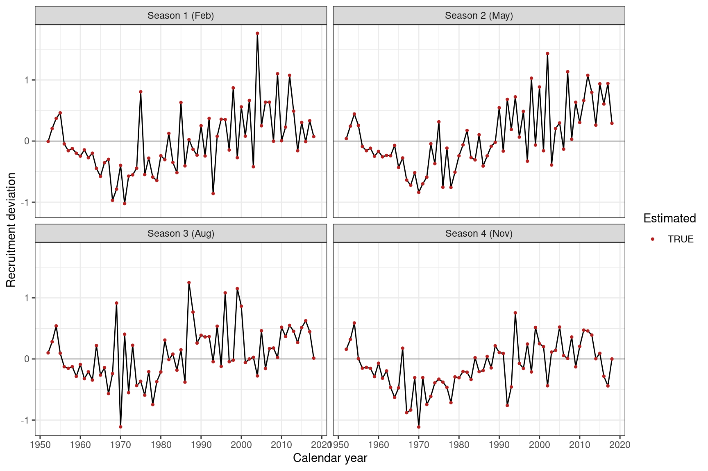](https://n-ducharmebarth-noaa.github.io/opal/articles/bet_files/figure-html/fig-rdev-1.png "Figure 5: Estimated recruitment deviations split by assessment season.")

Figure 5: Estimated recruitment deviations split by assessment season.

### Selectivity

Visualise the selectivity-at-length curves by fleet in
[Figure 6](#fig-selectivity-length).

Show code

``` r

par_sel_est <- obj$env$parList(obj$env$last.par.best)$par_sel
par_sel_ref <- parameters$par_sel

map_sel_mat <- matrix(map$par_sel, nrow = nrow(par_sel_est), ncol = ncol(par_sel_est))
fishery_estimated <- apply(map_sel_mat, 1, function(row) any(!is.na(row)))

sel_est_df <- do.call(rbind, lapply(seq_len(data$n_fishery), function(f) {
  sel_l <- if (data$sel_type_f[f] == 1L) {
    sel_logistic(len_mid, par_sel_est[f, ])
  } else {
    sel_double_normal(len_mid, par_sel_est[f, ])
  }
  data.frame(
    fishery = f,
    fleet_name = fleet_names[f],
    length = len_mid,
    selectivity = as.numeric(sel_l),
    estimated = fishery_estimated[f]
  )
}))

sel_orig_df <- do.call(rbind, lapply(seq_len(data$n_fishery), function(f) {
  sel_l <- if (data$sel_type_f[f] == 1L) {
    sel_logistic(len_mid, par_sel_ref[f, ])
  } else {
    sel_double_normal(len_mid, par_sel_ref[f, ])
  }
  data.frame(
    fishery = f,
    fleet_name = fleet_names[f],
    length = len_mid,
    selectivity = as.numeric(sel_l)
  )
}))

ggplot(data = sel_est_df, aes(x = length, y = selectivity, colour = estimated)) +
  geom_line() +
  geom_line(
    data = sel_orig_df,
    aes(x = length, y = selectivity),
    inherit.aes = FALSE,
    colour = "black",
    linetype = "dashed",
    linewidth = 0.7
  ) +
  facet_wrap(fleet_name ~ ., ncol = 4) +
  labs(x = "Length (cm)", y = "Selectivity") +
  coord_cartesian(ylim = c(0, 1))
```

[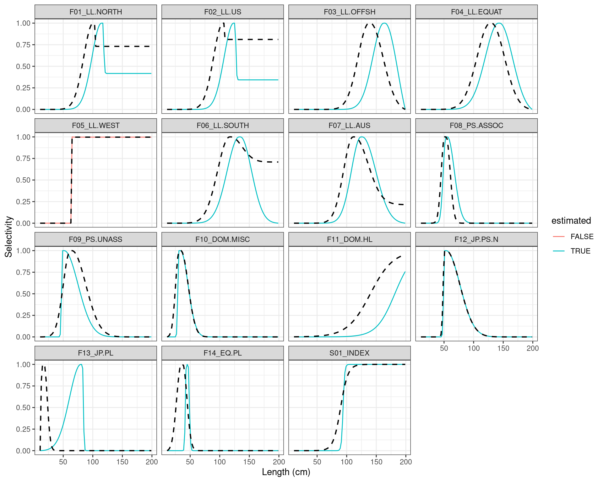](https://n-ducharmebarth-noaa.github.io/opal/articles/bet_files/figure-html/fig-selectivity-length-1.png "Figure 6: Selectivity-at-length by fleet. Coloured lines use the current parameter values; dashed black lines show the bundled reference.")

Figure 6: Selectivity-at-length by fleet. Coloured lines use the current
parameter values; dashed black lines show the bundled reference.

The corresponding selectivity-at-age curves are shown in
[Figure 7](#fig-selectivity-age). For comparison with SS3’s reported
age-selectivity output, the plotted curves are scaled to a maximum of 1
within each fleet. The model still uses the unscaled PLA-integrated
values in `rep$sel_fya`.

Show code

``` r

rep <- obj$report(obj$env$last.par.best)
sel_fya <- rep$sel_fya

sel_df <- expand.grid(fishery = 1:data$n_fishery, age = 1:data$n_age)
sel_df$selectivity <- sapply(1:nrow(sel_df), function(i) {
  sel_fya[sel_df$fishery[i], 1, sel_df$age[i]]
})
sel_df$real_age <- sel_df$age / 4
sel_df$fleet_name <- fleet_names[sel_df$fishery]
sel_df <- sel_df %>%
  group_by(fishery) %>%
  mutate(selectivity_reported = selectivity / max(selectivity, na.rm = TRUE)) %>%
  ungroup()

ggplot(sel_df, aes(x = real_age, y = selectivity_reported)) +
  geom_line() +
  facet_wrap(~fleet_name, ncol = 4) +
  labs(x = "Age (years)", y = "Selectivity") +
  ylim(0, 1)
```

[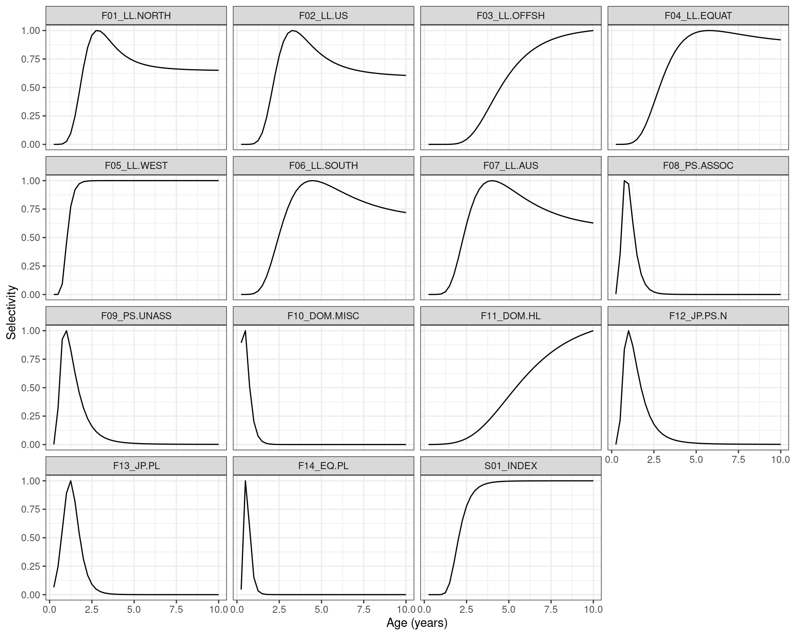](https://n-ducharmebarth-noaa.github.io/opal/articles/bet_files/figure-html/fig-selectivity-age-1.png "Figure 7: Reported selectivity-at-age by fleet after integrating length selectivity over the age-length key and scaling each fleet to a maximum of 1 for SS3-style plotting.")

Figure 7: Reported selectivity-at-age by fleet after integrating length
selectivity over the age-length key and scaling each fleet to a maximum
of 1 for SS3-style plotting.

[Table 4](#tbl-sel-par) summarises the selectivity parameter values and
the map status.

Show code

``` r

# Three sources to compare side by side:
#   1. Initial values used to build obj   (parameters$par_sel)
#   2. Bundled reference values            (wcpo_bet_parameters$par_sel)
#   3. Estimated / mapped status           (map$par_sel)
#
# par_sel is [n_fishery x 6] with columns (a, b, c, d, e, f) for double-normal
# or (par1, par2) for logistic (cols 3-6 ignored). `factor(map_sel)` flattens
# matrices column-major, so wrap the map vector back into the same shape.

n_f <- nrow(parameters$par_sel)
n_p <- ncol(parameters$par_sel)
col_lbls <- c("a (peak)", "b (plateau)", "c (asc width)", "d (desc width)", "e (init sel)", "f (final sel)")

# Estimated/fixed status from the map
map_sel_mat <- if (is.null(map$par_sel)) {
  matrix(seq_len(n_f * n_p), n_f, n_p) # everything estimated if no map
} else {
  matrix(map$par_sel, n_f, n_p)
}
estimated_mat <- !is.na(map_sel_mat)

# Reference values (may not have row/col names — assume same shape)
ref_mat <- as.matrix(wcpo_bet_parameters$par_sel)
stopifnot("wcpo_bet_parameters$par_sel must match parameters$par_sel shape" = all(dim(ref_mat) == c(n_f, n_p)))

# Selectivity type (logistic = 1, double-normal = 2)
sel_type_lbl <- ifelse(data$sel_type_f == 1L, "logistic", "double-normal")

# For logistic fisheries, columns 3-6 are unused -> NA-out for clarity
init_mat <- parameters$par_sel
for (f in seq_len(n_f)) {
  if (data$sel_type_f[f] == 1L) {
    init_mat[f, 3:6] <- NA
    ref_mat[f, 3:6] <- NA
    estimated_mat[f, 3:6] <- FALSE
  }
}

# Assemble long table
sel_par_tbl <- tibble(
  fishery    = rep(seq_len(n_f), times = n_p),
  fleet_name = rep(fleet_names[seq_len(n_f)], times = n_p),
  sel_type   = rep(sel_type_lbl, times = n_p),
  param      = rep(col_lbls, each = n_f),
  init       = as.numeric(init_mat),
  reference  = as.numeric(ref_mat),
  estimated  = as.vector(estimated_mat)
) %>%
  mutate(diff = init - reference) %>%
  arrange(fishery, match(param, col_lbls))

sel_par_tbl %>%
  mutate(
    init      = ifelse(is.na(init),      "—", formatC(init,      digits = 3, format = "f")),
    reference = ifelse(is.na(reference), "—", formatC(reference, digits = 3, format = "f")),
    diff      = ifelse(is.na(diff),      "—", formatC(diff,      digits = 3, format = "f")),
    estimated = ifelse(estimated, "✓", "")
  ) %>%
  select(Fleet = fleet_name,
         Type = sel_type,
         Param = param,
         Initial = init,
         `Reference (bundled)` = reference,
         `Δ (init − ref)` = diff,
         `Est?` = estimated) %>%
  knitr::kable(align   = c("l", "l", "l", "r", "r", "r", "c"))
```

| Fleet | Type | Param | Initial | Reference (bundled) | Δ (init − ref) | Est? |
|:---|:---|:---|---:|---:|---:|:--:|
| F01_LL.NORTH | double-normal | a (peak) | -0.081 | -0.081 | 0.000 | ✓ |
| F01_LL.NORTH | double-normal | b (plateau) | -5.000 | -5.000 | 0.000 |  |
| F01_LL.NORTH | double-normal | c (asc width) | -1.801 | 2.209 | -4.010 |  |
| F01_LL.NORTH | double-normal | d (desc width) | -11.323 | -7.313 | -4.010 | ✓ |
| F01_LL.NORTH | double-normal | e (init sel) | -9.000 | -9.000 | 0.000 |  |
| F01_LL.NORTH | double-normal | f (final sel) | 0.999 | 0.999 | 0.000 | ✓ |
| F02_LL.US | double-normal | a (peak) | 0.009 | 0.009 | 0.000 | ✓ |
| F02_LL.US | double-normal | b (plateau) | -5.000 | -5.000 | 0.000 |  |
| F02_LL.US | double-normal | c (asc width) | -1.795 | 2.215 | -4.010 |  |
| F02_LL.US | double-normal | d (desc width) | -12.641 | -8.631 | -4.010 | ✓ |
| F02_LL.US | double-normal | e (init sel) | -9.000 | -9.000 | 0.000 |  |
| F02_LL.US | double-normal | f (final sel) | 1.457 | 1.457 | 0.000 | ✓ |
| F03_LL.OFFSH | double-normal | a (peak) | 0.592 | 0.592 | 0.000 | ✓ |
| F03_LL.OFFSH | double-normal | b (plateau) | -5.000 | -5.000 | 0.000 |  |
| F03_LL.OFFSH | double-normal | c (asc width) | -1.508 | 2.502 | -4.010 |  |
| F03_LL.OFFSH | double-normal | d (desc width) | -1.173 | 2.837 | -4.010 |  |
| F03_LL.OFFSH | double-normal | e (init sel) | -9.000 | -9.000 | 0.000 |  |
| F03_LL.OFFSH | double-normal | f (final sel) | -495.000 | -495.000 | 0.000 |  |
| F04_LL.EQUAT | double-normal | a (peak) | 0.413 | 0.413 | 0.000 | ✓ |
| F04_LL.EQUAT | double-normal | b (plateau) | -5.000 | -5.000 | 0.000 |  |
| F04_LL.EQUAT | double-normal | c (asc width) | -1.145 | 2.865 | -4.010 |  |
| F04_LL.EQUAT | double-normal | d (desc width) | -1.147 | 2.863 | -4.010 |  |
| F04_LL.EQUAT | double-normal | e (init sel) | -9.000 | -9.000 | 0.000 |  |
| F04_LL.EQUAT | double-normal | f (final sel) | -495.000 | -495.000 | 0.000 |  |
| F05_LL.WEST | double-normal | a (peak) | -0.754 | -0.754 | 0.000 |  |
| F05_LL.WEST | double-normal | b (plateau) | -5.000 | -5.000 | 0.000 |  |
| F05_LL.WEST | double-normal | c (asc width) | -14.682 | -10.672 | -4.010 |  |
| F05_LL.WEST | double-normal | d (desc width) | -8.722 | -4.713 | -4.010 |  |
| F05_LL.WEST | double-normal | e (init sel) | -9.000 | -9.000 | 0.000 |  |
| F05_LL.WEST | double-normal | f (final sel) | 5.849 | 5.849 | 0.000 |  |
| F06_LL.SOUTH | double-normal | a (peak) | 0.210 | 0.210 | 0.000 | ✓ |
| F06_LL.SOUTH | double-normal | b (plateau) | -5.000 | -5.000 | 0.000 |  |
| F06_LL.SOUTH | double-normal | c (asc width) | -1.312 | 2.698 | -4.010 |  |
| F06_LL.SOUTH | double-normal | d (desc width) | -1.468 | 2.542 | -4.010 |  |
| F06_LL.SOUTH | double-normal | e (init sel) | -9.000 | -9.000 | 0.000 |  |
| F06_LL.SOUTH | double-normal | f (final sel) | 0.890 | 0.890 | 0.000 | ✓ |
| F07_LL.AUS | double-normal | a (peak) | 0.104 | 0.104 | 0.000 | ✓ |
| F07_LL.AUS | double-normal | b (plateau) | -5.000 | -5.000 | 0.000 |  |
| F07_LL.AUS | double-normal | c (asc width) | -1.772 | 2.238 | -4.010 |  |
| F07_LL.AUS | double-normal | d (desc width) | -1.081 | 2.928 | -4.010 |  |
| F07_LL.AUS | double-normal | e (init sel) | -9.000 | -9.000 | 0.000 |  |
| F07_LL.AUS | double-normal | f (final sel) | -1.292 | -1.292 | 0.000 | ✓ |
| F08_PS.ASSOC | double-normal | a (peak) | -0.984 | -0.984 | 0.000 | ✓ |
| F08_PS.ASSOC | double-normal | b (plateau) | -5.000 | -5.000 | 0.000 |  |
| F08_PS.ASSOC | double-normal | c (asc width) | -3.966 | 0.044 | -4.010 | ✓ |
| F08_PS.ASSOC | double-normal | d (desc width) | -3.563 | 0.447 | -4.010 | ✓ |
| F08_PS.ASSOC | double-normal | e (init sel) | -9.000 | -9.000 | 0.000 |  |
| F08_PS.ASSOC | double-normal | f (final sel) | -9.000 | -9.000 | 0.000 |  |
| F09_PS.UNASS | double-normal | a (peak) | -0.781 | -0.781 | 0.000 | ✓ |
| F09_PS.UNASS | double-normal | b (plateau) | -5.000 | -5.000 | 0.000 |  |
| F09_PS.UNASS | double-normal | c (asc width) | -2.389 | 1.621 | -4.010 | ✓ |
| F09_PS.UNASS | double-normal | d (desc width) | -1.023 | 2.986 | -4.010 |  |
| F09_PS.UNASS | double-normal | e (init sel) | -9.000 | -9.000 | 0.000 |  |
| F09_PS.UNASS | double-normal | f (final sel) | -9.000 | -9.000 | 0.000 |  |
| F10_DOM.MISC | double-normal | a (peak) | -1.334 | -1.334 | 0.000 | ✓ |
| F10_DOM.MISC | double-normal | b (plateau) | -5.000 | -5.000 | 0.000 |  |
| F10_DOM.MISC | double-normal | c (asc width) | -3.742 | 0.267 | -4.010 | ✓ |
| F10_DOM.MISC | double-normal | d (desc width) | -2.343 | 1.667 | -4.010 | ✓ |
| F10_DOM.MISC | double-normal | e (init sel) | -495.000 | -495.000 | 0.000 |  |
| F10_DOM.MISC | double-normal | f (final sel) | -9.000 | -9.000 | 0.000 |  |
| F11_DOM.HL | logistic | a (peak) | 0.635 | 0.635 | 0.000 | ✓ |
| F11_DOM.HL | logistic | b (plateau) | 0.032 | 0.032 | 0.000 | ✓ |
| F11_DOM.HL | logistic | c (asc width) | — | — | — |  |
| F11_DOM.HL | logistic | d (desc width) | — | — | — |  |
| F11_DOM.HL | logistic | e (init sel) | — | — | — |  |
| F11_DOM.HL | logistic | f (final sel) | — | — | — |  |
| F12_JP.PS.N | double-normal | a (peak) | -0.986 | -0.986 | 0.000 | ✓ |
| F12_JP.PS.N | double-normal | b (plateau) | -5.000 | -5.000 | 0.000 |  |
| F12_JP.PS.N | double-normal | c (asc width) | -5.813 | -1.803 | -4.010 | ✓ |
| F12_JP.PS.N | double-normal | d (desc width) | -1.043 | 2.967 | -4.010 |  |
| F12_JP.PS.N | double-normal | e (init sel) | -9.000 | -9.000 | 0.000 |  |
| F12_JP.PS.N | double-normal | f (final sel) | -9.000 | -9.000 | 0.000 |  |
| F13_JP.PL | double-normal | a (peak) | -1.640 | -1.640 | 0.000 | ✓ |
| F13_JP.PL | double-normal | b (plateau) | -5.000 | -5.000 | 0.000 |  |
| F13_JP.PL | double-normal | c (asc width) | -1.402 | 2.607 | -4.010 |  |
| F13_JP.PL | double-normal | d (desc width) | -4.023 | -0.013 | -4.010 | ✓ |
| F13_JP.PL | double-normal | e (init sel) | -9.000 | -9.000 | 0.000 |  |
| F13_JP.PL | double-normal | f (final sel) | -9.000 | -9.000 | 0.000 |  |
| F14_EQ.PL | double-normal | a (peak) | -1.274 | -1.274 | 0.000 | ✓ |
| F14_EQ.PL | double-normal | b (plateau) | -5.000 | -5.000 | 0.000 |  |
| F14_EQ.PL | double-normal | c (asc width) | -3.300 | 0.710 | -4.010 | ✓ |
| F14_EQ.PL | double-normal | d (desc width) | -3.501 | 0.509 | -4.010 | ✓ |
| F14_EQ.PL | double-normal | e (init sel) | -9.000 | -9.000 | 0.000 |  |
| F14_EQ.PL | double-normal | f (final sel) | -9.000 | -9.000 | 0.000 |  |
| S01_INDEX | logistic | a (peak) | -0.276 | -0.276 | 0.000 | ✓ |
| S01_INDEX | logistic | b (plateau) | -1.104 | -1.104 | 0.000 | ✓ |
| S01_INDEX | logistic | c (asc width) | — | — | — |  |
| S01_INDEX | logistic | d (desc width) | — | — | — |  |
| S01_INDEX | logistic | e (init sel) | — | — | — |  |
| S01_INDEX | logistic | f (final sel) | — | — | — |  |

Table 4: Selectivity parameter values, bundled reference values, and map
status.

### Diagnostics

The estimability result computed with the fit is stored in compact form,
so it travels with the other model diagnostics:

Show code

``` r

fit$fit$estimability
#> NULL
```

Look for any parameters with high correlations (absolute correlation \>
0.95) using the `get_cor_pairs` function:

Show code

``` r

get_cor_pairs(obj = obj, threshold = 0.95)
#>       par1     par2 correlation
#> 1 par_sel6 par_sel7       0.962
```

Parameter standard errors can be computed with `sdreport(obj)` when
needed. It is not run here because the diagnostic figures below use
fitted trajectories directly from `obj$report(obj$env$last.par.best)`.

### Data fits

Inspect fitted CPUE and catch. CPUE fits are shown in
[Figure 9](#fig-cpue-fit); catch fits and residuals are plotted below.

[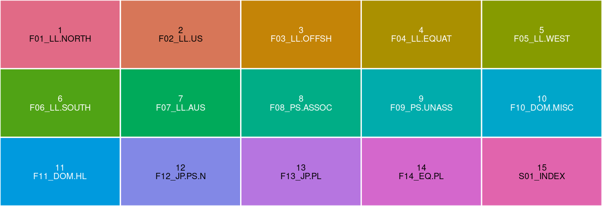](https://n-ducharmebarth-noaa.github.io/opal/articles/bet_files/figure-html/fig-fleet-palette-1.png "Figure 8: Fleet colour palette used for fishery-level diagnostic plots.")

Figure 8: Fleet colour palette used for fishery-level diagnostic plots.

Show code

``` r

if (data$cpue_switch == 0) {
  cat("CPUE likelihood is switched off (cpue_switch = 0), so no predicted CPUE to show.\n")
} else {
  rep <- obj$report(obj$env$last.par.best)
  
  df <- data$cpue_data %>%
    mutate(obs_id = row_number(), pred = rep$cpue_pred, sigma = rep$cpue_sigma)
  
  # Simulations
  n_sim <- 0
  df_sim <- if (n_sim > 0) {
    map_dfr(seq_len(n_sim), function(s) {
      sim_log <- obj$simulate(obj$env$last.par.best)$cpue_log_obs
      tibble(
        obs_id = seq_along(sim_log),
        year = data$cpue_data$year,
        month = data$cpue_data$month,
        fishery = data$cpue_data$fishery,
        sim_id = s,
        sim = exp(sim_log)
      )
    })
  } else {
    tibble(
      obs_id = integer(),
      year = numeric(),
      month = integer(),
      fishery = integer(),
      sim_id = integer(),
      sim = numeric()
    )
  }
  
  month_levels <- sort(unique(data$cpue_data$month))
  fish_levels <- sort(unique(data$cpue_data$fishery))
  format_facets <- function(d) {
    d %>%
      mutate(
        month = factor(month, levels = month_levels, labels = paste0("Month: ", month_levels)),
        fishery = factor(fishery, levels = fish_levels, labels = paste0("Fishery: ", fish_levels))
      )
  }
  df <- format_facets(df)
  df_sim <- format_facets(df_sim)
  
  ggplot(data = df, aes(x = year)) +
    {if (n_sim > 0) geom_line(data = df_sim, aes(y = sim, group = sim_id),
                              colour = "lightblue", alpha = 0.5, linewidth = 0.3)} +
    geom_linerange(aes(ymin = exp(log(value) - sigma),
                       ymax = exp(log(value) + sigma),
                       colour = "Observed"), alpha = 0.6) +
    geom_point(aes(y = value, colour = "Observed")) +
    geom_line(aes(y = pred, colour = "Predicted"), linewidth = 0.8) +
    facet_grid(fishery ~ month, scales = "free_y") +
    scale_y_continuous(limits = c(0, NA), expand = expansion(mult = c(0, 0.05))) +
    scale_x_continuous(breaks = scales::pretty_breaks()) +
    scale_colour_manual(values = c(Observed = "black", Predicted = "red3")) +
    labs(x = "Year", y = "CPUE", colour = NULL,
         subtitle = if (n_sim > 0) paste0(n_sim, " fitted-model simulations (grey)") else NULL) +
    theme(legend.position = "bottom")
}
```

[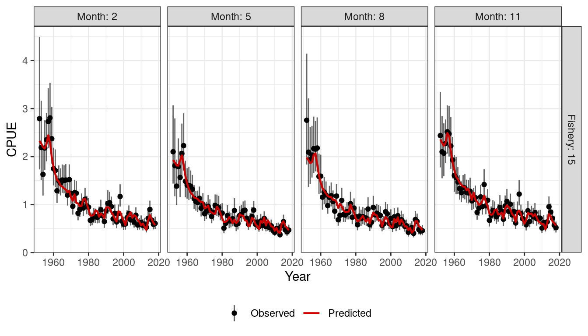](https://n-ducharmebarth-noaa.github.io/opal/articles/bet_files/figure-html/fig-cpue-fit-1.png "Figure 9: Observed and predicted CPUE by fishery and quarter, with simulated replicate series.")

Figure 9: Observed and predicted CPUE by fishery and quarter, with
simulated replicate series.

Show code

``` r

sum(fit_rep$catch_pred_ysf - data$catch_obs_ysf)
#> [1] 0.9999072
plot_catch(data = data, obj = obj)
plot_catch(data = data, obj = obj, plot_resid = TRUE)
```

[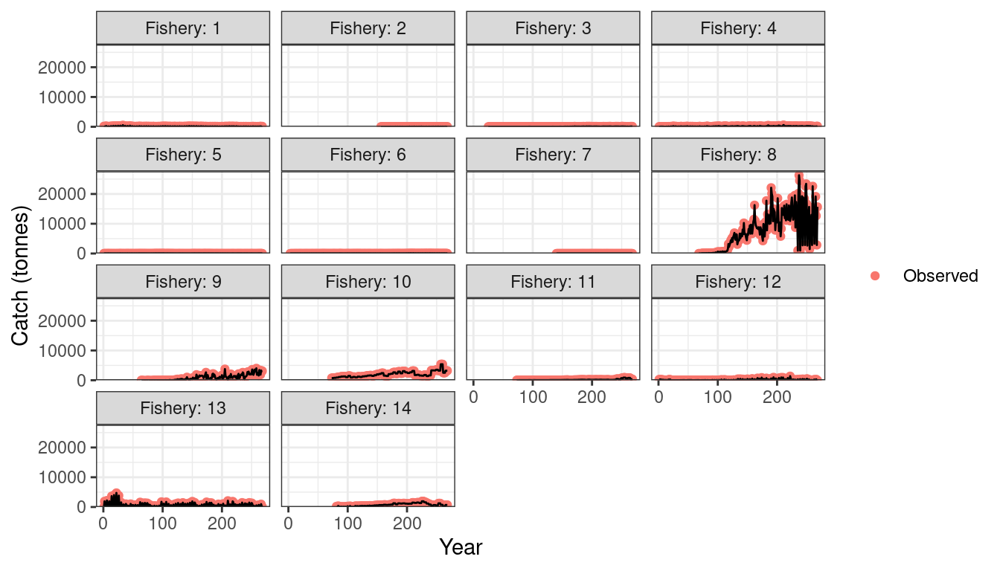](https://n-ducharmebarth-noaa.github.io/opal/articles/bet_files/figure-html/fig-catch-fit-1.png "Figure 10: Predicted catch and catch residual diagnostics for the initial model state.")

Figure 10: Predicted catch and catch residual diagnostics for the
initial model state.

[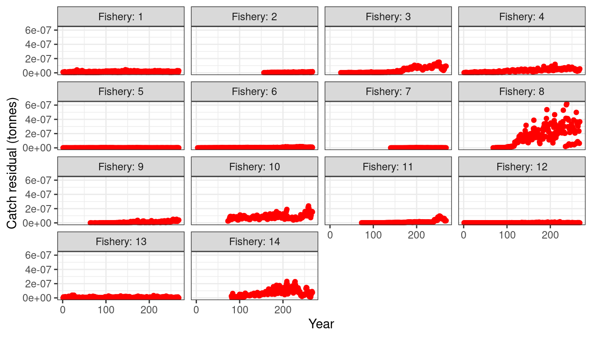](https://n-ducharmebarth-noaa.github.io/opal/articles/bet_files/figure-html/fig-catch-fit-2.png "Figure 11: Predicted catch and catch residual diagnostics for the initial model state.")

Figure 11: Predicted catch and catch residual diagnostics for the
initial model state.

Inspect predicted vs observed length compositions when the
length-composition likelihood is active.

Show code

``` r

# Convert model timestep -> "YYYY Qn" label
ts_to_label <- function(ts, first_yr = 1952, n_season = 4) {
  yr <- first_yr + (ts - 1L) %/% n_season
  qn <- ((ts - 1L) %% n_season) + 1L
  paste0(yr, " Q", qn)
}

if (data$lf_switch == 0) {
  cat("Length composition likelihood is switched off (lf_switch = 0), so no predicted length compositions to show.\n")
} else {
  lf_rep <- obj$report(obj$env$last.par.best)
  lf_pred <- lf_rep$lf_pred
  names(lf_pred) <- data$lf_fishery_f

  flat_to_comp_list <- function(v, n_f, fishery_f, minbin, maxbin) {
    out <- vector("list", length(n_f))
    offset <- 0L
    for (k in seq_along(n_f)) {
      f <- fishery_f[k]
      nbins <- maxbin[f] - minbin[f] + 1L
      n_values <- n_f[k] * nbins
      m <- matrix(v[seq.int(offset + 1L, length.out = n_values)],
                  nrow = n_f[k], ncol = nbins, byrow = TRUE)
      rs <- rowSums(m)
      rs[rs == 0] <- 1
      out[[k]] <- m / rs
      offset <- offset + n_values
    }
    out
  }

  comp_to_lf_long <- function(comp_list, fishery_f) {
    map_dfr(seq_along(comp_list), function(i) {
      f <- fishery_f[i]
      bins <- data$len_mid[data$lf_minbin[f]:data$lf_maxbin[f]]
      m <- comp_list[[i]]
      colnames(m) <- bins
      as.data.frame.table(m, responseName = "proportion",
                          stringsAsFactors = FALSE) %>%
        transmute(
          fishery = f,
          length = as.numeric(Var2),
          proportion = as.numeric(proportion)
        )
    })
  }

  for (k in seq_along(lf_pred)) {
    f <- data$lf_fishery_f[k]
    colnames(lf_pred[[k]]) <- data$len_mid[data$lf_minbin[f]:data$lf_maxbin[f]]
  }

  lf_obs_vec <- switch(as.character(data$lf_switch),
                       `1` = data$lf_obs_flat,
                       `2` = data$lf_obs_prop,
                       `3` = data$lf_obs_ints)
  lf_obs_list <- flat_to_comp_list(lf_obs_vec, data$lf_n_f, data$lf_fishery_f,
                                   data$lf_minbin, data$lf_maxbin)

  df_pred_mean <- comp_to_lf_long(lf_pred, data$lf_fishery_f) %>%
    group_by(fishery, length) %>%
    summarise(proportion = mean(proportion, na.rm = TRUE), .groups = "drop") %>%
    mutate(series = "Predicted")

  df_obs_mean <- comp_to_lf_long(lf_obs_list, data$lf_fishery_f) %>%
    group_by(fishery, length) %>%
    summarise(proportion = mean(proportion, na.rm = TRUE), .groups = "drop") %>%
    mutate(series = "Observed")

  n_sim <- 5
  df_sim_mean <- map_dfr(seq_len(n_sim), function(s) {
    sim <- obj$simulate(obj$env$last.par.best)
    sim_vec <- switch(as.character(data$lf_switch),
                      `1` = sim$lf_obs_flat,
                      `2` = sim$lf_obs_prop,
                      `3` = sim$lf_obs_ints)
    sim_list <- flat_to_comp_list(sim_vec, data$lf_n_f, data$lf_fishery_f,
                                  data$lf_minbin, data$lf_maxbin)
    comp_to_lf_long(sim_list, data$lf_fishery_f) %>%
      group_by(fishery, length) %>%
      summarise(proportion = mean(proportion, na.rm = TRUE), .groups = "drop") %>%
      mutate(sim_id = s)
  })

  fishery_levels <- paste("Fishery", sort(unique(data$lf_fishery_f)))
  df_lf_mean <- bind_rows(df_obs_mean, df_pred_mean) %>%
    mutate(fishery = factor(paste("Fishery", fishery), levels = fishery_levels))
  df_sim_mean <- df_sim_mean %>%
    mutate(fishery = factor(paste("Fishery", fishery), levels = fishery_levels))

  ggplot() +
    geom_col(data = filter(df_lf_mean, series == "Observed"),
             aes(x = length, y = proportion), fill = "grey75", width = 1.8) +
    geom_line(data = df_sim_mean,
              aes(x = length, y = proportion, group = sim_id),
              colour = "steelblue", alpha = 0.35, linewidth = 0.35) +
    geom_line(data = filter(df_lf_mean, series == "Predicted"),
              aes(x = length, y = proportion), colour = "red3", linewidth = 0.8) +
    facet_wrap(~ fishery, ncol = 2, scales = "free_y") +
    scale_y_continuous(limits = c(0, NA), expand = expansion(mult = c(0, 0.05))) +
    labs(x = "Length (cm)", y = "Mean proportion") +
    theme_minimal()
}
```

[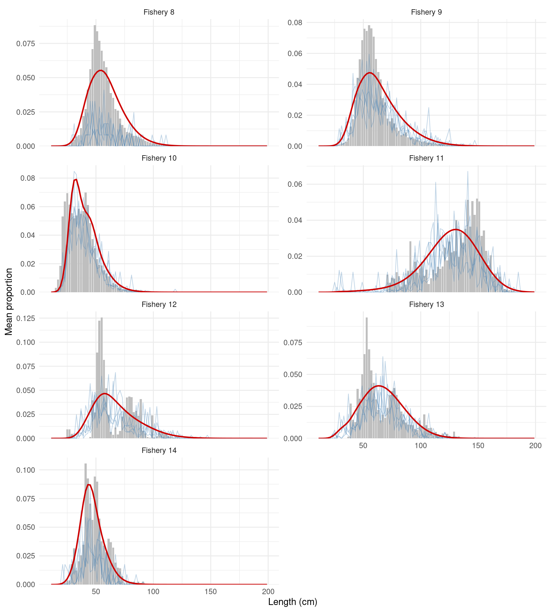](https://n-ducharmebarth-noaa.github.io/opal/articles/bet_files/figure-html/fig-lf-diagnostics-1.png "Figure 12: Mean observed, predicted, and simulated length composition proportions for active length-composition fisheries.")

Figure 12: Mean observed, predicted, and simulated length composition
proportions for active length-composition fisheries.

Inspect predicted vs observed weight compositions when the
weight-composition likelihood is enabled.

Show code

``` r

if (data$wf_switch == 0) {
  cat("Weight composition likelihood is switched off (wf_switch = 0), so no predicted weight compositions to show.\n")
} else {
  wf_rep <- obj$report(obj$env$last.par.best)
  wf_pred <- wf_rep$wf_pred
  names(wf_pred) <- data$wf_fishery_f

  flat_to_comp_list <- function(v, n_f, fishery_f, minbin, maxbin) {
    out <- vector("list", length(n_f))
    offset <- 0L
    for (k in seq_along(n_f)) {
      f <- fishery_f[k]
      nbins <- maxbin[f] - minbin[f] + 1L
      n_values <- n_f[k] * nbins
      m <- matrix(v[seq.int(offset + 1L, length.out = n_values)],
                  nrow = n_f[k], ncol = nbins, byrow = TRUE)
      rs <- rowSums(m)
      rs[rs == 0] <- 1
      out[[k]] <- m / rs
      offset <- offset + n_values
    }
    out
  }

  comp_to_wf_long <- function(comp_list, fishery_f) {
    map_dfr(seq_along(comp_list), function(i) {
      f <- fishery_f[i]
      bins <- data$wt_mid[data$wf_minbin[f]:data$wf_maxbin[f]]
      m <- comp_list[[i]]
      colnames(m) <- bins
      as.data.frame.table(m, responseName = "proportion",
                          stringsAsFactors = FALSE) %>%
        transmute(
          fishery = f,
          weight = as.numeric(Var2),
          proportion = as.numeric(proportion)
        )
    })
  }

  for (k in seq_along(wf_pred)) {
    f <- data$wf_fishery_f[k]
    colnames(wf_pred[[k]]) <- data$wt_mid[data$wf_minbin[f]:data$wf_maxbin[f]]
  }

  wf_obs_vec <- switch(as.character(data$wf_switch),
                       `1` = data$wf_obs_flat,
                       `2` = data$wf_obs_prop,
                       `3` = data$wf_obs_ints)
  wf_obs_list <- flat_to_comp_list(wf_obs_vec, data$wf_n_f, data$wf_fishery_f,
                                   data$wf_minbin, data$wf_maxbin)

  df_wf_pred_mean <- comp_to_wf_long(wf_pred, data$wf_fishery_f) %>%
    group_by(fishery, weight) %>%
    summarise(proportion = mean(proportion, na.rm = TRUE), .groups = "drop") %>%
    mutate(series = "Predicted")

  df_wf_obs_mean <- comp_to_wf_long(wf_obs_list, data$wf_fishery_f) %>%
    group_by(fishery, weight) %>%
    summarise(proportion = mean(proportion, na.rm = TRUE), .groups = "drop") %>%
    mutate(series = "Observed")

  n_sim <- 5
  df_wf_sim_mean <- map_dfr(seq_len(n_sim), function(s) {
    sim <- obj$simulate(obj$env$last.par.best)
    sim_vec <- switch(as.character(data$wf_switch),
                      `1` = sim$wf_obs_flat,
                      `2` = sim$wf_obs_prop,
                      `3` = sim$wf_obs_ints)
    sim_list <- flat_to_comp_list(sim_vec, data$wf_n_f, data$wf_fishery_f,
                                  data$wf_minbin, data$wf_maxbin)
    comp_to_wf_long(sim_list, data$wf_fishery_f) %>%
      group_by(fishery, weight) %>%
      summarise(proportion = mean(proportion, na.rm = TRUE), .groups = "drop") %>%
      mutate(sim_id = s)
  })

  fishery_levels <- paste("Fishery", sort(unique(data$wf_fishery_f)))
  df_wf_mean <- bind_rows(df_wf_obs_mean, df_wf_pred_mean) %>%
    mutate(fishery = factor(paste("Fishery", fishery), levels = fishery_levels))
  df_wf_sim_mean <- df_wf_sim_mean %>%
    mutate(fishery = factor(paste("Fishery", fishery), levels = fishery_levels))

  ggplot() +
    geom_col(data = filter(df_wf_mean, series == "Observed"),
             aes(x = weight, y = proportion), fill = "grey75", width = 0.9) +
    geom_line(data = df_wf_sim_mean,
              aes(x = weight, y = proportion, group = sim_id),
              colour = "steelblue", alpha = 0.35, linewidth = 0.35) +
    geom_line(data = filter(df_wf_mean, series == "Predicted"),
              aes(x = weight, y = proportion), colour = "red3", linewidth = 0.8) +
    facet_wrap(~ fishery, ncol = 2, scales = "free_y") +
    scale_y_continuous(limits = c(0, NA), expand = expansion(mult = c(0, 0.05))) +
    labs(x = "Weight (kg)", y = "Mean proportion") +
    theme_minimal()
}
```

[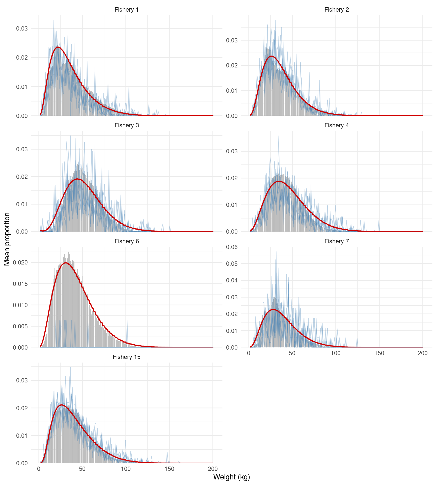](https://n-ducharmebarth-noaa.github.io/opal/articles/bet_files/figure-html/fig-wf-diagnostics-1.png "Figure 13: Mean observed, predicted, and simulated weight composition proportions for active weight-composition fisheries.")

Figure 13: Mean observed, predicted, and simulated weight composition
proportions for active weight-composition fisheries.

Inspect estimated spawning biomass trajectory:

Show code

``` r

sb_df <- tibble(
  time_step = seq_along(fit_rep$spawning_biomass_y),
  spawning_biomass = as.numeric(fit_rep$spawning_biomass_y)
)

ggplot(sb_df, aes(x = time_step, y = spawning_biomass)) +
  geom_line(colour = "blue", linewidth = 1) +
  scale_y_continuous(limits = c(0, NA), expand = expansion(mult = c(0, 0.05))) +
  labs(
    x = "Model time step",
    y = "Spawning biomass (mt)",
    title = "Estimated spawning biomass trajectory"
  )
```

[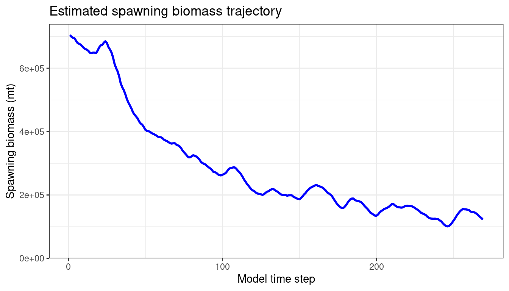](https://n-ducharmebarth-noaa.github.io/opal/articles/bet_files/figure-html/fig-opt-spbio-1.png "Figure 14: Estimated spawning biomass trajectory.")

Figure 14: Estimated spawning biomass trajectory.

Inspect estimated relative spawning biomass ($`SB/B_0`$). The dynamic
depletion ratio ($`SB/SB_{F=0}`$) is also reported in
[Table 5](#tbl-depletion-metrics) because it uses a different
denominator and should not be read as the usual $`SB/B_0`$ trajectory.

Show code

``` r

sb_dep_df <- tibble(
  time_step = seq_along(fit_rep$spawning_biomass_y),
  `SB/B0` = as.numeric(fit_rep$spawning_biomass_y) / fit_rep$B0,
  `SB/SB_F0` = as.numeric(fit_rep$dynamic_depletion_y)
) %>%
  pivot_longer(-time_step, names_to = "quantity", values_to = "value")

ggplot(sb_dep_df, aes(x = time_step, y = value, colour = quantity)) +
  geom_line(linewidth = 0.9) +
  scale_y_continuous(limits = c(0, NA), expand = expansion(mult = c(0, 0.05))) +
  labs(
    x = "Model time step",
    y = "Relative spawning biomass",
    colour = NULL,
    title = "Estimated relative spawning biomass trajectory",
    subtitle = "SB/B0 and dynamic depletion use different denominators"
  )
```

[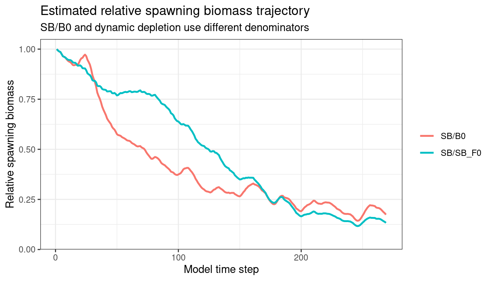](https://n-ducharmebarth-noaa.github.io/opal/articles/bet_files/figure-html/fig-opt-spdep-1.png "Figure 15: Estimated relative spawning biomass trajectories.")

Figure 15: Estimated relative spawning biomass trajectories.

Show code

``` r

tibble(
  metric = c("SB/B0", "SB/SB_F0"),
  final_value = c(
    tail(fit_rep$spawning_biomass_y, 1) / fit_rep$B0,
    tail(fit_rep$dynamic_depletion_y, 1)
  )
) %>%
  mutate(final_value = round(final_value, 3)) %>%
  knitr::kable()
```

| metric   | final_value |
|:---------|------------:|
| SB/B0    |       0.174 |
| SB/SB_F0 |       0.133 |

Table 5: Final-year relative biomass diagnostics using the estimated
fit.

## Simulation

The CPUE series is set up using RTMB’s `OBS` mechanism inside the model,
which allows simulation via `obj$simulate()`. The plots below compare
observed, predicted, and simulated log-CPUE.

Show code

``` r

if (data$cpue_switch == 0) {
  cat("CPUE likelihood is switched off (cpue_switch = 0), so no simulated CPUE to show.\n")
} else {
  cpue_rep <- obj$report(obj$env$last.par.best)
  cpue_indices <- sort(unique(data$cpue_data$index))
  cpue_months <- sort(unique(data$cpue_data$month))
  cpue_index_labels <- setNames(
    paste0("Month: ", cpue_months),
    as.character(seq_along(cpue_months))
  )

  cpue_df <- data$cpue_data %>%
    mutate(
      obs_id = row_number(),
      observed = log(value),
      predicted = log(cpue_rep$cpue_pred),
      index = factor(index, levels = cpue_indices,
                     labels = cpue_index_labels[as.character(cpue_indices)])
    )

  n_sim <- 10
  cpue_sim_df <- map_dfr(seq_len(n_sim), function(s) {
    tibble(
      obs_id = cpue_df$obs_id,
      year = cpue_df$year,
      index = cpue_df$index,
      sim_id = s,
      simulated = obj$simulate(obj$env$last.par.best)$cpue_log_obs
    )
  })

  ggplot(cpue_df, aes(x = year)) +
    geom_line(data = cpue_sim_df, aes(y = simulated, group = sim_id),
              colour = "grey70", alpha = 0.55, linewidth = 0.35) +
    geom_point(aes(y = observed), colour = "black", size = 1) +
    geom_line(aes(y = predicted), colour = "red3", linewidth = 0.8) +
    facet_wrap(~ index, ncol = 2, scales = "free_y") +
    labs(x = "Year", y = "log(CPUE)",
         subtitle = paste0(n_sim, " fitted-model simulations in grey")) +
    theme_minimal()
}
```

[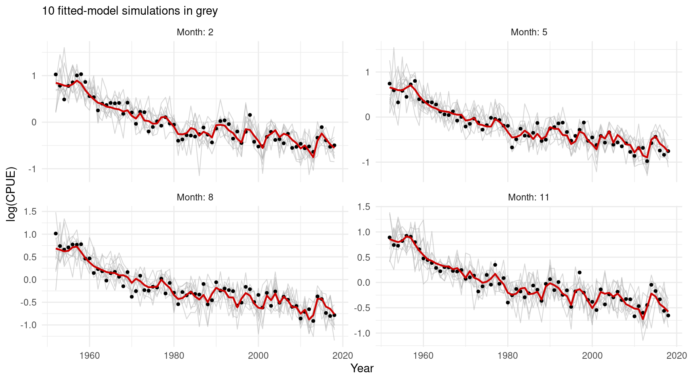](https://n-ducharmebarth-noaa.github.io/opal/articles/bet_files/figure-html/fig-cpue-sim-1.png "Figure 16: Observed, predicted, and simulated log-CPUE faceted by index.")

Figure 16: Observed, predicted, and simulated log-CPUE faceted by index.

## One step ahead (OSA) residuals

OSA residuals are a replacement for Pearson residuals:

Show code

``` r

if (data$cpue_switch == 0) {
  cat("CPUE likelihood is switched off (cpue_switch = 0), so no OSA residuals to show.\n")
} else {
  osa_cpue <- oneStepPredict(obj = obj, observation.name = "cpue_log_obs",
                             method = "oneStepGeneric", trace = FALSE)
  osa_df <- data$cpue_data %>%
    mutate(residual = osa_cpue$res)

  if ("month" %in% names(osa_df)) {
    cpue_months <- sort(unique(osa_df$month))
    osa_df <- osa_df %>%
      mutate(index = factor(month, levels = cpue_months,
                            labels = month.name[cpue_months]))
  } else {
    cpue_indices <- sort(unique(osa_df$index))
    osa_df <- osa_df %>%
      mutate(index = factor(index, levels = cpue_indices,
                            labels = paste("Index", cpue_indices)))
  }

  osa_qq <- osa_df %>%
    group_by(index) %>%
    arrange(residual, .by_group = TRUE) %>%
    mutate(
      q_theoretical = qnorm(ppoints(n())),
      panel = "Normal Q-Q"
    ) %>%
    ungroup() %>%
    transmute(index, panel, x = q_theoretical, y = residual)

  osa_time <- osa_df %>%
    transmute(index, panel = "Residual by year", x = year, y = residual)

  ggplot(bind_rows(osa_qq, osa_time), aes(x = x, y = y)) +
    geom_hline(yintercept = 0, colour = "grey55", linewidth = 0.35) +
    geom_hline(yintercept = c(-2, 2), linetype = "dashed",
               colour = "grey55", linewidth = 0.35) +
    geom_abline(data = data.frame(panel = "Normal Q-Q"),
                aes(intercept = 0, slope = 1),
                inherit.aes = FALSE, colour = "grey55", linewidth = 0.35) +
    geom_segment(data = osa_time,
                 aes(x = x, xend = x, y = 0, yend = y),
                 inherit.aes = FALSE, colour = "grey65", linewidth = 0.25) +
    geom_point(size = 0.9, alpha = 0.75, colour = "black") +
    facet_grid(index ~ panel, scales = "free_x") +
    labs(x = NULL, y = "OSA residual") +
    theme_minimal()
}
```

[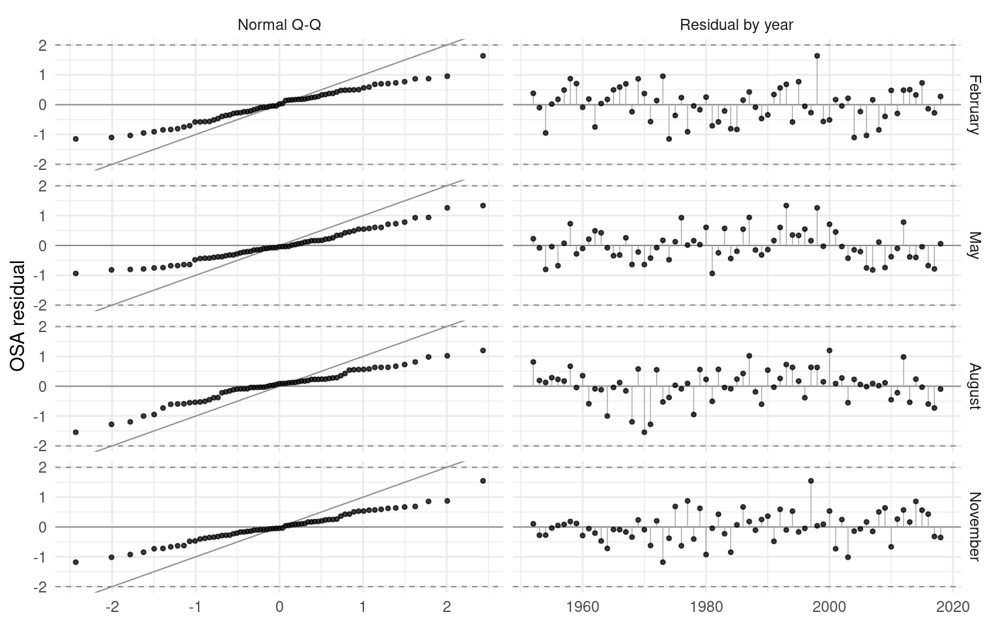](https://n-ducharmebarth-noaa.github.io/opal/articles/bet_files/figure-html/fig-osa-residuals-1.png "Figure 17: One-step-ahead CPUE residual QQ and residual-index diagnostics.")

Figure 17: One-step-ahead CPUE residual QQ and residual-index
diagnostics.

## Composition OSA residuals

The BET diagnostic data used here contain length- and weight-composition
observations rather than age-composition observations. The residual plot
below follows the same structure as the SBT composition residual plots,
using `compResidual` row-by-row for the active multinomial composition
likelihoods.

Show code

``` r

if (!requireNamespace("compResidual", quietly = TRUE)) {
  cat("Package 'compResidual' is required for composition residual plots.\n")
} else if (data$lf_switch != 1 || data$wf_switch != 1) {
  cat("This diagnostic chunk currently supports multinomial LF/WF likelihoods (switch = 1).\n")
} else {
  normalise_composition <- function(x) {
    total <- sum(x, na.rm = TRUE)
    if (!is.finite(total) || total <= 0) {
      return(rep(NA_real_, length(x)))
    }
    x / total
  }

  quiet_comp_residual_warnings <- function(expr) {
    withCallingHandlers(
      expr,
      warning = function(w) {
        if (grepl("NA/NaN function evaluation", conditionMessage(w), fixed = TRUE)) {
          invokeRestart("muffleWarning")
        }
      }
    )
  }

  ts_to_decimal_year <- function(ts, first_yr = data$first_yr,
                                 n_season = data$n_season) {
    first_yr + (as.integer(ts) - 1L) %/% n_season +
      ((as.integer(ts) - 1L) %% n_season) / n_season
  }

  flat_to_count_list <- function(v, n_f, fishery_f, minbin, maxbin) {
    out <- vector("list", length(n_f))
    offset <- 0L
    for (k in seq_along(n_f)) {
      f <- fishery_f[k]
      nbins <- maxbin[f] - minbin[f] + 1L
      n_values <- n_f[k] * nbins
      out[[k]] <- matrix(
        v[seq.int(offset + 1L, length.out = n_values)],
        nrow = n_f[k],
        ncol = nbins,
        byrow = TRUE
      )
      offset <- offset + n_values
    }
    out
  }

  composition_residual_rows <- function(type_label, y_label, obs_flat,
                                        pred_list, n_by_row, n_f, fishery_f,
                                        year_fi, minbin, maxbin, bins) {
    obs_list <- flat_to_count_list(obs_flat, n_f, fishery_f, minbin, maxbin)
    row_offset <- 0L

    map_dfr(seq_along(pred_list), function(i) {
      f <- fishery_f[i]
      n_rows <- n_f[i]
      row_ids <- seq.int(row_offset + 1L, length.out = n_rows)
      row_offset <<- row_offset + n_rows
      active_bins <- bins[minbin[f]:maxbin[f]]
      pred <- pred_list[[i]]
      obs <- obs_list[[i]]
      years <- year_fi[[as.character(f)]]

      map_dfr(seq_len(n_rows), function(j) {
        obs_prop <- normalise_composition(obs[j, ])
        pred_prop <- normalise_composition(pred[j, ])
        n_eff <- n_by_row[row_ids[j]]

        if (anyNA(obs_prop) || anyNA(pred_prop) ||
            !is.finite(n_eff) || n_eff <= 0) {
          return(tibble())
        }

        pred_prop <- pred_prop + 1e-6
        pred_prop <- pred_prop / sum(pred_prop)
        residual <- as.numeric(quiet_comp_residual_warnings(
          compResidual::resMulti(
            obs = matrix(obs_prop * n_eff, ncol = 1L),
            pred = matrix(pred_prop, ncol = 1L)
          )
        ))
        keep <- seq_along(residual)

        plot_year <- years[j]
        if (!is.finite(plot_year) || plot_year < 1000) {
          plot_year <- ts_to_decimal_year(years[j])
        }

        tibble(
          composition = type_label,
          y_label = y_label,
          fishery_num = f,
          fishery = fleet_names[f],
          row = row_ids[j],
          year = plot_year,
          bin = active_bins[keep],
          observed = obs_prop[keep],
          predicted = pred_prop[keep],
          n_eff = n_eff,
          residual = residual,
          Sign = if_else(residual >= 0, "Positive", "Negative")
        )
      })
    })
  }

  lf_residuals <- composition_residual_rows(
    type_label = "Length",
    y_label = "Length (cm)",
    obs_flat = data$lf_obs_flat,
    pred_list = fit_rep$lf_pred,
    n_by_row = data$lf_n,
    n_f = data$lf_n_f,
    fishery_f = data$lf_fishery_f,
    year_fi = if (!is.null(data$lf_calendar_year_fi)) data$lf_calendar_year_fi else data$lf_year_fi,
    minbin = data$lf_minbin,
    maxbin = data$lf_maxbin,
    bins = data$len_mid
  )

  wf_residuals <- composition_residual_rows(
    type_label = "Weight",
    y_label = "Weight (kg)",
    obs_flat = data$wf_obs_flat,
    pred_list = fit_rep$wf_pred,
    n_by_row = data$wf_n,
    n_f = data$wf_n_f,
    fishery_f = data$wf_fishery_f,
    year_fi = if (!is.null(data$wf_calendar_year_fi)) data$wf_calendar_year_fi else data$wf_year_fi,
    minbin = data$wf_minbin,
    maxbin = data$wf_maxbin,
    bins = data$wt_mid
  )

  comp_residuals <- bind_rows(lf_residuals, wf_residuals) %>%
    filter(is.finite(residual)) %>%
    mutate(
      fishery = factor(fishery, levels = fleet_names[sort(unique(fishery_num))]),
      composition = factor(composition, levels = c("Length", "Weight"))
    )

  residual_summary <- comp_residuals %>%
    summarise(
      n = n(),
      mean = mean(residual),
      SDNR = sd(residual),
      MAR = median(abs(residual)),
      max_abs = max(abs(residual)),
      .by = c(composition, fishery)
    ) %>%
    mutate(across(where(is.numeric), ~ signif(.x, 4)))

  plot_comp_bubbles <- function(plot_data, title, y_label) {
    ggplot(
      plot_data,
      aes(x = year, y = bin, size = abs(residual), fill = Sign)
    ) +
      geom_point(shape = 21, alpha = 0.65, colour = "grey30", stroke = 0.08) +
      facet_wrap(~ fishery, ncol = 2, scales = "free_y") +
      scale_fill_manual(values = c(Positive = "white", Negative = "black")) +
      scale_size_area(
        max_size = 4,
        limits = c(0, 4),
        oob = scales::squish,
        name = "|OSA residual|"
      ) +
      scale_x_continuous(breaks = scales::breaks_pretty(n = 6)) +
      labs(
        title = title,
        x = "Year",
        y = y_label,
        fill = "Residual sign",
        caption = "White = observed greater than predicted; black = observed less than predicted"
      ) +
      theme_bw() +
      theme(
        legend.position = "bottom",
        panel.grid.minor = element_blank(),
        strip.text = element_text(size = 9)
      )
  }

  lf_plot_data <- filter(comp_residuals, composition == "Length")
  wf_plot_data <- filter(comp_residuals, composition == "Weight")

  if (nrow(lf_plot_data) > 0L) {
    print(plot_comp_bubbles(lf_plot_data, "Length Composition OSA Residuals", "Length (cm)"))
  }

  if (nrow(wf_plot_data) > 0L) {
    print(plot_comp_bubbles(wf_plot_data, "Weight Composition OSA Residuals", "Weight (kg)"))
  }

  ggplot(comp_residuals, aes(sample = residual)) +
    stat_qq(size = 0.45, alpha = 0.45) +
    stat_qq_line(colour = "red3", linetype = "dashed") +
    facet_wrap(~ composition, ncol = 2, scales = "free") +
    labs(
      title = "Composition OSA Q-Q Normal Check",
      x = "Theoretical quantiles",
      y = "Sample quantiles"
    ) +
    theme_bw()
}
```

[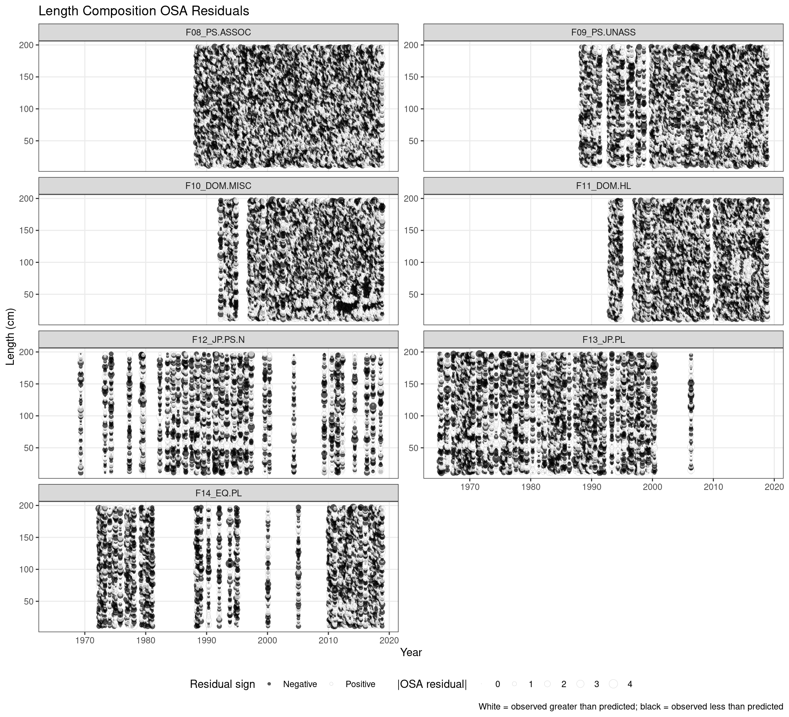](https://n-ducharmebarth-noaa.github.io/opal/articles/bet_files/figure-html/fig-comp-residuals-1.png "Figure 18: Composition OSA residual bubble plots by fishery and Q-Q diagnostics for active length and weight composition likelihoods.")

Figure 18: Composition OSA residual bubble plots by fishery and Q-Q
diagnostics for active length and weight composition likelihoods.

[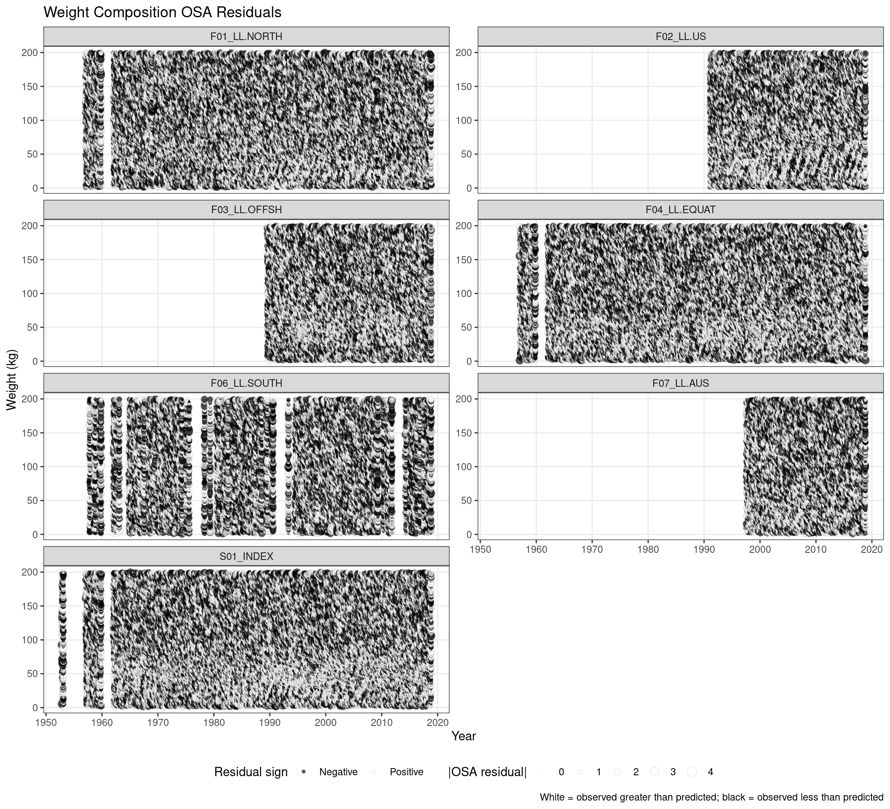](https://n-ducharmebarth-noaa.github.io/opal/articles/bet_files/figure-html/fig-comp-residuals-2.png "Figure 19: Composition OSA residual bubble plots by fishery and Q-Q diagnostics for active length and weight composition likelihoods.")

Figure 19: Composition OSA residual bubble plots by fishery and Q-Q
diagnostics for active length and weight composition likelihoods.

[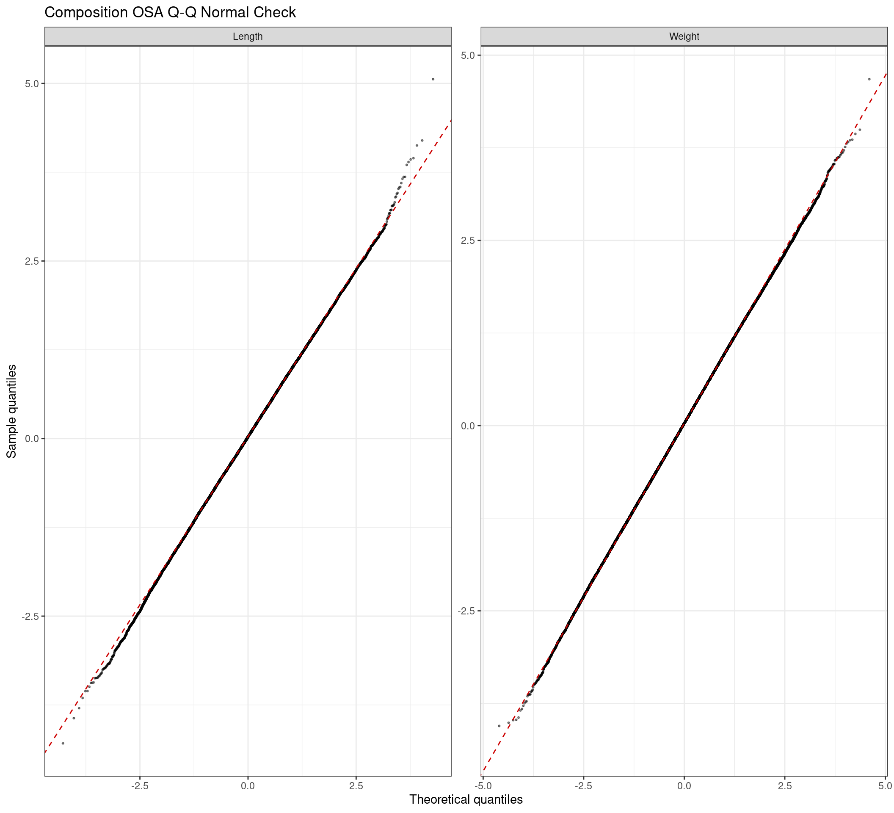](https://n-ducharmebarth-noaa.github.io/opal/articles/bet_files/figure-html/fig-comp-residuals-3.png "Figure 20: Composition OSA residual bubble plots by fishery and Q-Q diagnostics for active length and weight composition likelihoods.")

Figure 20: Composition OSA residual bubble plots by fishery and Q-Q
diagnostics for active length and weight composition likelihoods.

| composition | fishery      |     n |      mean |   SDNR |    MAR | max_abs |
|:------------|:-------------|------:|----------:|-------:|-------:|--------:|
| Length      | F08_PS.ASSOC | 11470 |  0.010770 | 0.9625 | 0.6599 |   4.291 |
| Length      | F09_PS.UNASS |  8272 |  0.045830 | 0.9221 | 0.6201 |   3.948 |
| Length      | F10_DOM.MISC |  8648 |  0.040800 | 0.9608 | 0.6450 |   3.458 |
| Length      | F11_DOM.HL   |  8366 |  0.024760 | 0.9181 | 0.6145 |   3.930 |
| Length      | F12_JP.PS.N  |  4042 |  0.020980 | 0.9965 | 0.6470 |   4.197 |
| Length      | F13_JP.PL    |  7238 |  0.008420 | 0.9515 | 0.6310 |   5.060 |
| Length      | F14_EQ.PL    |  5358 | -0.015710 | 0.9711 | 0.6583 |   3.937 |
| Weight      | F01_LL.NORTH | 47360 |  0.025510 | 0.9368 | 0.6437 |   4.011 |
| Weight      | F02_LL.US    | 22290 |  0.044460 | 0.8864 | 0.5996 |   3.651 |
| Weight      | F03_LL.OFFSH | 23480 |  0.031070 | 0.9319 | 0.6311 |   3.993 |
| Weight      | F04_LL.EQUAT | 47760 |  0.034900 | 0.9379 | 0.6437 |   4.054 |
| Weight      | F06_LL.SOUTH | 31440 | -0.003209 | 0.9848 | 0.6651 |   3.860 |
| Weight      | F07_LL.AUS   | 17110 |  0.024860 | 0.9483 | 0.6493 |   3.970 |
| Weight      | S01_INDEX    | 48160 |  0.045210 | 0.8997 | 0.6069 |   4.676 |

Table 6: Composition OSA residual diagnostics by composition type and
fishery.
