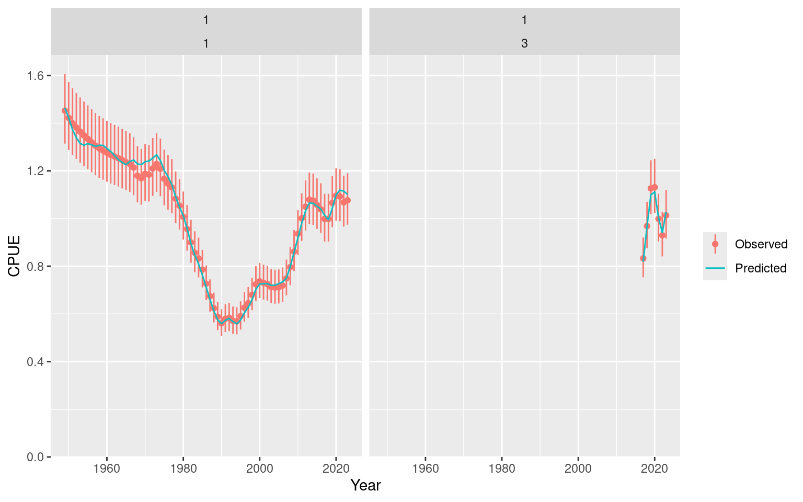

# Review an Opakapaka Fit

## Review an `opal_fit`

This vignette examines the portable fixed-effects opakapaka fit created
for the Quickstart. It rebuilds the transient RTMB objective only to
obtain model predictions, so no optimisation is performed here.

The bundled fit may have been saved under a different R version.
Portable integrity permits that difference while still checking model
compatibility and requiring the rebuilt objective to match the saved
value.

``` r

library(opal)

fit_path <- system.file("extdata", "opaka_quickstart_fit.rds", package = "opal")
if (!nzchar(fit_path)) {
  stop("The bundled opakapaka quickstart fit is unavailable.", call. = FALSE)
}
fit <- read_opal_fit(fit_path, strict = TRUE, integrity = "portable")
fit
#> <opal_fit>
#>   Model:        opal_model (schema 1)
#>   opal version: 0.0.4
#>   Parameters:   127 active
#>   Objective:    1832.412
#>   Convergence:  0
#>   Estimability: All 127 active fixed-effect parameters are estimable.
#>   MCMC:         not stored
#>   Derived sets: 0
#>   Created:      2026-09-21 20:58:28 UTC
summary(fit)
#> opal fitted-model summary
#> 
#>       model model_schema     scientific_version opal_version
#>  opal_model            1 opal_model_contract_v4        0.0.4
#> 
#> Optimization
#>  method n_parameters objective convergence                  message
#>  nlminb          127  1832.412           0 relative convergence (4)
#> 
#> Estimability: All 127 active fixed-effect parameters are estimable.
```

### CPUE fit

``` r

object <- opal_fit_object(fit, integrity = "portable")
plot_data <- fit$data
plot_data$cpue_data$season <- 1L
plot_cpue(plot_data, object)
```



### Diagnostics

The compact estimability result and maximum absolute gradient were saved
with the fit. They can be inspected without creating a new objective.

``` r

list(
  estimability = fit$fit$estimability,
  maximum_gradient = fit$fit$diagnostics$max_gradient
)
#> $estimability
#> $estimability$status
#> [1] "estimable"
#> 
#> $estimability$message
#> [1] "All 127 active fixed-effect parameters are estimable."
#> 
#> $estimability$n_parameters
#> [1] 127
#> 
#> $estimability$n_non_estimable_combinations
#> [1] 0
#> 
#> $estimability$implicated_parameters
#> character(0)
#> 
#> 
#> $maximum_gradient
#> [1] 0.003773483
```
