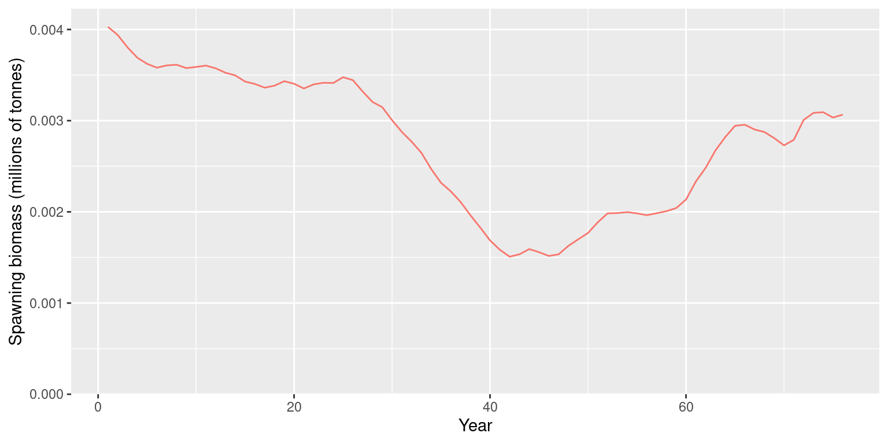

# Quickstart Guide

This guide fits a fixed-effects assessment for ’opakapaka
(*Pristipomoides filamentosus*) using the bundled data. The example uses
the same age convention and selectivity parameterization as its Stock
Synthesis 3 (SS3) reference model, then stores the fitted result as an
`opal_fit` S3 object.

`opal_fit` is the portable boundary for an assessment: it retains the
model inputs, fitted parameters, optimization results, and diagnostics
without serializing RTMB’s session-specific objective. An objective is
rebuilt only when it is needed for reporting or plotting.

## Load the model inputs

The package includes a model-input builder so this vignette and the
stored example fit use the same data preparation and fixed-effects
configuration.

``` r

library(opal)
library(RTMB)

inputs <- opaka_quickstart_inputs()
```

The input builder loads the bundled opakapaka catch, CPUE, and
length-composition data; uses biological ages 0–43 to align with SS3;
applies the SS3 recruitment bias ramps; and prepares multinomial length
compositions for the commercial and research fleets. It fixes
life-history parameters at their SS3 values and estimates biomass scale,
CPUE catchability, recruitment deviations, initial age structure, and
selectivity for fleets with length data.

``` r

data.frame(
  quantity = c("Years", "Ages", "Fisheries", "Length-composition samples"),
  value = c(
    inputs$data$n_year,
    inputs$data$n_age,
    inputs$data$n_fishery,
    length(inputs$data$lf_year)
  )
)
#>                     quantity value
#> 1                      Years    75
#> 2                       Ages    44
#> 3                  Fisheries     3
#> 4 Length-composition samples    82
```

## Fit the model

Build the RTMB objective, derive bounds for its active parameters, and
optimize twice. The second pass starts at the first optimum and is a
useful convergence check for this small fixed-effects model.

``` r

control <- list(eval.max = 10000, iter.max = 10000)
obj <- RTMB::MakeADFun(
  func = cmb(opal_model, inputs$data),
  parameters = inputs$parameters,
  map = inputs$map,
  silent = TRUE
)
bounds <- get_bounds(obj, inputs$parameters)

opt <- nlminb(
  obj$par, obj$fn, obj$gr,
  lower = bounds$lower, upper = bounds$upper, control = control
)
opt <- nlminb(
  opt$par, obj$fn, obj$gr,
  lower = bounds$lower, upper = bounds$upper, control = control
)
invisible(obj$fn(opt$par))

fit <- opal_fit(
  data = inputs$data,
  obj = obj,
  opt = opt,
  bounds = list(lower = bounds$lower, upper = bounds$upper),
  control = control,
  estimability = tryCatch(check_estimability(obj), error = identity),
  diagnostics = list(max_gradient = max(abs(obj$gr(opt$par)))),
  metadata = list(stock = "Opakapaka", model = "Fixed-effects quickstart")
)
fit
#> <opal_fit>
#>   Model:        opal_model (schema 1)
#>   opal version: 0.0.4
#>   Parameters:   127 active
#>   Objective:    1832.412
#>   Convergence:  0
#>   Estimability: All 127 active fixed-effect parameters are estimable.
#>   MCMC:         not stored
#>   Derived sets: 0
#>   Created:      2026-09-21 22:01:11 UTC
```

## Save a portable fitted model

[`save_opal_fit()`](https://n-ducharmebarth-noaa.github.io/opal/reference/opal_fit_io.md)
writes only portable R data. Reading it back verifies the stored
scientific contract and rebuilds the transient RTMB objective when it is
required.

``` r

fit_path <- tempfile("opaka-quickstart-", fileext = ".rds")
save_opal_fit(fit, fit_path)
fit <- read_opal_fit(fit_path, strict = TRUE)
summary(fit)
#> opal fitted-model summary
#> 
#>       model model_schema     scientific_version opal_version
#>  opal_model            1 opal_model_contract_v4        0.0.4
#> 
#> Optimization
#>  method n_parameters objective convergence                  message
#>  nlminb          127  1832.412           0 relative convergence (4)
#> 
#> Estimability: All 127 active fixed-effect parameters are estimable.
```

## Inspect spawning biomass

Use
[`opal_fit_object()`](https://n-ducharmebarth-noaa.github.io/opal/reference/opal_fit_object.md)
only at the runtime boundary required by the existing plotting API. For
direct derived values, use `opal_fit_report(fit)`.

``` r

report <- opal_fit_report(fit)
object <- opal_fit_object(fit)

plot_biomass_spawning(
  data_list = list(fit$data),
  object_list = list(object),
  relative = FALSE,
  labels = "Fixed effects"
)
```



The companion
[`vignette("opakapaka-fit-review")`](https://n-ducharmebarth-noaa.github.io/opal/articles/opakapaka-fit-review.md)
reopens the bundled `opal_fit` from this workflow for a fast review of
the optimization summary, CPUE fit, estimability, and gradients without
refitting the model.
