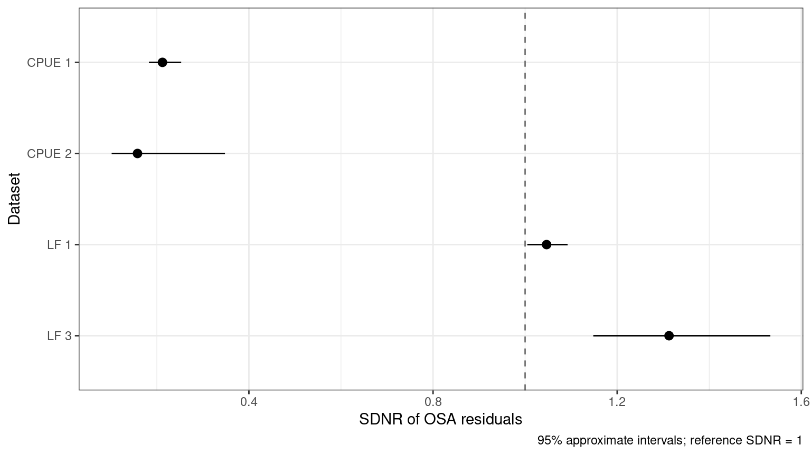
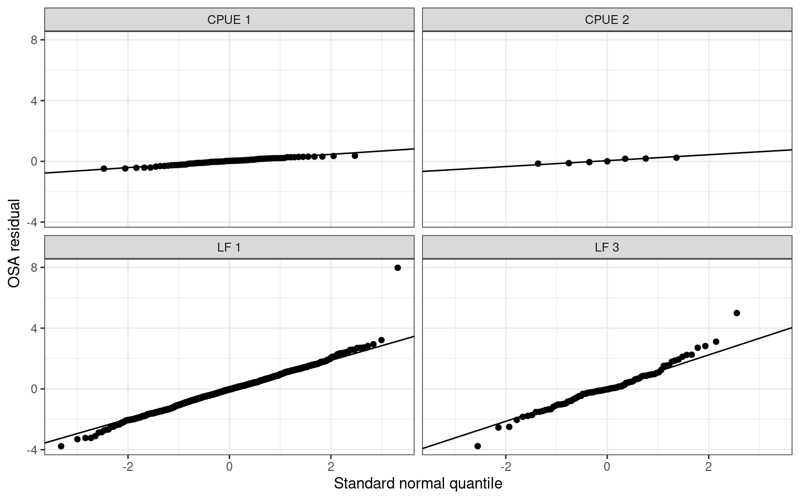
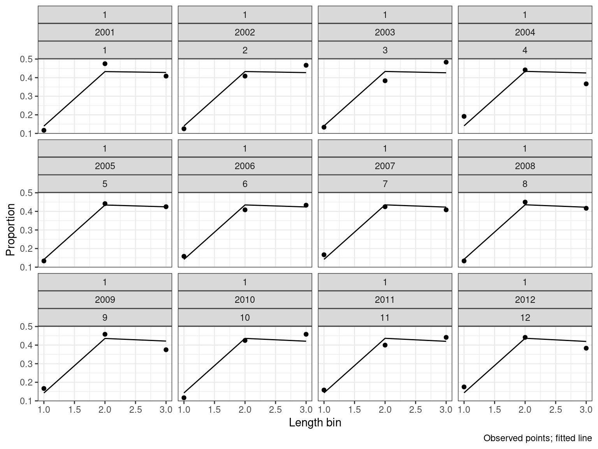
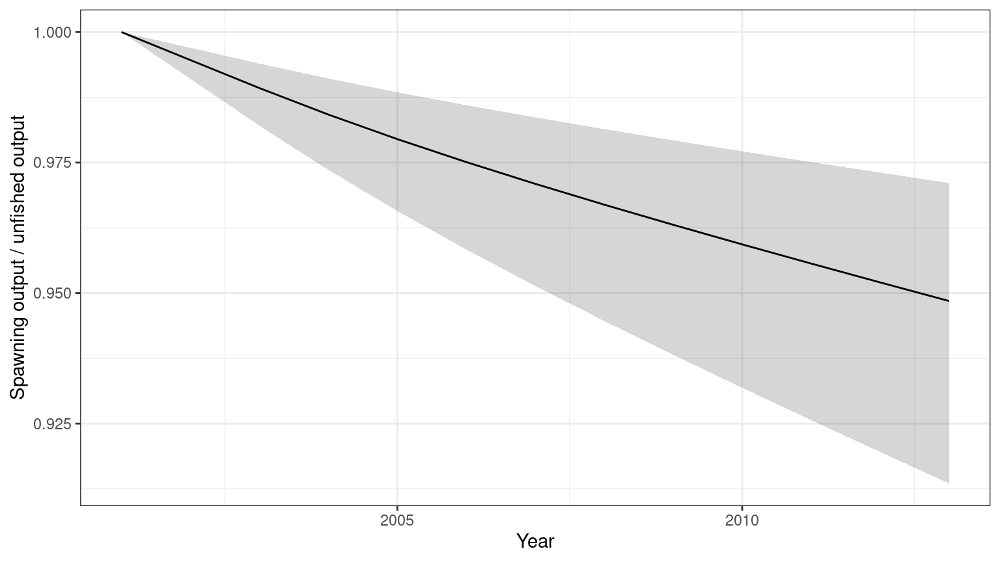
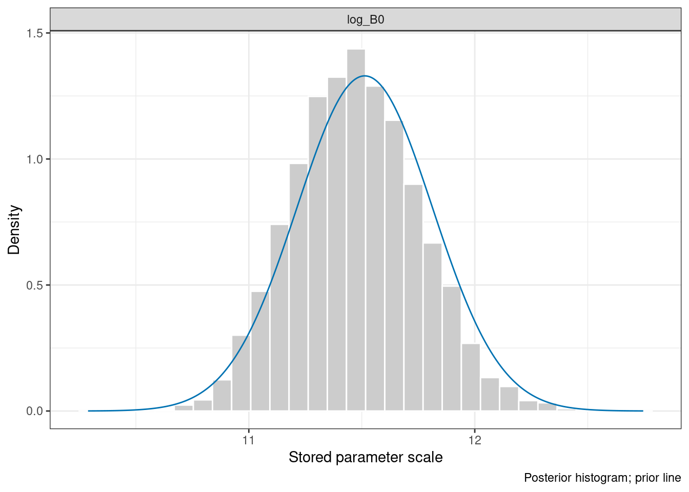
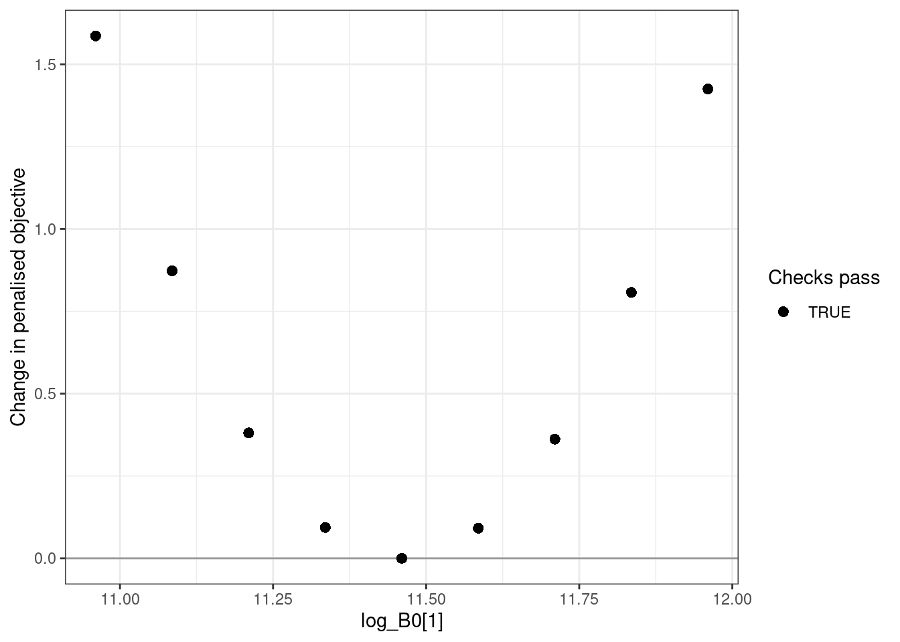

# Assessment diagnostics and sensitivity analyses

This guide demonstrates biological checks, one-step-ahead (OSA)
residuals, posterior summaries, parameter profiles, model grids, and
equilibrium reference points. Each analysis retains its settings and
source identity in an `opal_obj`. Changing its scientific configuration
clears dependent analyses. Saving and reading the object preserves the
results.

The diagnostic design follows the [SBT assessment
examples](https://www.quantifish.co.nz/sbt/articles/sbt.html). The
combined SDNR figure places each dataset on a separate row and compares
its OSA residual dispersion with a reference value of one.

## The dataset-level OSA figure

Start with the bundled Opakapaka optimum. Reading it does not optimise
or sample. This legacy optimum is retained for comparison with the
numerical reference; the [fit-review
article](https://n-ducharmebarth-noaa.github.io/opal/dev/articles/opakapaka-fit-review.md)
explains its remaining gradient. An observation diagnostic can be
inspected even when a fit check fails.

``` r

library(opal)
opaka <- opal_read(system.file("extdata", "opaka_quickstart_fit.rds", package = "opal"))
opaka <- opal_osa(opaka, seed = 123)
```

``` r

plot_osa_sdnr(opaka)
```



Figure 1: Opakapaka OSA residual SDNR by dataset. The dashed line is
one, and the horizontal intervals are approximate 95% intervals.
Parameters, including estimated recruitment deviations, are held at
their fitted values in this fixed-effects model.

``` r

knitr::kable(opal_derived(opaka, "osa")$summary[,
  c("dataset", "family", "n", "sdnr", "lower", "upper", "excluded", "failures")], digits = 3)
```

| dataset | family      |    n |  sdnr | lower | upper | excluded | failures |
|:--------|:------------|-----:|------:|------:|------:|---------:|---------:|
| CPUE 1  | lognormal   |   75 | 0.212 | 0.183 | 0.253 |        0 |        0 |
| CPUE 2  | lognormal   |    7 | 0.158 | 0.102 | 0.348 |        0 |        0 |
| LF 1    | multinomial | 1103 | 1.047 | 1.005 | 1.092 |      172 |        0 |
| LF 3    | multinomial |   94 | 1.313 | 1.148 | 1.533 |       25 |        0 |

SDNR is the standard deviation of normalised OSA residuals. Values above
one indicate more residual variation than expected under the fitted
observation model; values below one indicate less. This example has
relatively small CPUE SDNRs and a larger research-fleet composition
SDNR. These are prompts to examine variance assumptions, weighting, and
model flexibility. They are not automatic instructions to reweight the
data. The chi-squared intervals assume independent normal residuals with
known model parameters, so fitted-parameter effects make them
approximate.

Each CPUE index has its own row, even when several indices use the same
fishery. Length and weight compositions are grouped by fishery. Inspect
time patterns and normal quantiles as well as SDNR:

``` r

plot_osa_residuals(opaka, type = "qq")
```



Figure 2: Normal quantile plots for the same OSA residuals.

### Likelihood and conditioning conventions

| Observation likelihood | Conditional distribution used by OSA |
|----|----|
| Lognormal CPUE | Normal distribution of log CPUE, with the fitted total log-scale SD |
| Multinomial composition | Sequential binomial distributions |
| Dirichlet composition | Sequential beta distributions |
| Dirichlet–multinomial composition | Sequential beta-binomial distributions |

All three composition likelihoods work for both length and weight data.
The calculation uses the prepared observations, fitted probabilities,
effective sample sizes, and concentration parameters. It introduces no
extra pseudocounts. Multinomial rounding follows the likelihood.
Discrete residuals randomise within the observed count’s probability
mass; an explicit seed makes them reproducible without changing the
caller’s random-number state.

For fixed-effect models, residuals condition on the fitted parameters.
When the model declares random effects through `opal_obj(random = ...)`,
Opal uses RTMB’s sequential, Laplace-based integration of those latent
states. Other observation streams remain observed while each stream is
processed. This distinction matters for recruitment deviations:
estimated fixed effects and integrated random effects are different
diagnostic targets.

Within a stream, input order defines observation order, followed by
ascending composition bin. The final bin is constrained and has no
residual. Removed fisheries, zero sample sizes, exhausted counts, and
any numerical failures remain in `opal_derived(x, "osa")$residuals` with
an explicit `reason`. Failed residuals are reported in the summary; they
must not be mistaken for a successful check. Catch is conditioned on,
rather than modelled with an observation likelihood, so its
reconstruction differences are not OSA residuals. Recruitment priors are
also outside this observation diagnostic.

## A small, reproducible assessment

The remaining examples use simulated data for two fisheries, 12 years,
and two seasons.
[`opal_example_inputs()`](https://n-ducharmebarth-noaa.github.io/opal/dev/reference/opal_example_inputs.md)
supplies CPUE and both composition streams; its `family` argument
selects any of the three composition distributions. Three parameters are
estimated, and biology and recruitment deviations are fixed. This is a
software tutorial, not an assessment of a real stock.

``` r

inputs <- opal_example_inputs("multinomial", seed = 712)
assessment <- opal_obj(inputs$data, inputs$parameters, inputs$map)
assessment <- opal_fit(assessment)
summary(assessment)
```

    <opal_obj> fitted
    Active parameters: 3
    Objective: 240.3783
    Fit check: passed  | MCMC check: not run 

`cpue_data$ts` is a one-based, flattened year/season index:
`(year_index - 1) * n_season + season_index`. The first year’s seasons
are 1 and 2; the second year’s seasons are 3 and 4. Composition years
are model-year indices because their predictions use catch accumulated
over that year. `data$years` gives display labels. Biological vectors
are at age unless the model explicitly supplies length-based biology;
weight and spawning-output units must be consistent with the supplied
inputs. `catch_units_f` distinguishes weight from numbers. Use
`plot_catch(weight_units = ...)` and
`plot_biomass_spawning(units = ..., scale = ...)` for explicit display
units.

### Biological acceptance

``` r

opal_diagnose(assessment)
```

    $passes
    [1] TRUE

    $checks
     initial_equilibrium      harvest_penalty           population
                    TRUE                 TRUE                 TRUE
               mortality             maturity   spawning_potential
                    TRUE                 TRUE                 TRUE
                  weight          selectivity            steepness
                    TRUE                 TRUE                 TRUE
             recruitment      spawning_output              harvest
                    TRUE                 TRUE                 TRUE
               depletion catch_reconstruction
                    TRUE                 TRUE

    $metrics
    $metrics$initial_penalty
    [1] 0

    $metrics$total_penalty
    [1] 0

    $metrics$max_harvest
    [1] 0.007761073

    $metrics$max_relative_catch_error
    [1] 5.636512e-11

A passing fit requires convergence, the gradient and Hessian checks,
parameter bounds, and biological feasibility. The latter includes
initial-equilibrium and harvest penalties, abundance, mortality,
maturity, spawning potential, harvest fractions, catch reconstruction,
and depletion. Positive continuation keeps an invalid trial state
numerically evaluable; a positive penalty does not establish a valid
equilibrium.

Posterior checking evaluates **every retained joint draw**, including
its bounds and draw-specific biology, in addition to R-hat, ESS,
divergences, and tree depth. Failures retain their chain, iteration, and
reason. Marginal draws that omit random effects cannot pass the full
biological posterior check. Old validation records become stale when the
validation contract changes.

### Other composition distributions

These examples fit both composition streams for each likelihood, then
collect the same SDNR statistic. The seed controls independent simulated
observations and residual randomisation; results need not be identical
across distributions.

``` r

family_diagnostics <- lapply(c("multinomial", "Dirichlet", "Dirichlet-multinomial"), function(family) {
  z <- opal_example_inputs(family)
  fit <- opal_fit(opal_obj(z$data, z$parameters, z$map))
  fit <- opal_osa(fit)
  out <- opal_derived(fit, "osa")$summary
  out$composition_family <- family
  out
})
knitr::kable(do.call(rbind, family_diagnostics)[,
  c("composition_family", "dataset", "n", "sdnr", "failures")], digits = 3)
```

| composition_family    | dataset |   n |  sdnr | failures |
|:----------------------|:--------|----:|------:|---------:|
| multinomial           | CPUE 1  |  24 | 0.898 |        0 |
| multinomial           | CPUE 2  |  24 | 1.062 |        0 |
| multinomial           | LF 1    |  24 | 0.734 |        0 |
| multinomial           | LF 2    |  24 | 0.926 |        0 |
| multinomial           | WF 1    |  24 | 1.239 |        0 |
| multinomial           | WF 2    |  24 | 0.935 |        0 |
| Dirichlet             | CPUE 1  |  24 | 0.895 |        0 |
| Dirichlet             | CPUE 2  |  24 | 1.064 |        0 |
| Dirichlet             | LF 1    |  24 | 0.641 |        0 |
| Dirichlet             | LF 2    |  24 | 0.827 |        0 |
| Dirichlet             | WF 1    |  24 | 1.141 |        0 |
| Dirichlet             | WF 2    |  24 | 0.774 |        0 |
| Dirichlet-multinomial | CPUE 1  |  24 | 0.898 |        0 |
| Dirichlet-multinomial | CPUE 2  |  24 | 1.062 |        0 |
| Dirichlet-multinomial | LF 1    |  24 | 0.864 |        0 |
| Dirichlet-multinomial | LF 2    |  24 | 0.944 |        0 |
| Dirichlet-multinomial | WF 1    |  24 | 0.998 |        0 |
| Dirichlet-multinomial | WF 2    |  24 | 1.001 |        0 |

``` r

plot_composition(assessment, type = "lf", fishery = 1)
```



Figure 3: Observed length-composition proportions and fitted
probabilities for the first fishery in the simulated example.

## Posterior analysis

The bundled simulated posterior was generated with four chains, 1,000
warm-up iterations, and 1,000 retained iterations per chain. Its
generation script is `data-raw/generate-assessment-example.R`. That
script requires both fit and MCMC checks to pass before saving. Website
builds read the result instead of sampling. To reproduce it yourself:

``` r

assessment <- opal_mcmc(assessment, seed = 927, chains = 4, cores = 1,
                       num_warmup = 1000, num_samples = 1000, adapt_delta = 0.95)
assessment <- opal_check(assessment, "mcmc")
opal_save(assessment, "simulated-assessment.rds")
```

``` r

sampled <- opal_read(system.file("extdata", "assessment_example.rds", package = "opal"))
summary(sampled)
```

    <opal_obj> sampled
    Active parameters: 3
    Objective: 240.3783
    Fit check: passed  | MCMC check: passed
    MCMC: 4 chains; 1000 retained iterations

``` r

knitr::kable(sampled$validation$mcmc$metrics$parameters, digits = 3)
```

| variable        |  rhat | ess_bulk | ess_tail |
|:----------------|------:|---------:|---------:|
| log_B0          | 1.000 | 4087.463 | 3059.671 |
| log_cpue_q\[1\] | 1.000 | 3882.720 | 2788.743 |
| log_cpue_q\[2\] | 1.001 | 5052.341 | 3327.968 |

``` r

sampled$validation$mcmc$metrics$biology[c("passes", "checked", "scope")]
```

    $passes
    [1] TRUE

    $checked
    [1] 4000

    $scope
    [1] "all retained joint draws"

Summaries use each draw’s own model report and preserve the selected
chain and iteration identifiers. Non-finite values stop the calculation
rather than being silently removed. Running summaries does not turn an
unchecked posterior into an accepted one.

``` r

sampled <- opal_posterior(sampled,
  quantities = c("B0", "spawning_biomass_y", "static_depletion_y"))
posterior <- opal_derived(sampled, "posterior")
knitr::kable(posterior$parameters, digits = 3)
```

| quantity  | element |   mean |    sd | q0.025 | q0.500 | q0.975 | parameter       |
|:----------|--------:|-------:|------:|-------:|-------:|-------:|:----------------|
| parameter |       1 | 11.476 | 0.280 | 10.953 | 11.467 | 12.041 | log_B0          |
| parameter |       2 | -0.234 | 0.026 | -0.285 | -0.234 | -0.183 | log_cpue_q\[1\] |
| parameter |       3 |  0.176 | 0.026 |  0.125 |  0.176 |  0.228 | log_cpue_q\[2\] |

``` r

depletion <- subset(posterior$reports, quantity == "static_depletion_y")
depletion$year <- c(sampled$data$years, sampled$data$last_yr + 1)
ggplot2::ggplot(depletion, ggplot2::aes(x = year, y = q0.500)) +
  ggplot2::geom_ribbon(ggplot2::aes(ymin = q0.025, ymax = q0.975), alpha = 0.2) +
  ggplot2::geom_line() + ggplot2::labs(x = "Year", y = "Spawning output / unfished output") +
  ggplot2::theme_bw()
```



Figure 4: Median and 95% posterior intervals for simulated depletion.
These intervals are conditional on the model’s fixed biology and
recruitment deviations.

``` r

plot_prior_posterior(sampled)
```



Figure 5: Specified log-spawning-output prior and the simulated
example’s posterior. Densities are on the stored parameter scale.

The plotted prior is its specified, untruncated density; bounds may
further restrict the target. Shared-map parameters with multiple prior
contributions are omitted with a warning rather than displayed as a
misleading single prior. SparseNUTS diagnostics can use
`opal_as_tmbfit(sampled)` for additional chain plots.

## Profiles and model grids

[`opal_profile()`](https://n-ducharmebarth-noaa.github.io/opal/dev/reference/opal_profile.md)
fixes a parameter value and re-optimises the remaining active
parameters. It profiles the **penalised objective**, including priors,
unless those terms are absent. Do not interpret it automatically as a
likelihood-ratio confidence interval. Inspect the saved convergence,
gradient, biological checks, and component contributions for every
point.

``` r

centre <- assessment$fit$parameters$log_B0
assessment <- opal_profile(assessment, "log_B0", centre + seq(-0.5, 0.5, length.out = 9))
knitr::kable(opal_derived(assessment, "profile")$table, digits = 3)
```

|  value | objective | delta | max_gradient | passes | error |
|-------:|----------:|------:|-------------:|:-------|:------|
| 10.960 |   241.965 | 1.586 |            0 | TRUE   | NA    |
| 11.085 |   241.251 | 0.873 |            0 | TRUE   | NA    |
| 11.210 |   240.759 | 0.381 |            0 | TRUE   | NA    |
| 11.335 |   240.472 | 0.094 |            0 | TRUE   | NA    |
| 11.460 |   240.378 | 0.000 |            0 | TRUE   | NA    |
| 11.585 |   240.470 | 0.091 |            0 | TRUE   | NA    |
| 11.710 |   240.740 | 0.362 |            0 | TRUE   | NA    |
| 11.835 |   241.186 | 0.807 |            0 | TRUE   | NA    |
| 11.960 |   241.803 | 1.425 |            0 | TRUE   | NA    |

``` r

plot_opal_profile(assessment)
```



A grid makes alternative assumptions explicit. Checkpoints are reusable
only when the scientific target, starting state, fitting controls, and
validation contract match. Failed scenarios remain in the result.

``` r

higher_mortality <- inputs$data
higher_mortality$M <- rep(0.35, inputs$data$n_age)
grid <- opal_grid(opal_obj(inputs$data, inputs$parameters, inputs$map),
  scenarios = list(base = list(), higher_M = list(data = higher_mortality)))
knitr::kable(grid$summary, digits = 3)
```

| model    | objective | passes | reused | error |
|:---------|----------:|:-------|:-------|:------|
| base     |   240.378 | TRUE   | FALSE  | NA    |
| higher_M |   257.592 | TRUE   | FALSE  | NA    |

For a larger analysis, supply `directory = "sensitivity-checkpoints"`.
Sampling and balanced model selection are explicit subsequent steps:

``` r

grid <- opal_grid_mcmc(grid, seed = 927, chains = 4, cores = 4,
                       num_warmup = 1000, num_samples = 1000)
selection <- opal_grid_draws(grid, n_per_model = 400, seed = 123)
```

Balanced selection requires a current passing posterior check for
**every** grid member. It samples without replacement, balances chains,
and attaches equal model weights. Equal model weights are a scientific
assumption, not a conclusion from comparing the fitted objectives.

## Equilibrium reference points

[`opal_msy()`](https://n-ducharmebarth-noaa.github.io/opal/dev/reference/opal_msy.md)
calculates deterministic equilibrium yield using a stated fleet
allocation, fixed reference-year selectivity, and Beverton–Holt
recruitment. Here the fleets receive equal harvest-intensity weights.
This calculation is independent of the projection engine.

``` r

assessment <- opal_msy(assessment, fleet_weights = c(0.5, 0.5))
knitr::kable(opal_derived(assessment, "msy")$draws, digits = 3)
```

| iteration | chain | draw | msy | b_msy | r_msy | u_msy | depletion_msy | terminal_b_bmsy | at_upper_bound | resolved |
|---:|---:|---:|---:|---:|---:|---:|---:|---:|:---|:---|
| NA | NA | 1 | 2123.869 | 27020.71 | 3509.737 | 0.16 | 0.285 | 3.329 | FALSE | TRUE |

`u_msy` is a scalar **seasonal harvest intensity**, not an instantaneous
annual fishing mortality. Fleet/age harvest fractions are
`u * fleet_weight[f] * selectivity[f,a]`. Yield uses model weight units,
while `b_msy` uses model spawning-output units. The engine matches the
historical seasonal survival and plus-group convention and solves
equilibrium recruitment without recruitment deviations or positive
continuation. Upper-bound maxima are flagged as unresolved.

``` r

# Deliberately small, balanced subset for a quick tutorial calculation.
selected <- unlist(lapply(0:3, function(chain) chain * 1000 + seq(1, 901, by = 100)))
sampled <- opal_msy(sampled, fleet_weights = c(0.5, 0.5),
                    uncertainty = "mcmc", draws = selected)
msy <- opal_derived(sampled, "msy")
knitr::kable(head(msy$draws), digits = 3)
```

|  | iteration | chain | draw | msy | b_msy | r_msy | u_msy | depletion_msy | terminal_b_bmsy | at_upper_bound | resolved |
|:---|---:|---:|---:|---:|---:|---:|---:|---:|---:|:---|:---|
| 1 | 1001 | 1 | 1 | 2288.590 | 29116.36 | 3781.941 | 0.16 | 0.285 | 3.342 | FALSE | TRUE |
| 101 | 1101 | 1 | 101 | 1866.202 | 23742.57 | 3083.936 | 0.16 | 0.285 | 3.303 | FALSE | TRUE |
| 201 | 1201 | 1 | 201 | 2429.690 | 30911.48 | 4015.111 | 0.16 | 0.285 | 3.352 | FALSE | TRUE |
| 301 | 1301 | 1 | 301 | 2227.596 | 28340.37 | 3681.148 | 0.16 | 0.285 | 3.337 | FALSE | TRUE |
| 401 | 1401 | 1 | 401 | 1780.616 | 22653.70 | 2942.503 | 0.16 | 0.285 | 3.293 | FALSE | TRUE |
| 501 | 1501 | 1 | 501 | 1491.058 | 18969.84 | 2464.004 | 0.16 | 0.285 | 3.251 | FALSE | TRUE |

``` r

msy$probability_below_bmsy
```

    [1] 0

Every selected draw supplies its own biology. This 40-draw result
demonstrates the calculation; use an appropriately sized posterior
analysis for inference. These reference points are conditional on the
fleet mix, selectivity, biology, and deterministic recruitment
assumptions. They are not stochastic MSY or management advice.

Projection development, estimated selectivity time blocks, and close-kin
components are outside the scope of this tutorial and feature addition.
