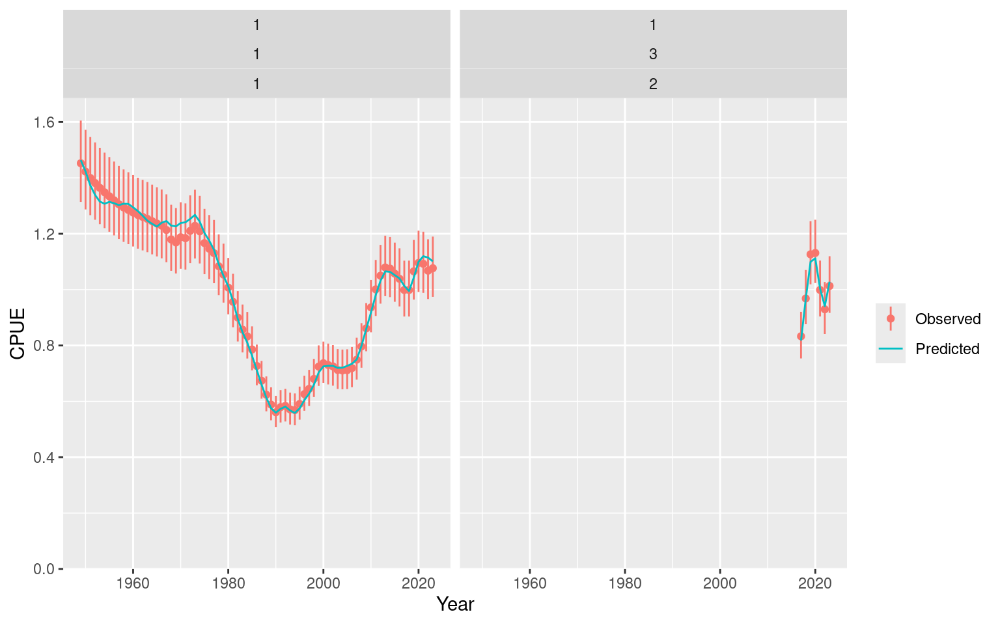

# Review an Opakapaka Fit

## Review a saved assessment

This vignette upgrades the bundled legacy `opal_fit` to `opal_obj`. It
examines the portable fixed-effects opakapaka fit created for the
[Quickstart](https://n-ducharmebarth-noaa.github.io/opal/dev/articles/quickstart.md).
It rebuilds the transient RTMB objective to verify the stored objective
and obtain predictions, without optimisation.

The bundled fit may have been saved under a different R version.
Portable integrity permits that difference while still checking model
compatibility and requiring the rebuilt objective to match the saved
value.

``` r

library(opal)

fit_path <- system.file("extdata", "opaka_quickstart_fit.rds", package = "opal")
if (!nzchar(fit_path)) {
  stop("The bundled opakapaka quickstart fit is unavailable.", call. = FALSE)
}
fit <- opal_read(fit_path)
fit
#> <opal_obj> fitted
#> Active parameters: 127 
#> Objective: 1832.412 
#> Fit check: not run  | MCMC check: not run
summary(fit)
#> <opal_obj> fitted
#> Active parameters: 127 
#> Objective: 1832.412 
#> Fit check: not run  | MCMC check: not run
```

### CPUE fit

``` r

plot_cpue(fit)
```



### Diagnostics

The compact estimability result and maximum absolute gradient were saved
with the fit. They can be inspected without creating a new objective.

``` r

list(
  estimability = fit$fit$estimability,
  maximum_gradient = fit$fit$diagnostics$max_gradient
)
#> $estimability
#> $estimability$status
#> [1] "estimable"
#> 
#> $estimability$message
#> [1] "All 127 active fixed-effect parameters are estimable."
#> 
#> $estimability$n_parameters
#> [1] 127
#> 
#> $estimability$n_non_estimable_combinations
#> [1] 0
#> 
#> $estimability$implicated_parameters
#> character(0)
#> 
#> 
#> $maximum_gradient
#> [1] 0.003773483
```

Refresh the reusable fit checks with
[`opal_check()`](https://n-ducharmebarth-noaa.github.io/opal/dev/reference/opal_check.md).
The stage remains `fitted` whether checks pass or fail; inspect the
validation record before interpreting the assessment.

``` r

fit <- opal_check(fit, scope = "fit")
fit$validation$fit$metrics
#> $convergence
#> [1] 0
#> 
#> $max_gradient
#> [1] 0.003773483
#> 
#> $positive_hessian
#> [1] TRUE
#> 
#> $inside_bounds
#> [1] TRUE
#> 
#> $valid_population
#> [1] TRUE
#> 
#> $biology
#> $biology$passes
#> [1] TRUE
#> 
#> $biology$checks
#>  initial_equilibrium      harvest_penalty           population 
#>                 TRUE                 TRUE                 TRUE 
#>            mortality             maturity   spawning_potential 
#>                 TRUE                 TRUE                 TRUE 
#>               weight          selectivity            steepness 
#>                 TRUE                 TRUE                 TRUE 
#>          recruitment      spawning_output              harvest 
#>                 TRUE                 TRUE                 TRUE 
#>            depletion catch_reconstruction 
#>                 TRUE                 TRUE 
#> 
#> $biology$metrics
#> $biology$metrics$initial_penalty
#> [1] 0
#> 
#> $biology$metrics$total_penalty
#> [1] 0
#> 
#> $biology$metrics$max_harvest
#> [1] 0.09746102
#> 
#> $biology$metrics$max_relative_catch_error
#> [1] 6.704798e-10
summary(fit)
#> <opal_obj> fitted
#> Active parameters: 127 
#> Objective: 1832.412 
#> Fit check: failed  | MCMC check: not run
```

The bundled legacy fit’s maximum gradient can exceed the default `0.001`
tolerance even with optimiser convergence code zero. That is a failed
diagnostic check, not a read or migration failure. This review preserves
the saved point; the
[Quickstart](https://n-ducharmebarth-noaa.github.io/opal/dev/articles/quickstart.md)
and [projection
guide](https://n-ducharmebarth-noaa.github.io/opal/dev/articles/projections.md)
demonstrate bounded continuation from that point before using a fit that
passes the checks.

### Continue and save the assessment

Metadata changes preserve the fitted result. Configuration changes
through
[`opal_update()`](https://n-ducharmebarth-noaa.github.io/opal/dev/reference/opal_update.md)
clear dependent results so that another fit or sampler run cannot
accidentally use stale outputs.

``` r

fit <- opal_update(fit, metadata = list(label = "Reviewed baseline"))
path <- tempfile(fileext = ".rds")
opal_save(fit, path)
restored <- opal_read(path, rebuild = TRUE)
stopifnot(isTRUE(all.equal(opal_report(fit), opal_report(restored))))
unlink(path)
```

See the [projection
guide](https://n-ducharmebarth-noaa.github.io/opal/dev/articles/projections.md)
to carry this object into a future-catch scenario, or
[`opal_mcmc()`](https://n-ducharmebarth-noaa.github.io/opal/dev/reference/opal_mcmc.md)
to add posterior sampling.

### OSA residuals and further analyses

Use `fit <- opal_osa(fit)` followed by `plot_osa_sdnr(fit)` to compare
observation residual dispersion across datasets. The [assessment-tools
guide](https://n-ducharmebarth-noaa.github.io/opal/dev/articles/assessment-tools.md)
shows this figure, composition fits, posterior analysis, and sensitivity
workflows.
