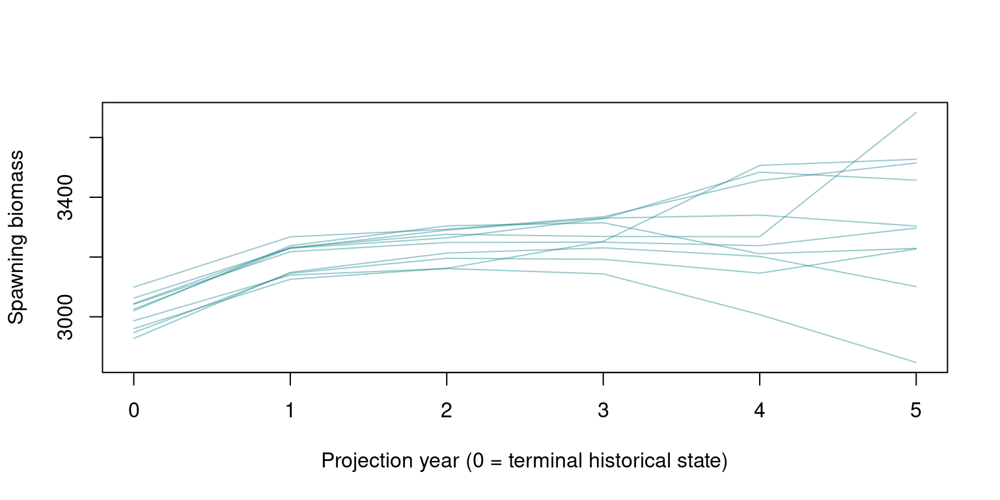

# Project a saved assessment

This example carries one `opal_obj` from a saved fixed-effects
assessment through a five-year projection and a save/read round trip.
Ten trajectories keep the example quick; they demonstrate the interface
and do not provide assessment-quality uncertainty estimates. See the
[Quickstart](https://n-ducharmebarth-noaa.github.io/opal/dev/articles/quickstart.md)
for fitting and the [saved-fit
review](https://n-ducharmebarth-noaa.github.io/opal/dev/articles/opakapaka-fit-review.md)
for diagnostics.

## Load and check the assessment

``` r

library(opal)
assessment <- opal_read(system.file(
  "extdata", "opaka_quickstart_fit.rds", package = "opal"
))
assessment <- opal_check(assessment, scope = "fit")
summary(assessment)
```

    <opal_obj> fitted
    Active parameters: 127
    Objective: 1832.412
    Fit check: failed  | MCMC check: not run 

The saved fit may pass the optimiser’s stopping rule while missing
Opal’s stricter gradient check. Continue optimisation from the saved
point when needed, with the same model and diagnostic threshold. Tighten
the optimiser’s relative objective tolerance so that it does not stop
before the gradient check passes. Check after each pass, allowing at
most three; this example stops if the checks still fail. Reading alone
never refits a model.

``` r

for (attempt in seq_len(3L)) {
  if (isTRUE(assessment$validation$fit$passes)) break
  assessment <- opal_fit(
    assessment, n_passes = 1L,
    control = list(eval.max = 10000L, iter.max = 10000L, rel.tol = 1e-10)
  )
}
stopifnot(isTRUE(assessment$validation$fit$passes))
summary(assessment)
```

    <opal_obj> fitted
    Active parameters: 127
    Objective: 1832.412
    Fit check: passed  | MCMC check: not run 

## Choose future inputs

This illustrative scenario repeats the final observed annual catch, uses
the last ten model years to generate future selectivity, and simulates
recruitment deviations from an autoregressive model of the fitted
history. These are explicit scenario assumptions that require review for
each stock.

``` r

set.seed(42)
n_proj <- 5L
n_iter <- 10L
data <- assessment$data

recruitment <- project_rec_devs(
  assessment, uncertainty = "fit", arima = FALSE,
  first_yr = data$last_yr - 9L, n_proj = n_proj, n_iter = n_iter
)
selectivity <- project_selectivity(
  assessment, first_yr = data$last_yr - 9L,
  n_proj = n_proj, n_iter = n_iter
)
future_catch <- array(0, c(n_proj, data$n_season, data$n_fishery))
for (year in seq_len(n_proj)) {
  future_catch[year, , ] <- data$catch_obs_ysf[data$n_year, , ]
}
```

Recruitment has dimensions `[iteration, future year]`; selectivity has
`[iteration, fishery, future year, age]`; catch has
`[future year, season, fishery]`. Historical windows use the model-year
coordinates in `data$first_yr` and `data$last_yr`; the bundled
Quickstart uses indices 1–75, rather than calendar years.
[`project_selectivity()`](https://n-ducharmebarth-noaa.github.io/opal/dev/reference/project_selectivity.md)
uses the stored point report and simulates variation independently by
age and fishery; it does not propagate posterior uncertainty in
selectivity parameters.

## Project and retain the result

`uncertainty = "mvn"` draws parameters using the Hessian at the fitted
point. This path supports fixed-effects models.
[`opal_project()`](https://n-ducharmebarth-noaa.github.io/opal/dev/reference/opal_project.md)
retains the output, future inputs, seed, and source identity inside the
assessment. Its seed controls the dynamics draws; the seed above
controls recruitment and selectivity generation.

``` r

assessment <- opal_project(
  assessment, name = "constant_catch", uncertainty = "mvn", seed = 43,
  n_proj = n_proj, n_iter = n_iter,
  rdev_y = recruitment$rdev_y, sel_fya = selectivity,
  catch_ysf = future_catch, return_hist = TRUE
)
```

``` r

projection <- assessment$derived$constant_catch$result
names(projection)
```

    [1] "dyn"       "hist_sbio"

``` r

assessment$derived$constant_catch$uncertainty
```

    [1] "mvn"

``` r

length(projection$dyn)
```

    [1] 10

The first projected state is the terminal historical state for the same
parameter draw. Include this bridge point when plotting a continuous
trajectory from the historical period into the future.

``` r

spawning_biomass <- vapply(
  projection$dyn, function(draw) as.numeric(draw$spawning_biomass_y),
  numeric(n_proj + 1L)
)
matplot(0:n_proj, spawning_biomass,
        type = "l", lty = 1, col = grDevices::adjustcolor("#00797F", 0.4),
        xlab = "Projection year (0 = terminal historical state)",
        ylab = "Spawning biomass")
```



## Save the assessment and its projection

``` r

path <- tempfile(fileext = ".rds")
opal_save(assessment, path)
restored <- opal_read(path)
stopifnot(identical(restored$derived$constant_catch$result, projection))
unlink(path)
```

Changing model configuration through
[`opal_update()`](https://n-ducharmebarth-noaa.github.io/opal/dev/reference/opal_update.md),
or replacing the source fit or posterior, clears stored projections.
Change a label through `metadata` to preserve compatible results.

## Use posterior draws

For an assessment with MCMC, select the uncertainty source explicitly.
Recruitment and dynamics consume the same first `n_iter` retained draws
in the same order. Random-effect models require complete joint posterior
draws; marginal-only draws and random-effect MVN projections are
unsupported.

The following recipe is not executed during documentation builds. Run it
after choosing sampling effort and reviewing the MCMC diagnostics.

``` r

assessment <- opal_mcmc(assessment, seed = 44, chains = 4, cores = 4,
                        num_warmup = 1000, num_samples = 500)
summary(assessment)
assessment$validation$mcmc

set.seed(45)
recruitment <- project_rec_devs(
  assessment, uncertainty = "mcmc", arima = FALSE,
  first_yr = data$last_yr - 9L, n_proj = n_proj, n_iter = n_iter
)
assessment <- opal_project(
  assessment, name = "posterior_constant_catch", uncertainty = "mcmc",
  seed = 46, n_proj = n_proj, n_iter = n_iter,
  rdev_y = recruitment$rdev_y, sel_fya = selectivity,
  catch_ysf = future_catch, return_hist = TRUE
)
opal_save(assessment, "assessment-projected.rds")
```
