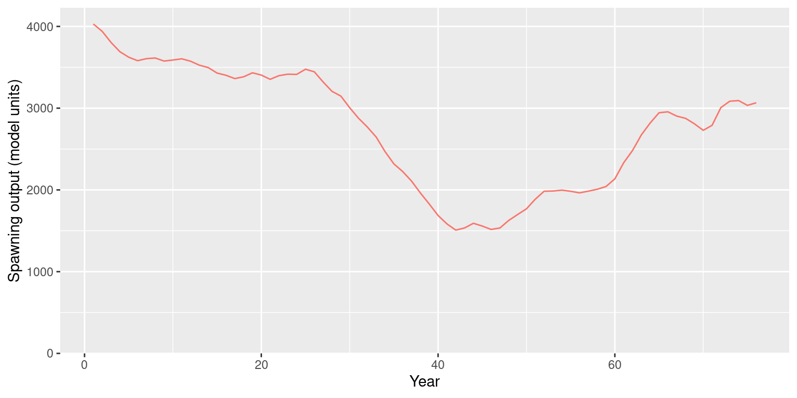

# Quickstart Guide

This guide fits a fixed-effects assessment for ’opakapaka
(*Pristipomoides filamentosus*) using the bundled data. It uses the same
age convention and selectivity parameterisation as its Stock Synthesis 3
(SS3) reference model.

One portable S3 class, `opal_obj`, holds the assessment from
configuration through fitting, sampling, and reporting. Its lifecycle
stage and diagnostic status are separate: a fitted object can still fail
its convergence checks. RTMB objectives live outside the saved object
and are rebuilt when needed.

## Load the model inputs

The package includes a model-input builder so this vignette and the
stored example fit use the same data preparation and fixed-effects
configuration.

``` r

library(opal)

inputs <- opaka_quickstart_inputs()
```

The input builder loads the bundled opakapaka catch, CPUE, and
length-composition data; uses biological ages 0–43 to align with SS3;
applies the SS3 recruitment bias ramps; and prepares multinomial length
compositions for the commercial and research fleets. It fixes
life-history parameters at their SS3 values and estimates biomass scale,
CPUE catchability, recruitment deviations, initial age structure, and
selectivity for fleets with length data.

``` r

data.frame(
  quantity = c("Years", "Ages", "Fisheries", "Length-composition samples"),
  value = c(
    inputs$data$n_year,
    inputs$data$n_age,
    inputs$data$n_fishery,
    length(inputs$data$lf_year)
  )
)
#>                     quantity value
#> 1                      Years    75
#> 2                       Ages    44
#> 3                  Fisheries     3
#> 4 Length-composition samples    82
```

## Fit the model

Create the assessment, then optimise twice using the existing Opal
defaults. The wrapper resolves bounds, stores both optimiser passes, and
checks the final fit. It retains results and warns if the checks fail.

``` r

fit <- opal_obj(
  data = inputs$data,
  parameters = inputs$parameters,
  map = inputs$map,
  metadata = list(stock = "Opakapaka", model = "Fixed-effects quickstart")
)
fit <- opal_fit(fit)
fit
#> <opal_obj> fitted
#> Active parameters: 127 
#> Objective: 1832.412 
#> Fit check: failed  | MCMC check: not run
fit$validation$fit
#> $passes
#> [1] FALSE
#> 
#> $metrics
#> $metrics$convergence
#> [1] 0
#> 
#> $metrics$max_gradient
#> [1] 0.001041864
#> 
#> $metrics$positive_hessian
#> [1] TRUE
#> 
#> $metrics$inside_bounds
#> [1] TRUE
#> 
#> $metrics$valid_population
#> [1] TRUE
#> 
#> $metrics$biology
#> $metrics$biology$passes
#> [1] TRUE
#> 
#> $metrics$biology$checks
#>  initial_equilibrium      harvest_penalty           population 
#>                 TRUE                 TRUE                 TRUE 
#>            mortality             maturity   spawning_potential 
#>                 TRUE                 TRUE                 TRUE 
#>               weight          selectivity            steepness 
#>                 TRUE                 TRUE                 TRUE 
#>          recruitment      spawning_output              harvest 
#>                 TRUE                 TRUE                 TRUE 
#>            depletion catch_reconstruction 
#>                 TRUE                 TRUE 
#> 
#> $metrics$biology$metrics
#> $metrics$biology$metrics$initial_penalty
#> [1] 0
#> 
#> $metrics$biology$metrics$total_penalty
#> [1] 0
#> 
#> $metrics$biology$metrics$max_harvest
#> [1] 0.09746108
#> 
#> $metrics$biology$metrics$max_relative_catch_error
#> [1] 6.704801e-10
#> 
#> 
#> 
#> 
#> $error
#> NULL
#> 
#> $identity
#> $identity$target
#> [1] "ced004c827f173c7b89c6399529db21c"
#> 
#> $identity$fit
#> [1] "7459c22d1102869eeae932f6f18cec4b"
#> 
#> 
#> $version
#> [1] "opal_validation_v2"
#> 
#> $settings
#> $settings$gradient_tolerance
#> [1] 0.001
#> 
#> $settings$max_rhat
#> [1] 1.01
#> 
#> $settings$min_ess
#> [1] 100
#> 
#> $settings$penalty_tolerance
#> [1] 1e-10
#> 
#> $settings$catch_tolerance
#> [1] 1e-06
#> 
#> 
#> $checked_at
#> [1] "2026-09-29 03:45:17 UTC"
#> 
#> $payload_id
#> [1] "9de87019b09406046fcddb2e4e2858b5"
```

The optimiser can return convergence code zero while the maximum
gradient still exceeds the default tolerance of `0.001`. Inspect the
recorded metrics. If needed, continue from the stored optimum with a
tighter relative objective tolerance for the optimiser, keeping the same
model and diagnostic threshold. This example checks after each pass,
allows up to three further passes, and stops if the checks still fail;
the `fitted` stage alone is not acceptance.

``` r

for (attempt in seq_len(3L)) {
  if (isTRUE(fit$validation$fit$passes)) break
  fit <- opal_fit(
    fit, n_passes = 1L,
    control = list(eval.max = 10000L, iter.max = 10000L, rel.tol = 1e-10)
  )
}
stopifnot(isTRUE(fit$validation$fit$passes))
summary(fit)
#> <opal_obj> fitted
#> Active parameters: 127 
#> Objective: 1832.412 
#> Fit check: passed  | MCMC check: not run
```

## Save a portable fitted model

[`opal_save()`](https://n-ducharmebarth-noaa.github.io/opal/dev/reference/opal_io.md)
stores ordinary R data with a payload checksum.
[`opal_read()`](https://n-ducharmebarth-noaa.github.io/opal/dev/reference/opal_io.md)
verifies the payload and scientific contract. Neither reading nor
rebuilding runs optimisation or MCMC. The same functions also save
unfitted objects.

``` r

fit_path <- tempfile("opaka-quickstart-", fileext = ".rds")
opal_save(fit, fit_path)
fit <- opal_read(fit_path, rebuild = TRUE)
summary(fit)
#> <opal_obj> fitted
#> Active parameters: 127 
#> Objective: 1832.412 
#> Fit check: passed  | MCMC check: not run
unlink(fit_path)
```

## Inspect spawning biomass

Existing plots accept the assessment object directly. Advanced callers
can obtain a transient RTMB objective with
`opal_rtmb(fit, fresh = TRUE)`.

``` r

report <- opal_report(fit)
plot_biomass_spawning(fit, relative = FALSE, labels = "Fixed effects")
```



## Sample and update

Sampling can start before or after fitting. The default sampler uses the
stored point, skips internal optimisation, and honours parameter bounds.
The following example is intentionally not run while building the
vignette. Sampling effort and convergence thresholds need
assessment-specific review.

``` r

fit <- opal_mcmc(fit, seed = 42, chains = 4, cores = 4,
                 num_warmup = 1000, num_samples = 500)
fit <- opal_check(fit, scope = "mcmc")
summary(fit)
```

Failed checks retain the samples. A failed or unchecked new run does not
replace a previously checked, passing posterior; inspect
`fit$mcmc_history` for earlier and unselected attempts. Refitting the
same target preserves its posterior and records which optimisation
originally supplied it.

Use
[`opal_update()`](https://n-ducharmebarth-noaa.github.io/opal/dev/reference/opal_update.md)
for changes. Updating data, priors, parameters, maps, random effects, or
bounds clears dependent fits, samples, and projections. Metadata and
optimiser controls preserve them. Direct changes to scientific fields
are rejected by validation. An omitted map resolves defaults, whereas
`map = list()` explicitly leaves all parameters free. Custom stocks
should supply their own parameters; a bundled default requires an
explicit `model`.

``` r

labelled <- opal_update(fit, metadata = list(label = "Baseline"))
summary(labelled)
#> <opal_obj> fitted
#> Active parameters: 127 
#> Objective: 1832.412 
#> Fit check: passed  | MCMC check: not run
```

## Projections and older workflows

[`project_selectivity()`](https://n-ducharmebarth-noaa.github.io/opal/dev/reference/project_selectivity.md),
[`project_rec_devs()`](https://n-ducharmebarth-noaa.github.io/opal/dev/reference/project_rec_devs.md),
and
[`project_dynamics()`](https://n-ducharmebarth-noaa.github.io/opal/dev/reference/project_dynamics.md)
accept objects directly. Choose `uncertainty = "mcmc"` or `"mvn"` for
dynamics when posterior draws exist.
[`opal_project()`](https://n-ducharmebarth-noaa.github.io/opal/dev/reference/opal_project.md)
stores a projection with its source identity and settings; future
catches, selectivity, and recruitment remain explicit inputs.
Random-effect dynamics projections require complete joint posterior
draws; marginal-only draws and random-effect MVN projections are
rejected.

`opal_fit(data, obj, opt, ...)` still supports the legacy constructor.
[`opal_from_fit()`](https://n-ducharmebarth-noaa.github.io/opal/dev/reference/opal_from_fit.md)
converts an existing fit, and
[`opal_read()`](https://n-ducharmebarth-noaa.github.io/opal/dev/reference/opal_io.md)
upgrades legacy saved fits after verifying the rebuilt objective,
without refitting. The companion [saved-fit
review](https://n-ducharmebarth-noaa.github.io/opal/dev/articles/opakapaka-fit-review.md)
demonstrates this migration. The [projection
guide](https://n-ducharmebarth-noaa.github.io/opal/dev/articles/projections.md)
gives a complete runnable example with future catch, recruitment,
selectivity, and saved projection provenance.

## Assessment diagnostics and sensitivities

The [assessment-tools
guide](https://n-ducharmebarth-noaa.github.io/opal/dev/articles/assessment-tools.md)
demonstrates biological validation, OSA residuals for every observation
likelihood, the dataset-level SDNR plot, posterior summaries, profiles,
model grids, and equilibrium reference points. All results retain their
source assessment and calculation settings.
